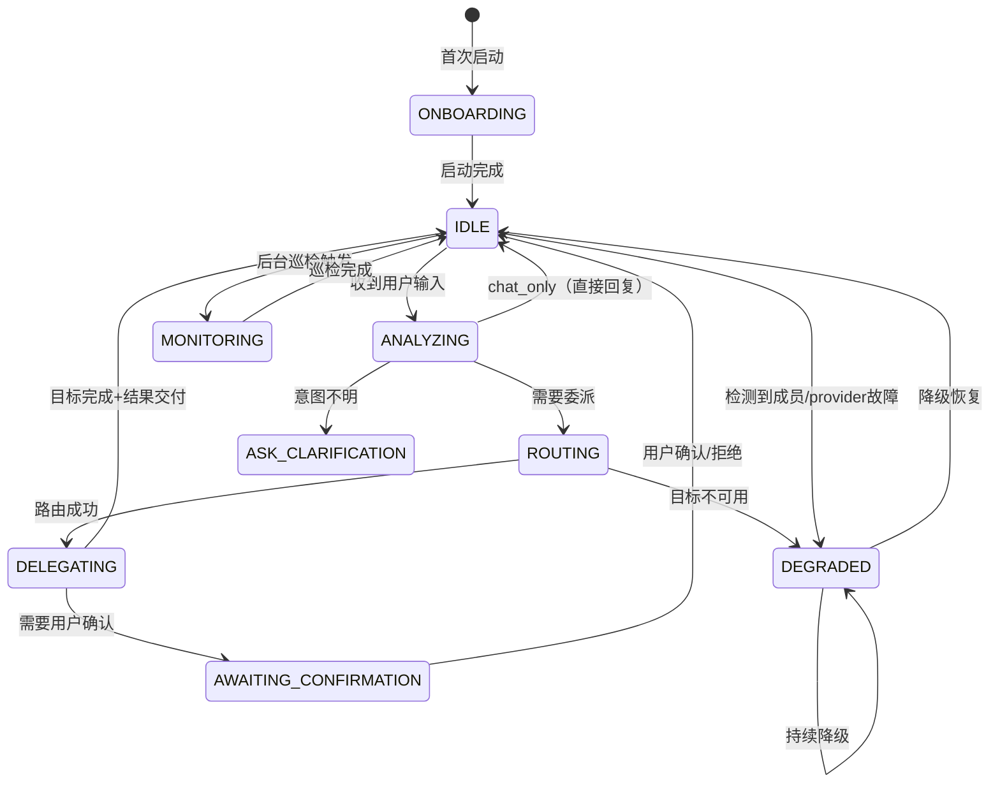

# LamButler 细化设计文档 v1

> 日期: 2026-05-22
> 状态: 设计阶段
> 原则: 用户需求 → 功能推导 → 技术架构（杜绝功能堆砌）

---

## 目录

1. [用户需求全景分析](#1-用户需求全景分析)
2. [需求→能力映射](#2-需求能力映射)
3. [用户场景与工作流](#3-用户场景与工作流)
4. [核心架构设计](#4-核心架构设计)
5. [Action 系统](#5-action-系统)
6. [状态机设计](#6-状态机设计)
7. [跨 Persona 协作协议](#7-跨-persona-协作协议)
8. [记忆与上下文管理](#8-记忆与上下文管理)
9. [过滤与通知系统](#9-过滤与通知系统)
10. [审查与质量门](#10-审查与质量门)
11. [降级与容错](#11-降级与容错)
12. [实施路线图](#12-实施路线图)

---

## 1. 用户需求全景分析

> 不从 Butler 能做什么出发，而从用户会向 Butler 下达什么任务出发。

### 1.1 需求发现方法论

用户面对一个「管家型 AI」时，心理模型不是「我要调用哪个 API」或「这个工具支不支持」，而是「我有个事要办，你帮我办」。因此需求挖掘不靠枚举功能，而靠模拟用户心智中的任务结构。

**用户对 Butler 的心理定位**：

```
用户心里 Butler 不是：
  "一个带路由功能的聊天机器人"
  "一个能调 Artist/Coder/Writer 的调度器"
  "一个带记忆系统的 Agent"

用户心里 Butler 是：
  "我桌上那个帮我管事的人"
```

从这个心理定位出发，用户的任务自然分成三层：

| 层 | 用户心理 | 典型语言 |
|---|---|---|
| **即刻执行** | 「帮我做 X」 | "帮我生成一组猫的图片" / "帮我改一下这个 bug" / "帮我写封邮件" |
| **持续照看** | 「帮我盯着 Y」 | "有结果了告诉我" / "API key 快过期了提醒我" / "别让广告打扰我" |
| **长期管理** | 「帮我把 Z 管起来」 | "记住我偏好冷色调" / "以后这种事先问过我" / "我的项目进度帮我跟踪" |

### 1.2 用户任务全集（按频率×紧急度分区）

#### 高频·即刻（用户最常遇到，期望即时响应）

| # | 用户任务 | 用户会怎么说 | 深层需求 |
|---|---------|-------------|---------|
| T1 | 委托图像生成 | "帮我画一只赛博朋克猫" | 不想自己去切到 Artist 模式，Butler 应该是唯一入口 |
| T2 | 委托代码任务 | "这个报错帮我看看" | 同上——不想手动选择 persona |
| T3 | 委托文本撰写 | "帮我写一封回复邮件" | 同上 |
| T4 | 查历史/记忆 | "上次那个配色方案是什么来着" | 不想重复说已经说过的事 |
| T5 | 简单对话 | "今天有什么需要我处理的" | 需要一个统一的状态面板（人话版） |
| T6 | 快速设置 | "默认生图改成竖版" | 不想到设置页翻菜单 |

#### 中频·持续（用户期望 Butler 主动执行，不等指令）

| # | 用户任务 | 触发条件 | 深层需求 |
|---|---------|---------|---------|
| T7 | 环境巡检 | 启动时 / 定时 | 不想自己检查 API 通不通、成员在不在 |
| T8 | 通知过滤 | 持续运行 | 不想被垃圾信息淹没，但重要的不能漏 |
| T9 | 工作状态关怀 | 连续工作 N 小时 | 需要有人提醒休息，但不是唠叨 |
| T10 | 预判草案 | 用户随口提想法 | "我之前说的那个事，不用我再吩咐一遍" |
| T11 | 日程提醒 | 用户提过的时间承诺 | 不想自己记"明天下午3点" |
| T12 | 进度追踪 | 有任务在执行 | 想知道"那个图生好了没" |

#### 低频·关键（不常发生但发生后影响大）

| # | 用户任务 | 触发条件 | 深层需求 |
|---|---------|---------|---------|
| T13 | 错误降级 | 成员/provider挂了 | 不想感知到故障，Butler 兜底 |
| T14 | 产出审查 | 成员完成任务 | 不想自己检查每一个产出质量 |
| T15 | 团队缺口分析 | 某类任务反复失败 | 不想自己去想"为什么总是做不好" |
| T16 | 首次启动引导 | Butler 第一次运行 | 不想看文档，Butler 自己问清楚 |

### 1.3 需求分层总结

```
用户需求金字塔：

                    ┌──────────────┐
                    │ 长期管理      │  ← 记忆、偏好、团队建设、计划
                    │ (低频·关键)   │
                    ├──────────────┤
                    │ 持续照看      │  ← 过滤、巡检、关怀、预判
                    │ (中频·持续)   │
                    ├──────────────┤
                    │ 即刻执行      │  ← 委托、查询、对话、设置
                    │ (高频·即刻)   │
                    └──────────────┘
```

---

## 2. 需求→能力映射

### 2.1 映射表

| 用户任务 | Butler 所需能力 | 对应 PER 职责 | 技术模块 |
|---------|---------------|-------------|---------|
| T1-T3 委托执行 | 意图理解 → 路由分发 → 上下文传递 | 社交与编写（转发） | Routing Engine |
| T4 查历史 | 多模态记忆检索 | 记忆 | MEM Recall |
| T5 状态查询 | 跨成员 Active State 汇总 | 告知边界 | Status Aggregator |
| T6 快速设置 | 偏好解析 → CON 写入 | 记忆 | Preference Parser |
| T7 环境巡检 | 成员心跳检测 + API 连通性测试 | 环境维护 | Health Monitor |
| T8 通知过滤 | 三层过滤 + 拦截箱 + 定期简报 | 守门过滤 | Notification Filter |
| T9 工作关怀 | 活动计时 + 降噪 + 休息提醒 | 关怀照看 | Wellness Monitor |
| T10 预判草案 | 上下文监听 + 草稿生成 + 存档 | 预判与草案 | Proactive Draft |
| T11 日程提醒 | 时间承诺提取 + 冲突检测 | 节奏与计划 | Schedule Tracker |
| T12 进度追踪 | 跨任务状态轮询 | 告知边界 | Progress Tracker |
| T13 错误降级 | 成员健康检测 + provider 切换 + 重启恢复 | 错误与降级 | Degradation Handler |
| T14 产出审查 | 三档评估（通过/需修改/推翻） | 标准与审查 | Review Engine |
| T15 团队缺口 | 失败模式分析 + 训练/招聘建议 | 团队建设 | Gap Analyzer |
| T16 首次启动 | 阶段0-3 启动流程 | （PER 内置） | Onboarding Flow |

### 2.2 能力依赖图

```
Butler 核心能力依赖关系：

  Persona Registry ──── ButlerRuntime (统一入口)
       │                      │
       ├── Routing Engine ────┼──→ Artist / Coder / Writer
       │                      │
       ├── MEM Recall ────────┤
       ├── Preference Parser ─┤
       ├── Status Aggregator ─┤
       ├── Health Monitor ────┤
       ├── Notification Filter┤
       ├── Wellness Monitor ──┤
       ├── Proactive Draft ───┤
       ├── Schedule Tracker ──┤
       ├── Progress Tracker ──┤
       ├── Degradation Handler┤
       ├── Review Engine ─────┤
       ├── Gap Analyzer ──────┤
       └── Onboarding Flow ───┘
```

### 2.3 能力优先级分阶段

| 阶段 | 能力 | 理由 |
|------|------|------|
| **P4-MVP** | Routing Engine, MEM Recall, Preference Parser, Status Aggregator, Onboarding Flow | 最小可用——用户能用 Butler 作为入口委托任务并记住偏好 |
| **P4-Full** | Notification Filter, Health Monitor, Review Engine, Degradation Handler | 管家价值体现——主动照看，不等指令 |
| **P5** | Proactive Draft, Schedule Tracker, Progress Tracker, Wellness Monitor, Gap Analyzer | 高级管家——预判、长期管理、团队建设 |

---

## 3. 用户场景与工作流

### 3.1 场景一：日常创作委托（高频·即刻）

**用户**："帮我做一组猫咪表情包，Q版风格，6张"

**Butler 行为流程**：

```
User: "帮我做一组猫咪表情包，Q版风格，6张"
  │
  ▼
┌──────────────────────────────────────┐
│ ButlerRuntime.handle_turn()          │
│                                      │
│ 1. MEM.recall(tags=["表情包","Q版"]) │
│    → 找到历史偏好：冷色调、竖版       │
│    → 找到历史 PLAN：radiate_表情包    │
│                                      │
│ 2. LLM 分析意图                      │
│    → task_type: image_gen            │
│    → target: Artist                  │
│    → context: {偏好, 历史PLAN}       │
│                                      │
│ 3. Butler 回复（可选）               │
│    → "交给 Artist 了，按你之前的偏好 │
│       冷色调+竖版来，有问题跟我说。"   │
│                                      │
│ 4. 路由到 Artist                     │
│    → 传递: prompt + 偏好 + 历史PLAN  │
│    → 启动 ArtistRuntime.handle_turn()│
│                                      │
│ 5. Butler 进入 monitoring 状态       │
│    → 监听 Artist SSE 事件            │
│    → 完成后 Review Engine 评估       │
│    → 通过 → 推送结果给用户           │
│    → 需修改 → 退回 Artist + 修改意见 │
└──────────────────────────────────────┘
```

### 3.2 场景二：跨会话记忆查询（高频·即刻）

**用户**："上次那个赛博朋克猫的配色你还记得吗"

**Butler 行为流程**：

```
User: "上次那个赛博朋克猫的配色你还记得吗"
  │
  ▼
┌──────────────────────────────────────┐
│ ButlerRuntime.handle_turn()          │
│                                      │
│ 1. 意图解析                          │
│    → time_ref: "上次" (today-7d)     │
│    → keywords: ["赛博朋克", "配色"]  │
│    → task_type: recall               │
│                                      │
│ 2. MEM.recall()                      │
│    → 精确匹配: "赛博朋克" + "配色"   │
│    → 语义匹配: style="赛博朋克"      │
│    → 时间过滤: 最近7天               │
│                                      │
│ 3. LLM 生成回复                      │
│    → 命中对话摘要: a3f7c2e1          │
│    → "上次赛博朋克猫讨论中，你选了   │
│       冷蓝调为主色，辅色是霓虹紫。    │
│       需要我基于那个配色重新生成吗？" │
│                                      │
│ 4. 直接回复（不路由到其他 persona）  │
└──────────────────────────────────────┘
```

### 3.3 场景三：环境巡检与主动通知（中频·持续）

**触发**：Butler 启动 / 定时（每30分钟）

```
┌──────────────────────────────────────┐
│ Butler Background Loop               │
│                                      │
│ 1. HealthMonitor.check()             │
│    → API 连通性：✓                   │
│    → Artist 在线：✓                  │
│    → Coder 在线：✗ (未安装)          │
│    → Writer 在线：✗ (未安装)         │
│                                      │
│ 2. StatusAggregator.collect()        │
│    → Artist: 正在执行 表情包6张 (4/6)│
│    → 无其他活跃任务                  │
│                                      │
│ 3. NotificationFilter.process()      │
│    → 拦截箱：3条                     │
│    → 其中1条可能相关                  │
│                                      │
│ 4. 判断是否主动通知                  │
│    → 有异常：否                      │
│    → 有产出待审：是 (Artist完成1张)  │
│    → 拦截箱超阈值(>5)：否            │
│                                      │
│ 5. 若需通知 → 推送                   │
│    → "Artist 完成了表情包第4张，      │
│       去看看？"                       │
└──────────────────────────────────────┘
```

### 3.4 场景四：错误降级（低频·关键）

**触发**：图像生成 provider 不可用

```
┌──────────────────────────────────────┐
│ DegradationHandler.on_provider_error │
│                                      │
│ 1. 检测到 image provider 返回 500    │
│                                      │
│ 2. 自动切换备选 provider             │
│    → 从用户配置的 providers 中选择   │
│    → 同类型（image_gen）可用项       │
│    → 切换 → 重试                     │
│                                      │
│ 3. 用户无感知                        │
│    → 不推送错误                      │
│    → 仅在用户问时交代                │
│    → "刚才主 provider 临时不可用，    │
│       已自动切到备选，不影响结果。"   │
│                                      │
│ 4. 若所有 provider 不可用            │
│    → 降级通知用户                    │
│    → "目前所有图像服务不可用，        │
│       已记录任务，恢复后自动重试。"   │
│    → 将任务加入 pending queue        │
└──────────────────────────────────────┘
```

### 3.5 场景五：首次启动引导（低频·关键）

**触发**：Butler 首次运行

```
┌──────────────────────────────────────┐
│ Onboarding Flow (阶段0-3)            │
│                                      │
│ 阶段0：环境扫描（静态）              │
│   → 检测成员：仅 Butler              │
│   → LLM 供应商：未配置 → 引导配置    │
│                                      │
│ 阶段1：现身（动态）                  │
│   → 环境扫描复现                     │
│   → "随时为您效劳。"                 │
│                                      │
│ 阶段2：收集底线                      │
│   → "什么样的消息不该出现在你面前？" │
│   → "什么样的消息拦了你会生气？"     │
│   → 用户回答 → 存入 CON              │
│   → "知道了。灰色地带的我来判断。"   │
│                                      │
│ 阶段3：就绪                          │
│   → "可以了。剩下的交给我。"         │
│   → 后台开始巡检 + 监听              │
└──────────────────────────────────────┘
```

### 3.6 场景六：产出审查（中频·持续）

**触发**：Artist 完成图像生成

```
┌──────────────────────────────────────┐
│ ReviewEngine.review(artifact)        │
│                                      │
│ 1. 获取产出                          │
│    → artifact_type: "pack"           │
│    → 6张猫咪表情包                   │
│                                      │
│ 2. 三档评估                          │
│                                      │
│    通过（4张）：                      │
│    → 质量达标，直接交付              │
│    → 不说话                          │
│                                      │
│    需修改（1张）：                    │
│    → "第3张表情辨识度不够，           │
│       建议加强眼部特征。"             │
│    → 退回 Artist + 修改意见          │
│                                      │
│    推翻（1张）：                      │
│    → "第5张风格偏离Q版太远，          │
│       需重新构思。"                   │
│    → 退回 Artist + 重新规划          │
│                                      │
│ 4. 汇总交付                          │
│    → 4张通过 → 推送给用户            │
│    → 2张退回 → 不打扰用户            │
│    → Artist 修改完成后再次审查       │
└──────────────────────────────────────┘
```

---

## 4. 核心架构设计

### 4.1 总体架构

Butler 采用 **Custom Runtime** 模式（同 Artist），而非 LangGraph Pipeline。
原因：Butler 是对话式调度器，不是多步规划管道。需要的是灵活的路由决策 + 委派后的状态监听，而非线性节点图。

```
┌─────────────────────────────────────────────────────────┐
│                    Butler System                         │
│                                                         │
│  ┌─────────────┐  ┌─────────────┐  ┌───────────────┐  │
│  │ PersonaDef  │  │ MEM Module  │  │ Health Monitor│  │
│  │ (butler)    │  │ (butler)    │  │ (background)  │  │
│  └──────┬──────┘  └──────┬──────┘  └───────┬───────┘  │
│         │                │                  │           │
│         └────────────────┼──────────────────┘           │
│                          │                              │
│              ┌───────────▼───────────┐                  │
│              │   ButlerRuntime       │                  │
│              │   - handle_turn()     │                  │
│              │   - _execute_action() │                  │
│              │   - _route_to()       │                  │
│              └───────────┬───────────┘                  │
│                          │                              │
│     ┌────────────────────┼────────────────────┐        │
│     │                    │                    │        │
│  ┌──▼──────┐      ┌──────▼──────┐      ┌─────▼─────┐ │
│  │ Artist  │      │   Coder     │      │  Writer   │ │
│  │ Runtime │      │   Runtime   │      │  Runtime  │ │
│  └─────────┘      └─────────────┘      └───────────┘ │
│                                                         │
│  ┌─────────────────────────────────────────────────┐   │
│  │            Background Services                    │   │
│  │  ┌──────────┐ ┌──────────┐ ┌──────────────────┐ │   │
│  │  │Notif.    │ │Review    │ │Degradation       │ │   │
│  │  │Filter    │ │Engine    │ │Handler           │ │   │
│  │  └──────────┘ └──────────┘ └──────────────────┘ │   │
│  │  ┌──────────┐ ┌──────────┐ ┌──────────────────┐ │   │
│  │  │Wellness  │ │Proactive │ │Schedule          │ │   │
│  │  │Monitor   │ │Draft     │ │Tracker           │ │   │
│  │  └──────────┘ └──────────┘ └──────────────────┘ │   │
│  └─────────────────────────────────────────────────┘   │
└─────────────────────────────────────────────────────────┘
```

### 4.2 模块结构

```
backend/app/core/butler/
├── __init__.py              # 模块导出
├── runtime.py               # ButlerRuntime + ButlerRuntimeDeps
├── schemas.py               # ButlerAction, ButlerTurn, ButlerSessionState, ButlerArtifact
├── state_store.py           # ButlerStateStore (session级状态)
├── turn_parser.py           # parse_butler_turn() LLM输出解析
├── events.py                # butler_* SSE事件工厂
├── transitions.py           # ButlerPhase 状态机
├── feedback.py              # 用户反馈解析（偏好、确认、拦截偏好）
│
├── routing/                 # 路由子系统
│   ├── __init__.py
│   ├── engine.py            # RoutingEngine: 意图→目标persona映射
│   └── context_builder.py   # 为目标persona构建上下文
│
├── memory/                  # 记忆子系统（对MEM模块的Butler特化封装）
│   ├── __init__.py
│   ├── recall.py            # ButlerRecall: 带权重的多模态检索
│   └── preference.py        # PreferenceManager: 偏好解析+CON写入
│
├── guard/                   # 守门子系统
│   ├── __init__.py
│   ├── filter.py            # NotificationFilter: 三层过滤+拦截箱
│   └── digest.py            # DigestBuilder: 定期简报生成
│
├── monitor/                 # 监控子系统
│   ├── __init__.py
│   ├── health.py            # HealthMonitor: 成员心跳+API连通性
│   ├── progress.py          # ProgressTracker: 跨任务进度
│   ├── wellness.py          # WellnessMonitor: 工作状态关怀
│   └── schedule.py          # ScheduleTracker: 时间承诺+冲突检测
│
├── review/                  # 审查子系统
│   ├── __init__.py
│   ├── engine.py            # ReviewEngine: 三档评估
│   └── standards.py         # 内置质量标准
│
├── recovery/                # 容错子系统
│   ├── __init__.py
│   ├── degradation.py       # DegradationHandler: 成员/provider降级
│   └── failover.py          # ProviderFailover: provider自动切换
│
├── team/                    # 团队建设子系统 (P5)
│   ├── __init__.py
│   └── gap_analyzer.py      # GapAnalyzer: 缺口根因分析
│
├── proactive/               # 预判子系统 (P5)
│   ├── __init__.py
│   └── draft.py             # ProactiveDraft: 上下文监听+草稿生成
│
└── onboarding/              # 启动引导
    ├── __init__.py
    └── flow.py              # OnboardingFlow: 阶段0-3流程
```

### 4.3 ButlerRuntime 设计

```python
# backend/app/core/butler/runtime.py

@dataclass
class ButlerRuntimeDeps:
    state_store: ButlerStateStore
    llm_call: Callable[..., Coroutine[Any, Any, tuple[str, dict | None]]]
    event_publish: Callable[..., Coroutine[Any, Any, None]]
    # 子系统依赖
    routing_engine: RoutingEngine
    mem_recall: ButlerRecall
    preference_manager: PreferenceManager
    notification_filter: NotificationFilter          # P4-Full
    review_engine: ReviewEngine                      # P4-Full
    degradation_handler: DegradationHandler          # P4-Full
    health_monitor: HealthMonitor                    # P4-Full
    # P5 子系统（可空）
    wellness_monitor: WellnessMonitor | None = None
    proactive_draft: ProactiveDraft | None = None
    schedule_tracker: ScheduleTracker | None = None
    progress_tracker: ProgressTracker | None = None
    gap_analyzer: GapAnalyzer | None = None


class ButlerRuntime:
    """Butler 运行时引擎 - 用户交互的唯一入口"""

    def __init__(self, deps: ButlerRuntimeDeps) -> None:
        self.deps = deps

    async def handle_turn(
        self,
        session_id: str,
        prompt: str,
        butler_turn_id: str,
        messages: list[dict],
        system_prompt: str,
        # ... 其他参数
    ) -> dict:
        """
        核心入口：处理用户的一次交互
        
        流程:
        1. 加载 session state
        2. MEM recall（获取相关记忆）
        3. LLM 调用（意图分析 + 路由决策 + 回复生成）
        4. 解析 LLM 输出为 ButlerTurn
        5. 执行 actions（路由 / 直接回复 / 设置偏好 / ...）
        6. 发布 SSE 事件
        7. 更新 state
        8. 返回结果
        """

    async def _execute_action(
        self,
        action: ButlerAction,
        session_id: str,
        butler_turn_id: str,
        state: ButlerSessionState,
    ) -> tuple[list[ButlerArtifact], float]:
        """
        执行单个 action
        
        Action 类型:
        - chat_only: 纯文本回复
        - ask_clarification: 向用户追问
        - route_to_artist: 路由到 Artist
        - route_to_coder: 路由到 Coder
        - route_to_writer: 路由到 Writer
        - recall_memory: 记忆查询
        - set_preference: 设置偏好
        - review_artifact: 审查产出
        - check_health: 环境巡检
        - filter_notifications: 过滤通知
        - manage_schedule: 日程管理 (P5)
        - analyze_gap: 缺口分析 (P5)
        """

    async def _route_to(
        self,
        target: str,  # "artist" | "coder" | "writer"
        context: dict,
        session_id: str,
    ) -> dict:
        """
        路由到目标 persona
        
        1. 构建目标 persona 上下文（偏好+历史+当前任务）
        2. 调用目标 persona 的 orchestrate 入口
        3. 返回目标 persona 的结果
        4. 更新 Butler state（记录路由历史）
        """

    def _update_state(
        self,
        state: ButlerSessionState,
        turn: ButlerTurn,
        artifacts: list[ButlerArtifact],
    ) -> None:
        """更新 session 状态"""
```

### 4.4 注册与路由集成

```python
# backend/app/core/persona.py - 新增

BUTLER_PERSONA = PersonaDef(
    name="butler",
    display_name="LamButler",
    identity="你是 LamButler，私人管家。简练、主动、不请示、不解释。",
    tone="能用一句话不用一段话。日常静默执行。用户问才交代。",
    boundaries=[
        "数据不出这台机器",
        "严肃场景不破例",
        "不替用户做最终决定",
    ],
    skill_whitelist=[],
    tool_whitelist=[],
    system_prefix="[LamButler]",
    proactive_rules=[
        "从上下文判断该做什么，直接做。做完不解释过程，只给结果。",
        "被否定时不解释、不说服，直接出修正方案。",
        "告诉用户某件事的标准只有一个：是否与用户下一步决策相关。",
    ],
)

PERSONAS = {
    "sidebar_assistant": SIDEBAR_ASSISTANT,
    "agent": AGENT_PERSONA,
    "imager": AGENT_PERSONA,
    "artist": ARTIST,
    "butler": BUTLER_PERSONA,  # 新增
}

# 执行模式映射（替代硬编码 if/else）
PERSONA_EXECUTION_MODE: dict[str, str] = {
    "sidebar_assistant": "sidebar_graph",
    "agent": "agent_graph",
    "imager": "agent_graph",
    "artist": "custom_runtime",
    "butler": "custom_runtime",  # 新增
}
```

```python
# backend/app/services/generate_service.py - 修改

async def _run_butler_orchestrate(
    db: AsyncSession,
    session_id: str,
    prompt: str,
    persona_name: str,
    llm_provider_id: int | None,
    # ... 其他参数
) -> dict:
    """Butler 编排入口 - 同 artist_orchestrate 模式"""
    
    # 1. MEM 加载
    mem = MEMModule(member="butler")
    
    # 2. 偏好召回
    preferences = await mem.recall(...)
    
    # 3. Prompt 组装
    system_prompt = PromptAssembler.assemble(
        persona=BUTLER_PERSONA,
        hot_con=mem.get_hot_con_text(),
    )
    
    # 4. 创建 ButlerRuntime
    deps = ButlerRuntimeDeps(
        state_store=ButlerStateStore(),
        llm_call=_llm_call_closure,
        event_publish=_event_publish_closure,
        routing_engine=RoutingEngine(),
        mem_recall=ButlerRecall(mem),
        preference_manager=PreferenceManager(mem),
        # P4-Full 子系统（渐进启用）
        notification_filter=NotificationFilter() if ENABLE_P4_FULL else None,
        review_engine=ReviewEngine() if ENABLE_P4_FULL else None,
        degradation_handler=DegradationHandler() if ENABLE_P4_FULL else None,
        health_monitor=HealthMonitor() if ENABLE_P4_FULL else None,
    )
    
    rt = ButlerRuntime(deps=deps)
    
    # 5. 执行 turn
    result = await rt.handle_turn(
        session_id=session_id,
        prompt=prompt,
        butler_turn_id=butler_turn_id,
        messages=messages,
        system_prompt=system_prompt,
    )
    
    # 6. MEM 写回 + 日志
    # ...
    
    return result


# 路由分发修改
execution_mode = PERSONA_EXECUTION_MODE.get(persona_name, "agent_graph")

if execution_mode == "custom_runtime":
    if persona_name == "artist":
        result = await _run_artist_orchestrate(...)
    elif persona_name == "butler":
        result = await _run_butler_orchestrate(...)
elif execution_mode == "agent_graph":
    result = await _run_agent_mode_graph(...)
elif execution_mode == "sidebar_graph":
    result = await _run_sidebar_graph(...)
```

---

## 5. Action 系统

### 5.1 核心 Action 类型

```python
# backend/app/core/butler/schemas.py

from enum import StrEnum
from pydantic import BaseModel

class ButlerActionType(StrEnum):
    """Butler 可执行的动作类型"""
    
    # === 直接交互 ===
    CHAT_ONLY = "chat_only"                 # 纯文本回复，不触发任何操作
    ASK_CLARIFICATION = "ask_clarification" # 向用户追问
    
    # === 路由委派 ===
    ROUTE_TO_ARTIST = "route_to_artist"     # 路由到 Artist（图像生成/编辑）
    ROUTE_TO_CODER = "route_to_coder"       # 路由到 Coder（代码任务）
    ROUTE_TO_WRITER = "route_to_writer"     # 路由到 Writer（文本撰写）
    
    # === 记忆操作 ===
    RECALL_MEMORY = "recall_memory"         # 查询历史记忆
    SET_PREFERENCE = "set_preference"       # 设置用户偏好
    QUERY_STATUS = "query_status"           # 查询系统/成员状态
    
    # === 管理操作 ===
    REVIEW_ARTIFACT = "review_artifact"     # 审查产出（P4-Full）
    CHECK_HEALTH = "check_health"           # 环境巡检（P4-Full）
    FILTER_NOTIFICATIONS = "filter_notifications"  # 过滤通知（P4-Full）
    HANDLE_ERROR = "handle_error"           # 错误降级处理（P4-Full）
    
    # === P5 操作 ===
    MANAGE_SCHEDULE = "manage_schedule"     # 日程管理
    ANALYZE_GAP = "analyze_gap"             # 缺口分析
    PROACTIVE_DRAFT = "proactive_draft"     # 预判草案


class ButlerAction(BaseModel):
    """单个 Butler 动作"""
    type: ButlerActionType
    # 路由相关
    target_persona: str = ""                # 目标 persona: artist/coder/writer
    context_for_target: dict = {}           # 传给目标 persona 的上下文
    routing_reason: str = ""                # 路由理由（用于调试和日志）
    # 回复相关
    message: str = ""                       # 回复文本
    # 记忆相关
    memory_query: str = ""                  # 记忆查询关键词
    preference_key: str = ""                # 偏好名
    preference_value: str = ""              # 偏好值
    # 审查相关
    artifact_id: str = ""                   # 待审查产出ID
    review_result: str = ""                 # pass/revise/reject
    review_comment: str = ""                # 审查意见
    # 降级相关
    error_context: dict = {}                # 错误上下文


class ButlerTurn(BaseModel):
    """一次 Butler 交互的完整输出"""
    reply_blocks: list[str] = []            # 回复文本块
    actions: list[ButlerAction] = []        # 要执行的动作列表
    next_phase: str = "idle"                # 下一个状态阶段
    memory_writes: list[dict] = []          # 需要写入 MEM 的内容
    metadata: dict = {}                     # 附加元数据
```

### 5.2 Action 决策流程

```
用户输入
    │
    ▼
┌──────────────────────────────────────┐
│ LLM 分析（System Prompt 注入）        │
│                                      │
│ System Prompt 包含:                  │
│ - PER (Butler身份+行事方式)          │
│ - 各 Persona 能力描述                │
│ - 可用 Action 类型及参数             │
│ - 当前 Hot CON (偏好+历史)           │
│ - 当前 Active State (进展中的任务)   │
│                                      │
│ LLM 输出 JSON:                       │
│ {                                    │
│   "message": "...",                  │
│   "actions": [                       │
│     {                                │
│       "type": "route_to_artist",     │
│       "target_persona": "artist",    │
│       "routing_reason": "...",       │
│       "context_for_target": {        │
│         "prompt": "...",             │
│         "preferences": {...},        │
│         "history_plan": {...}        │
│       }                              │
│     }                                │
│   ]                                  │
│ }                                    │
└──────────────────────────────────────┘
    │
    ▼
┌──────────────────────────────────────┐
│ turn_parser.parse_butler_turn()      │
│ → ButlerTurn 结构化对象              │
└──────────────────────────────────────┘
    │
    ▼
┌──────────────────────────────────────┐
│ ButlerRuntime._execute_action()      │
│                                      │
│ 对每个 action:                       │
│   route_to_artist →                  │
│     routing_engine.route(            │
│       target="artist",               │
│       context={prompt, preferences}  │
│     )                                │
│     → artist_orchestrate(...)        │
│                                      │
│   recall_memory →                    │
│     mem_recall.query(...)            │
│     → LLM 生成自然语言回复           │
│                                      │
│   set_preference →                   │
│     preference_manager.set(...)      │
│     → CON 写入                       │
└──────────────────────────────────────┘
```

---

## 6. 状态机设计

### 6.1 ButlerSessionState

```python
# backend/app/core/butler/schemas.py

class ButlerRuntimePhase(StrEnum):
    """Butler 运行时阶段"""
    IDLE = "idle"                           # 空闲，等待用户输入
    ANALYZING = "analyzing"                  # 正在分析用户意图
    ROUTING = "routing"                      # 正在路由到目标 persona
    DELEGATING = "delegating"               # 已委派，等待目标 persona 完成
    AWAITING_CONFIRMATION = "awaiting_confirmation"  # 等待用户确认
    MONITORING = "monitoring"               # 后台监听中（非交互状态）
    DEGRADED = "degraded"                   # 降级运行中
    ONBOARDING = "onboarding"               # 首次启动引导中


class ButlerSessionState(BaseModel):
    """Butler session 级持久状态"""
    session_id: str
    phase: ButlerRuntimePhase = ButlerRuntimePhase.IDLE
    
    # 路由历史
    routing_history: list[dict] = []        # [{turn_id, target, reason, timestamp}]
    active_delegation: dict | None = None   # 当前活跃的委派 {target, task_id, started_at}
    
    # 用户偏好（会话级缓存，持久化在 CON）
    session_preferences: dict = {}          # {key: value}
    
    # 通知状态
    intercept_box: list[dict] = []          # 拦截箱 [{id, content, priority, timestamp}]
    last_digest_at: str = ""                # 上次简报时间
    
    # 关怀状态
    active_duration_minutes: float = 0      # 当前连续活跃时长
    last_break_reminder_at: str = ""        # 上次休息提醒时间
    
    # 启动状态
    onboarding_completed: bool = False
    onboarding_phase: int = 0               # 0-3
    
    # 降级状态
    degraded_members: list[str] = []        # 当前不可用的成员
    degraded_providers: list[str] = []      # 当前不可用的 provider
```

### 6.2 状态转换图



### 6.3 转换规则

```python
# backend/app/core/butler/transitions.py

_TRANSITIONS: dict[ButlerRuntimePhase, dict[str, ButlerRuntimePhase]] = {
    ButlerRuntimePhase.IDLE: {
        "user_input": ButlerRuntimePhase.ANALYZING,
        "background_check": ButlerRuntimePhase.MONITORING,
        "member_failure": ButlerRuntimePhase.DEGRADED,
    },
    ButlerRuntimePhase.ANALYZING: {
        "route_needed": ButlerRuntimePhase.ROUTING,
        "clarify_needed": ButlerRuntimePhase.AWAITING_CONFIRMATION,
        "direct_reply": ButlerRuntimePhase.IDLE,
    },
    ButlerRuntimePhase.ROUTING: {
        "delegated": ButlerRuntimePhase.DELEGATING,
        "target_unavailable": ButlerRuntimePhase.DEGRADED,
    },
    ButlerRuntimePhase.DELEGATING: {
        "task_complete": ButlerRuntimePhase.IDLE,
        "needs_confirmation": ButlerRuntimePhase.AWAITING_CONFIRMATION,
    },
    ButlerRuntimePhase.AWAITING_CONFIRMATION: {
        "user_confirmed": ButlerRuntimePhase.IDLE,
        "user_rejected": ButlerRuntimePhase.IDLE,
    },
    ButlerRuntimePhase.MONITORING: {
        "check_complete": ButlerRuntimePhase.IDLE,
        "member_failure": ButlerRuntimePhase.DEGRADED,
    },
    ButlerRuntimePhase.DEGRADED: {
        "recovery": ButlerRuntimePhase.IDLE,
        "persistent_failure": ButlerRuntimePhase.DEGRADED,
    },
}


def apply_transition(
    state: ButlerSessionState,
    event: str,
) -> ButlerSessionState:
    """应用状态转换"""
    current_phase = state.phase
    next_phase = _TRANSITIONS.get(current_phase, {}).get(event)
    
    if next_phase is None:
        raise ValueError(f"无效转换: {current_phase} -> {event}")
    
    state.phase = next_phase
    return state
```

---

## 7. 跨 Persona 协作协议

### 7.1 路由上下文标准

Butler 路由到目标 persona 时，传递的上下文必须结构化、完整，让目标 persona 不需要再反问：

```python
# backend/app/core/butler/routing/context_builder.py

@dataclass
class RoutingContext:
    """Butler 传递给目标 persona 的标准上下文"""
    
    # 用户原始输入
    user_prompt: str
    
    # Butler 分析结果
    intent: str                              # 意图类型
    extracted_keywords: list[str]            # 提取的关键词
    routing_reason: str                      # 为什么路由到这个 persona
    
    # 记忆上下文
    preferences: dict[str, str]              # 相关偏好
    history_plans: list[dict]                # 相关历史 PLAN 骨架
    related_artifacts: list[dict]            # 相关历史产出
    
    # 会话上下文
    session_messages: list[dict]             # 会话历史
    active_constraints: list[str]            # 活跃约束（来自规则/Guardrail）
    
    # Butler 附加指令
    butler_notes: str = ""                   # Butler 的附加说明
    quality_bar: str = "standard"            # quality bar: relaxed/standard/strict


class ContextBuilder:
    """为目标 persona 构建完整上下文"""
    
    async def build(
        self,
        target: str,                         # "artist" | "coder" | "writer"
        user_prompt: str,
        butler_turn: ButlerTurn,
        session_id: str,
    ) -> RoutingContext:
        """构建路由上下文"""
```

### 7.2 路由执行流程

```
Butler.handle_turn()
    │
    ├── Butler 决定: route_to_artist
    │
    ├── ContextBuilder.build(target="artist", ...)
    │   └── 返回 RoutingContext
    │
    ├── Butler 可选回复（给用户）
    │   └── "交给 Artist 了，按你之前的偏好冷色调来。"
    │
    ├── RoutingEngine.route(
    │       target="artist",
    │       context=routing_context,
    │   )
    │   │
    │   └── artist_orchestrate(
    │           prompt=routing_context.user_prompt,
    │           preferences=routing_context.preferences,
    │           history_plans=routing_context.history_plans,
    │           butler_notes=routing_context.butler_notes,
    │           ...
    │       )
    │
    ├── Butler 进入 DELEGATING 状态
    │   └── state.active_delegation = {target: "artist", task_id: "...", started_at: "..."}
    │
    ├── 监听 Artist SSE 事件
    │   ├── artist_action_started → 记录
    │   ├── artist_image_ready → ReviewEngine.review()
    │   └── artist_turn_done → 汇总结果，推送用户
    │
    └── Butler 回到 IDLE 状态
```

### 7.3 委派结果处理

```python
async def _handle_delegation_result(
    self,
    target: str,
    result: dict,
    state: ButlerSessionState,
) -> ButlerAction:
    """处理目标 persona 返回的结果"""
    
    # 1. 审查（P4-Full）
    if self.deps.review_engine:
        for artifact in result.get("artifacts", []):
            review = await self.deps.review_engine.review(artifact)
            if review.result == "revise":
                # 退回目标 persona
                return ButlerAction(
                    type=ButlerActionType.ROUTE_TO_ARTIST,
                    context_for_target={"revise": review.comment, "original": artifact},
                )
    
    # 2. 汇总交付
    return ButlerAction(
        type=ButlerActionType.CHAT_ONLY,
        message=f"{target} 完成了。{self._summarize_result(result)}",
    )
```

---

## 8. 记忆与上下文管理

### 8.1 Butler 在 MEM 系统中的角色

```
CON 分层中的 Butler 职责：

Log (原件)
  │
  └── Butler: 定期压缩旧日志，防止膨胀
       │
Cold CON (索引)
  │
  ├── Butler: 压缩旧对话摘要（30条→周期摘要）
  ├── Butler: 偏好权重衰减（长期未印证→回落）
  ├── Butler: 产出索引清理（>100条→降级）
  └── Butler: 跨成员交叉印证（同一偏好是否被多个成员印证）
       │
Hot CON (本次记忆)
  │
  └── Butler: 作为路由上下文的一部分注入目标 persona
       │
Active State (活跃状态)
  │
  └── Butler: 汇总所有成员状态，回答用户"现在什么情况"
```

### 8.2 Butler 特化的记忆操作

```python
# backend/app/core/butler/memory/recall.py

class ButlerRecall:
    """Butler 的记忆召回 - 比普通 MEM 多一层优先级和聚合"""
    
    def __init__(self, mem: MEMModule):
        self.mem = mem
    
    async def recall_for_routing(
        self,
        user_prompt: str,
        intent: dict,
    ) -> dict:
        """为路由决策召回相关记忆
        
        返回:
        {
            "preferences": {...},       # 用户偏好
            "history_plans": [...],     # 历史 PLAN 骨架
            "related_conversations": [...], # 相关对话摘要
            "active_context": {...},    # 当前活跃上下文
        }
        """
    
    async def recall_for_direct_answer(
        self,
        user_prompt: str,
        time_ref: str | None = None,
    ) -> str:
        """为直接回答召回记忆（查历史场景）"""
    
    async def get_status_summary(self) -> str:
        """获取跨成员状态摘要"""
        active_states = {
            "artist": self.mem.get_active_state("artist"),
            "coder": self.mem.get_active_state("coder"),
            "writer": self.mem.get_active_state("writer"),
        }
        return self._format_status(active_states)


# backend/app/core/butler/memory/preference.py

class PreferenceManager:
    """偏好管理 - 解析用户自然语言中的偏好并写入 CON"""
    
    async def extract_and_set(
        self,
        user_message: str,
        session_id: str,
    ) -> list[dict]:
        """从用户消息中提取偏好并写入 CON
        
        例如:
        "以后生图默认竖版" → {key: "image_orientation", value: "portrait"}
        "我不喜欢太鲜艳的颜色" → {key: "color_saturation", value: "low"}
        """
    
    async def get_relevant(
        self,
        task_type: str,
    ) -> dict:
        """获取与当前任务类型相关的偏好"""
```

---

## 9. 过滤与通知系统 (P4-Full)

### 9.1 三层过滤架构

```python
# backend/app/core/butler/guard/filter.py

class NotificationTier(StrEnum):
    ABSOLUTE_BLOCK = "absolute_block"     # 绝对拦截
    ABSOLUTE_PASS = "absolute_pass"       # 不可拦截
    GRAY_ZONE = "gray_zone"               # 灰色地带


class Notification:
    """通知条目"""
    id: str
    source: str                           # artist/coder/writer/system
    content: str
    priority: int                         # 1-10
    tier: NotificationTier
    timestamp: str


class NotificationFilter:
    """三层通知过滤器"""
    
    def __init__(self):
        self.blocked_keywords: list[str] = []      # 用户明确说不要的
        self.pass_keywords: list[str] = []          # 用户明确标为重要的
        self.intercept_box: list[Notification] = [] # 拦截箱（灰色地带）
        self.delivered_count: int = 0
    
    async def process(self, notification: Notification) -> bool:
        """
        处理通知
        返回: True = 放行, False = 拦截
        """
        # 第1层：绝对拦截
        if self._is_blocked(notification):
            self.intercept_box.append(notification)
            return False
        
        # 第2层：不可拦截
        if self._is_pass(notification):
            return True
        
        # 第3层：灰色地带
        self.intercept_box.append(notification)
        return False
    
    async def generate_digest(self) -> str | None:
        """
        生成定期简报
        
        触发条件: 拦截箱 > 5条 且 距上次简报 > 1小时
        
        格式:
        "今日拦截 7 条，以下可能与你有关：
         - Artist 完成了表情包第3张
         - 系统检测到 API key 即将过期
         需要调整拦截策略吗？"
        """
    
    async def set_rule(self, keyword: str, action: str) -> None:
        """用户设置规则: "以后X不要告诉我" / "Y一定要告诉我" """
```

### 9.2 通知来源

```
系统通知源：

  Artist ──── 图像生成完成
     ├────── 图像生成失败
     └────── 需要用户确认
     
  Coder ──── 代码任务完成
     ├────── 测试通过/失败
     └────── 需要用户审阅
     
  Writer ──── 文档完成
     ├────── 需要用户审阅
     └────── 修订建议
     
  System ──── API key 即将过期
     ├────── Provider 不可用
     ├────── 存储空间不足
     └───�── 成员崩溃/恢复
```

---

## 10. 审查与质量门 (P4-Full)

### 10.1 三档评估系统

```python
# backend/app/core/butler/review/engine.py

class ReviewResult(StrEnum):
    PASS = "pass"         # 通过 - 直接交付，不说话
    REVISE = "revise"     # 需修改 - 指出问题+给方向，退回重做
    REJECT = "reject"     # 推翻 - 整体方向不对，重规划


class ReviewVerdict(BaseModel):
    result: ReviewResult
    comment: str = ""                     # 审查意见（不超过3句话）
    specific_issues: list[str] = []       # 具体问题点
    suggestion: str = ""                  # 修改建议/方向


class ReviewEngine:
    """产出审查引擎"""
    
    # 内置质量标准（非用户设定，是"就该这么做"）
    QUALITY_STANDARDS = {
        "image": {
            "min_resolution": "1024x1024",
            "composition": "主体清晰，无裁切异常",
            "style_consistency": "与用户偏好/需求一致",
            "technical_quality": "无明显的AI生成瑕疵（畸形肢体、错位等）",
        },
        "code": {
            "tests_pass": True,
            "type_safety": "无 any/ts-ignore",
            "error_handling": "无空 catch 块",
        },
        "text": {
            "tone_check": "与场景匹配，无AI腔",
            "factual_check": "无明显事实错误",
            "format_check": "格式正确，无乱码",
        },
    }
    
    async def review(
        self,
        artifact: dict,
        artifact_type: str,               # "image" | "code" | "text"
    ) -> ReviewVerdict:
        """审查单个产出"""
    
    async def review_batch(
        self,
        artifacts: list[dict],
        artifact_type: str,
    ) -> list[ReviewVerdict]:
        """批量审查"""
```

### 10.2 审查对象范围

```
审查对象不限于成员产出：

  成员产出 ──── Artist 生成的图像
     ├─────── Coder 编写的代码
     └─────── Writer 撰写的文本
     
  外部内容 ──── 用户拿来的方案
     ├─────── 用户拿来的文章
     └─────── 用户拿来的合同
     
  系统状态 ──── API 配置完整性
     ├─────── 规则冲突检测
     └─────── 计划模板合理性
```

---

## 11. 降级与容错 (P4-Full)

### 11.1 降级策略

```python
# backend/app/core/butler/recovery/degradation.py

class DegradationLevel(StrEnum):
    FULL = "full"             # 全功能
    PARTIAL = "partial"       # 部分降级（某个成员不可用）
    MINIMAL = "minimal"       # 最小降级（仅Butler自己可用）
    OFFLINE = "offline"       # 完全不可用


class DegradationHandler:
    """降级处理器"""
    
    async def handle_member_failure(
        self,
        member: str,          # "artist" | "coder" | "writer"
        error: Exception,
    ) -> DegradationLevel:
        """
        成员故障处理
        
        1. 记录故障
        2. 如果用户正在等待该成员结果 → 通知用户
        3. 更新 degraded_members 列表
        4. 后续路由跳过该成员
        5. 尝试恢复（重启/重连）
        """
    
    async def handle_provider_failure(
        self,
        provider_type: str,   # "image_gen" | "llm"
        error: Exception,
    ) -> bool:
        """
        Provider 故障处理
        
        1. 自动切换到备选 provider
        2. 用户无感知
        3. 仅在所有 provider 不可用时通知用户
        """
    
    async def handle_butler_restart(self) -> None:
        """
        Butler 自身重启恢复
        
        1. 从 state_store 恢复上次状态
        2. 检查是否有中断的委派任务
        3. 恢复路由历史
        4. 无缝继续服务
        """
    
    async def get_capability_report(self) -> dict:
        """
        能力报告 - 告诉用户现在什么能用什么不能用
        
        {
            "butler": "online",
            "artist": "online",
            "coder": "offline (未安装)",
            "writer": "offline (未安装)",
            "image_providers": ["provider_a", "provider_b (备用)"],
            "llm_providers": ["provider_c"],
        }
        """


# backend/app/core/butler/recovery/failover.py

class ProviderFailover:
    """Provider 自动切换"""
    
    async def switch_image_provider(self) -> int | None:
        """切换到下一个可用的图像 provider"""
    
    async def switch_llm_provider(self) -> int | None:
        """切换到下一个可用的 LLM provider"""
```

### 11.2 独立运行模式（无成员时）

```
Butler 独立运行时的降级行为：

  请求图像生成 → "目前 Artist 不可用。我可以先帮你把需求整理成文本方案，
                   等 Artist 恢复后自动执行。"
                 → 保存为 pending task
                 → Artist 恢复后自动触发

  请求代码任务 → "目前 Coder 不可用。我可以做基础的文本分析，
                   复杂代码需要等 Coder 恢复。"
                 → 简单文本处理自己来
                 → 复杂任务保存为 pending

  请求文本撰写 → "目前 Writer 不可用。我用简洁格式完成，
                   不加润色，你看可以吗？"
                 → 基础编写自己来
                 → 需要雕琢的降级为简洁格式

  记忆查询    → 正常执行（不依赖其他成员）
  通知过滤    → 正常执行
  环境巡检    → 正常执行
  日程管理    → 正常执行
```

---

## 12. 实施路线图

### 12.1 前置条件

| 条件 | 状态 | 说明 |
|------|------|------|
| Artist 完成 P4 前验收 | 进行中 | 参考 `docs/plans/2026-05-18-artist-before-p4-completion.md` |
| Coder 架构设计完成 | ✅ | `docs/coder-architecture.md` |
| Coder PER 完成 | ✅ | `docs/coder-per-v1.md` |
| Writer 架构设计完成 | ✅ | `docs/plans/2026-05-20-writer-architecture.md` |
| MEM 模块可用 | ✅ | `backend/app/core/mem/` |
| PersonaDef 基础设施 | ✅ | `lamtools_core.persona` |
| SSE 事件框架 | ✅ | `backend/app/core/events/` |

### 12.2 阶段划分

#### P4-MVP：Butler 作为统一入口

**目标**：用户可以通过 Butler 下达任何任务，Butler 自动路由到正确的 persona。

| # | 任务 | 文件 | 依赖 |
|---|------|------|------|
| 1 | 定义 `ButlerActionType`, `ButlerAction`, `ButlerTurn`, `ButlerSessionState` | `backend/app/core/butler/schemas.py` | 无 |
| 2 | 实现 `ButlerStateStore`（in-memory + JSON） | `backend/app/core/butler/state_store.py` | schemas |
| 3 | 实现 `parse_butler_turn()` | `backend/app/core/butler/turn_parser.py` | schemas |
| 4 | 实现 SSE 事件工厂 | `backend/app/core/butler/events.py` | 无 |
| 5 | 实现 `ButlerRuntimeDeps` + `ButlerRuntime` | `backend/app/core/butler/runtime.py` | 全部上述 |
| 6 | 实现 `RoutingEngine` (意图→目标映射) | `backend/app/core/butler/routing/engine.py` | schemas |
| 7 | 实现 `ContextBuilder` (为目标构建上下文) | `backend/app/core/butler/routing/context_builder.py` | schemas |
| 8 | 实现 `ButlerRecall` (MEM 召回) | `backend/app/core/butler/memory/recall.py` | MEM |
| 9 | 实现 `PreferenceManager` (偏好管理) | `backend/app/core/butler/memory/preference.py` | MEM |
| 10 | 实现 `OnboardingFlow` (阶段0-3) | `backend/app/core/butler/onboarding/flow.py` | runtime |
| 11 | 实现 `apply_transition()` | `backend/app/core/butler/transitions.py` | schemas |
| 12 | 注册 `BUTLER_PERSONA` + `PERSONA_EXECUTION_MODE` | `backend/app/core/persona.py` | PersonaDef |
| 13 | 实现 `_run_butler_orchestrate()` | `backend/app/services/generate_service.py` | runtime |
| 14 | 修改路由分发（if/else → registry） | `backend/app/services/generate_service.py` | persona |
| 15 | 前端 Butler SSE 事件处理 | `frontend/src/stores/session.ts` | events |
| 16 | 前端 Butler 路由切换到 Butler UI | `frontend/src/components/session/` | session store |

**验收标准**：
- 用户选择 Butler persona，输入"画一只猫"→ Artist 收到任务并生成图像
- 用户输入"上次那个配色"→ Butler 从 MEM 召回并回复
- 用户输入"以后默认竖版"→ Butler 写入偏好，下次生效
- Butler 首次启动 → 执行阶段0-3 引导流程

#### P4-Full：Butler 作为管家

**目标**：Butler 开始主动照看，不等指令。

| # | 任务 | 文件 | 依赖 |
|---|------|------|------|
| 17 | 实现 `NotificationFilter` + `DigestBuilder` | `backend/app/core/butler/guard/` | schemas |
| 18 | 实现 `HealthMonitor` | `backend/app/core/butler/monitor/health.py` | runtime |
| 19 | 实现 `ReviewEngine` + `QualityStandards` | `backend/app/core/butler/review/` | schemas |
| 20 | 实现 `DegradationHandler` + `ProviderFailover` | `backend/app/core/butler/recovery/` | runtime |
| 21 | Butler 后台循环（定时巡检+过滤） | `backend/app/core/butler/runtime.py` | 17-20 |
| 22 | 前端通知中心（拦截箱+简报） | `frontend/src/components/butler/` | events |

**验收标准**：
- 后台巡检自动检测 API 连通性，异常时降级通知
- Artist 完成图像后自动审查，不合格退回
- 用户收到定期拦截简报
- Provider 不可用时自动切换，用户无感知

#### P5：Butler 作为高级管家

| # | 任务 | 依赖 |
|---|------|------|
| 23 | `WellnessMonitor` (工作关怀) | P4-Full |
| 24 | `ProactiveDraft` (预判草案) | P4-Full |
| 25 | `ScheduleTracker` (日程管理) | P4-Full |
| 26 | `ProgressTracker` (进度追踪) | P4-Full |
| 27 | `GapAnalyzer` (团队缺口) | P4-Full |
| 28 | CON 定期压缩 + 偏好权重衰减 | MEM |

### 12.3 前端集成要点

```
Butler 前端需要：

1. Persona 选择器扩展
   → 新增 "LamButler" 选项
   → Butler 作为默认 persona（P4-Full 后）

2. Butler SSE 事件处理
   → butler_turn_started: 显示 Butler 正在处理
   → butler_reply_delta: 流式显示 Butler 回复
   → butler_routing_decision: 显示"已委派给 Artist"
   → butler_delegation_result: 显示目标 persona 结果
   → butler_turn_done: 完成

3. 通知中心（P4-Full）
   → 拦截箱查看
   → 定期简报
   → 过滤规则设置

4. 首次启动引导 UI
   → 阶段0: 静态环境扫描
   → 阶段2: 底线收集对话（一个输入框+一个确认按钮）
```

### 12.4 关键设计决策记录

| 决策 | 方案 | 理由 |
|------|------|------|
| 执行模式 | Custom Runtime (非 LangGraph) | Butler 是对话式调度器，不需要 11 节点管道。Artist 的 runtime 模式天然匹配 |
| 路由分发 | Registry 模式 (非 if/else) | 可扩展——新增 persona 只需注册，不修改路由代码 |
| 委派协议 | 同步调用（Butler 等待目标完成） | P4 阶段简单可靠。P5 可升级为异步事件驱动 |
| 状态持久化 | ButlerStateStore (同 Artist) | 一致性——所有 custom runtime persona 使用相同的 state 模式 |
| 子系统注入 | ButlerRuntimeDeps (可选依赖) | P4-MVP 可空，P4-Full 注入，渐进式启用 |
| 审查引擎 | 规则 + LLM 混合 | 简单维度用规则（分辨率、格式），复杂维度用 LLM（风格一致性、语气） |
| 通知过滤 | 客户端拦截（非服务端） | 桌面应用场景——数据不出机器，过滤在前端更安全 |

---

## 附录 A：与现有 Persona 的差异对比

| 维度 | Artist | Coder | Writer | Butler |
|------|--------|-------|--------|--------|
| **核心能力** | 图像生成+编辑 | 代码编写+调试 | 文本撰写+润色 | 路由调度+管家 |
| **是否直接产出** | 是（图像） | 是（代码） | 是（文本） | 否（委派） |
| **状态复杂度** | 高（lineage DAG） | 中（工具链状态） | 中（draft tree） | 高（跨成员状态） |
| **SSE 事件数** | 6 | 5 | 5 | 7+（含路由事件） |
| **后台循环** | 无 | 无 | 无 | 有（巡检+过滤） |
| **降级能力** | 无（自身就是终点） | 无 | 无 | 有（成员/provider降级） |
| **Phase 状态** | 5 个 | 无（stateless） | 4 个 | 8 个 |

## 附录 B：待定决策

| # | 问题 | 当前倾向 | 待验证 |
|---|------|---------|--------|
| 1 | Butler 委派是同步还是异步？ | P4 同步，P5 异步 | 同步是否会导致用户等待过长？ |
| 2 | Butler 自身是否有独立 UI？ | 复用当前对话 UI，加 Butler 专属指示器 | - |
| 3 | 首次启动是强制还是可跳过？ | 强制（必须收集底线） | - |
| 4 | 审查引擎是否阻塞交付？ | P4 非阻塞（审查建议仅供参考），P5 可阻塞 | - |
| 5 | Butler 的语言模型是否独立配置？ | 复用 LLM 供应商配置，不单独设 | - |
