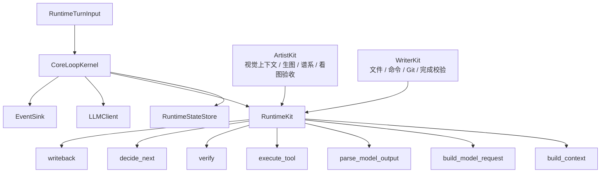
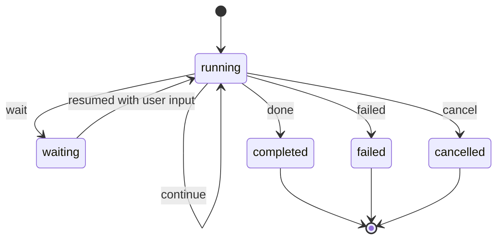

# Core Loop Kernel 设计

本文档定义 LamTools Core SDK 的共享运行内核。目标是合并 Artist / Writer / 后续成员的主循环骨架，同时不把任何成员的业务逻辑塞进 Core。

核心判断：

```text
Runtime 的骨架可以合并。
Runtime 的业务决策不能合并。
```

因此最终形态不是 `UniversalRuntime`，而是：

```text
CoreLoopKernel + RuntimeKit
```

Kernel 负责“怎么跑”，Kit 负责“这个成员的任务怎么算完成”。

## 1. 设计目标

Core Loop Kernel 要解决的问题：

- Artist 和 Writer 都有 while loop、模型调用、工具调用、验收、继续/等待/完成/失败。
- 两边现在各自维护事件、工具结果、完成判断、错误恢复，长期会分叉。
- 新成员如果继续复制一套 runtime，家族底座会越来越难统一。

Kernel 的目标：

- 抽出稳定主循环。
- 统一 loop 状态：`continue / wait / done / failed`。
- 统一工具执行结果回写。
- 统一事件发射入口。
- 统一错误、取消、超时、最大轮次保护。
- 让业务差异通过 RuntimeKit 注入。

Kernel 不追求：

- 不把 ArtistRuntime 和 WriterRuntime 直接搬进 SDK。
- 不支持 `if artist / if writer`。
- 不处理图像、文件、Git、小说设定等业务事实。
- 不定义具体前端渲染。
- 不绑定 FastAPI / SQLite / WebView。

## 2. 核心结构



## 3. 分工边界

### 3.1 Kernel 负责

- 加载和保存 `RuntimeState`。
- 创建 `run_id`、维护 `turn_count`。
- 发送通用生命周期事件。
- 调用 Kit 构建上下文。
- 通过 Core `LLMClient` 发起模型调用。
- 调用 Kit 解析模型输出。
- 执行 Kit 给出的工具调用。
- 将工具结果回写成下一轮模型可见的消息。
- 调用 Kit 做验收。
- 调用 Kit 决定下一步。
- 处理 `continue / wait / done / failed`。
- 处理最大轮次、取消、异常。

### 3.2 Kit 负责

- 构建业务上下文。
- 决定模型请求内容：JSON mode、tool calling、vision blocks、tools、temperature、metadata。
- 把模型输出解析成通用 `KernelTurn`。
- 执行业务工具。
- 做业务验收。
- 维护业务状态。
- 写回记忆、谱系、Git checkpoint、任务计划等业务事实。
- 把业务事件映射成 Core Event。

### 3.3 绝不进入 Kernel 的内容

- Artist 的参考图选择。
- Artist 的 visual workspace。
- Artist 的 lineage。
- Artist 的看图验收。
- Writer 的文件系统工具。
- Writer 的命令执行。
- Writer 的 Git 逻辑。
- Writer 的 `loop_position` 业务状态机（`WriterLoopPosition` 是 Writer 专有枚举，Kernel 用中性的 `LoopPhase`）。
- Writer 的 `task_plan` / `TaskPlanStep` / `PlanningDepth` / `TaskComplexity`（这些是 Writer 业务模型，Kernel 不认）。
- Writer 的 `CompletionVerifier`（业务验收器实现，Kernel 只认 `VerificationResult` 协议）。
- Writer 的 drift detection / doom loop / forced action（这些是 Writer 专有防护策略）。
- Writer 的 `design_agent` / `design_session`（业务设计流水线）。
- 任何产品页面或前端状态。

### 3.4 从 Writer 经验提炼的中性概念（进入 Core）

Writer 的 `loop_position = plan/execute/verify/idle` 揭示了一个通用模式：任何产品运行时都有「规划→执行→验收」三阶段循环。这不是 Writer 专有的——Artist 同样有「理解目标→生图→验收」、Coder 同样有「设计方案→写代码→跑测试」。

因此 Kernel 引入中性的 `LoopPhase`：

```text
LoopPhase = Literal["idle", "plan", "execute", "verify"]
```

这不是 Writer 的 `WriterLoopPosition`——后者绑定了 `TaskPlan`、`PlanningDepth`、`TaskComplexity` 等业务模型。Kernel 的 `LoopPhase` 只表达"当前循环在做什么"，具体含义由 Kit 注入。

进入 Core 的中性概念：

| Writer 模式 | 中性提炼 | 进入位置 |
| --- | --- | --- |
| loop_position 循环阶段 | LoopPhase (idle/plan/execute/verify) | KernelStep.phase, RuntimeState.position |
| completion_repair 循环 | VerificationResult + repair_prompt 注入 | Kernel 主循环 |
| verification attempt tracking | VerificationResult.attempt / max_attempts | VerificationResult |
| assistant response to history | 模型输出回写 history | Kernel 主循环 |
| cancel_event | 取消信号 | Kernel.cancel() |

留在 RuntimeKit 的 Writer 业务概念：

| Writer 模式 | 理由 | 留在哪 |
| --- | --- | --- |
| WriterLoopPosition | 绑定 TaskPlan 业务模型 | WriterKit 内部 |
| TaskPlan / TaskPlanStep | 业务计划模型 | WriterKit |
| PlanningDepth / TaskComplexity | 业务复杂度评估 | WriterKit |
| CompletionVerifier 实现 | 业务验收器（跑 pytest、npm build 等） | WriterKit |
| drift detection / doom loop | 专有防护策略 | WriterKit |
| forced action / hard cap | 专有防护策略 | WriterKit |
| design_agent / design_session | 业务设计流水线 | WriterKit |

## 4. 与当前 SDK 类型的关系

当前 Core 已有：

- `lamtools_core.llm`
- `lamtools_core.tool`
- `lamtools_core.event`
- `lamtools_core.prompt`
- `lamtools_core.mem`
- `lamtools_core.guardrail`
- `lamtools_core.runtime`

Kernel 应新增在：

```text
src/lamtools_core/kernel/
  __init__.py
  loop.py
  kit.py
  state.py
  policy.py
  errors.py
```

现有 `lamtools_core.runtime` 保留为协议和结果模型。`CoreLoopKernel` 可以实现现有 `RuntimeDriver` 协议，但不强行把全部 Kernel 类型塞进 `runtime/__init__.py`。

## 5. 核心类型

### 5.1 LoopDecision

Kernel 只认四种循环结果：

```python
LoopDecision = Literal["continue", "wait", "done", "failed"]
```

含义：

| 值 | 含义 | Kernel 行为 |
| --- | --- | --- |
| `continue` | 任务未完成，无需用户输入 | 进入下一轮 |
| `wait` | 任务未完成，需要用户输入 | 保存状态并退出/暂停 |
| `done` | 任务完成 | 保存完成状态并退出 |
| `failed` | 任务失败 | 保存失败状态并退出 |

注意：`wait` 不是失败，也不是完成。它是可恢复暂停。

### 5.1a LoopPhase

循环阶段，表达"当前循环在做什么"。

```python
LoopPhase = Literal["idle", "plan", "execute", "verify"]
```

含义：

| 值 | 含义 | 典型场景 |
| --- | --- | --- |
| `idle` | 未在循环中 | 初始状态、完成后 |
| `plan` | 规划阶段 | 理解任务、制定方案 |
| `execute` | 执行阶段 | 执行工具、生成产物 |
| `verify` | 验收阶段 | 检查产物、运行测试 |

`LoopPhase` 与 `LoopDecision` 是两个正交维度：

- `LoopDecision` = 循环的结果（继续/等待/完成/失败）
- `LoopPhase` = 循环的阶段（规划/执行/验收）

`LoopPhase` 记录在 `KernelStep.phase` 和 `RuntimeState.position` 中。Kit 的 `decide_next` 可以改变 `LoopPhase`——比如验收失败后从 `verify` 回到 `execute`，这就是 repair 循环。

`LoopPhase` 不是 Writer 的 `WriterLoopPosition`。后者绑定 `TaskPlan`、`PlanningDepth`、`TaskComplexity` 等业务模型。Kernel 的 `LoopPhase` 只提供阶段标记，不定义阶段内容。

### 5.2 KernelTurn

Kit 把业务模型输出转成 `KernelTurn`，Kernel 只读通用字段。

```python
@dataclass
class KernelTurn:
    reply: str = ""
    tool_calls: list[ToolCall] = field(default_factory=list)
    decision_hint: LoopDecision = "continue"
    wait_reason: str = ""
    repair_prompt: str = ""
    events: list[CoreEvent] = field(default_factory=list)
    metadata: dict[str, Any] = field(default_factory=dict)
```

说明：

- `reply` 是给用户的文本。
- `tool_calls` 是本轮要执行的工具。
- `decision_hint` 是模型或业务解析给出的初步状态，不是最终状态。
- `wait_reason` 用于 `wait`。
- `repair_prompt` 用于下一轮修复。
- `events` 是 Kit 产生的业务事件，Kernel 只转发。
- `metadata` 留给 Kit，不被 Kernel 解释。

### 5.3 VerificationResult

验收结果由 Kit 产生。

```python
@dataclass
class VerificationResult:
    passed: bool
    required: bool = False
    summary: str = ""
    repair_prompt: str = ""
    attempt: int = 0
    max_attempts: int = 3
    checks: list[CompletionCheck] = field(default_factory=list)
    events: list[CoreEvent] = field(default_factory=list)
    metadata: dict[str, Any] = field(default_factory=dict)
```

说明：

- `required=False` 表示本轮不需要验收。
- `passed=True` 不等于任务完成，只表示验收门通过。
- 是否 `done` 仍由 Kit 的 `decide_next` 决定。
- `attempt` 是当前修复尝试次数（0 = 首次验收，1 = 第 1 次修复后验收，...）。
- `max_attempts` 是最大修复尝试次数，由 Kit 设置（不同产品可设不同上限）。
- 当 `attempt >= max_attempts` 且 `passed=False` 时，Kernel 应转为 `failed`，不再继续修复。

### 5.4 KernelStep

每一轮 loop 的记录。

```python
@dataclass
class KernelStep:
    index: int
    state_before: RuntimeState
    turn: KernelTurn | None = None
    tool_steps: list[RuntimeToolStep] = field(default_factory=list)
    verification: VerificationResult | None = None
    decision: LoopDecision = "continue"
    phase: LoopPhase = "execute"
    error: str = ""
    events: list[CoreEvent] = field(default_factory=list)
    metadata: dict[str, Any] = field(default_factory=dict)
```

说明：

- `phase` 记录本轮循环的阶段。Kit 的 `decide_next` 可以改变下一轮的 `phase`。

### 5.5 KernelResult

整个 run 的输出。

```python
@dataclass
class RuntimeState:
    session_id: str
    history: list[dict[str, Any]] = field(default_factory=list)
    context: dict[str, Any] = field(default_factory=dict)
    position: LoopPhase = "idle"
    metadata: dict[str, Any] = field(default_factory=dict)
```

说明：

- `position` 记录当前循环阶段。初始为 `"idle"`，进入循环后由 Kit 更新。

## 6. RuntimeKit 协议

Kernel 不拆成很多碎 hook。每个成员实现一个 `RuntimeKit`，聚合业务能力。

```python
class RuntimeKit(Protocol):
    name: str

    async def on_run_start(
        self,
        state: RuntimeState,
        turn_input: RuntimeTurnInput,
    ) -> None: ...

    async def build_context(
        self,
        state: RuntimeState,
        turn_input: RuntimeTurnInput,
        history: list[LLMMessage],
        step_index: int,
    ) -> PromptContext: ...

    async def build_model_request(
        self,
        state: RuntimeState,
        context: PromptContext,
    ) -> LLMRequest: ...

    async def parse_model_output(
        self,
        state: RuntimeState,
        response: LLMResponse,
    ) -> KernelTurn: ...

    async def execute_tool(
        self,
        state: RuntimeState,
        call: ToolCall,
    ) -> ToolResult: ...

    async def format_tool_result_for_model(
        self,
        state: RuntimeState,
        call: ToolCall,
        result: ToolResult,
    ) -> LLMMessage: ...

    async def verify(
        self,
        state: RuntimeState,
        turn: KernelTurn,
        tool_results: list[ToolResult],
    ) -> VerificationResult: ...

    async def decide_next(
        self,
        state: RuntimeState,
        turn: KernelTurn,
        verification: VerificationResult,
        step: KernelStep,
    ) -> LoopDecision: ...

    async def writeback(
        self,
        state: RuntimeState,
        turn: KernelTurn,
        tool_results: list[ToolResult],
        verification: VerificationResult,
        decision: LoopDecision,
    ) -> None: ...

    async def on_run_end(
        self,
        state: RuntimeState,
        result: KernelResult,
    ) -> None: ...
```

### 6.1 为什么由 Kit 构建 LLMRequest

Artist 需要 vision blocks、JSON mode、参考图上下文。Writer 需要 function calling、工具 schema、项目上下文。Kernel 不应该知道这些差异。

但真正的模型调用由 Kernel 通过 Core `LLMClient` 执行。这样模型超时、重试、错误事件可以统一。

### 6.2 为什么保留 format_tool_result_for_model

工具结果回写给模型的格式是业务相关的：

- Artist 可能需要回写 artifact id、图片路径、验收目标。
- Writer 可能需要回写文件路径、命令退出码、测试摘要。

Kernel 只要求得到一条 `LLMMessage(role="tool")`，具体内容由 Kit 格式化。

### 6.3 为什么 decide_next 放在 Kit

完成条件是业务逻辑：

- Artist 必须确认图像产物满足用户目标。
- Writer 必须确认文件、测试、无 stub、无未完成目标。

Kernel 不能用“有文本回复”或“无工具调用”私自结束任务。Kernel 只能执行 Kit 的决策。

## 7. CoreLoopKernel 依赖

```python
@dataclass
class CoreLoopKernel:
    kit: RuntimeKit
    llm_client: LLMClient
    state_store: RuntimeStateStore
    event_sink: EventSink
    policy: LoopPolicy = field(default_factory=LoopPolicy)
```

### 7.1 LoopPolicy

```python
@dataclass
class LoopPolicy:
    model_timeout_seconds: float = 360.0
    model_retries: int = 3
    tool_timeout_seconds: float | None = None
    emit_debug_events: bool = False
    metadata: dict[str, Any] = field(default_factory=dict)
```

`LoopPolicy` 只包含通用运行策略。业务策略留在 Kit。

不要放入：

- `artist_pack_count`
- `image_quality`
- `writer_loop_position`
- `work_root`
- `git_branch`

## 8. 主循环算法

```text
1. load state
2. mark running
3. kit.on_run_start
4. append user input to history
5. repeat until terminal decision:
   5.1 check cancel → break if cancelled
   5.2 inject repair_prompt from previous step (if any)
   5.3 build context
   5.4 build model request
   5.5 call model with timeout/retry
   5.6 parse model output
   5.7 emit reply and kit events
   5.8 append assistant response to history
   5.9 execute tool calls
   5.10 append formatted tool results to history
   5.11 verify
   5.12 decide next
   5.13 writeback
   5.14 update LoopPhase from Kit
   5.15 save state
   5.16 break on wait/done/failed
6. kit.on_run_end
7. emit final event
8. return KernelResult
```

### 8.1 伪代码

```python
async def run(self, turn_input: RuntimeTurnInput) -> KernelResult:
    state = turn_input.state or await self.state_store.get(turn_input.metadata["session_id"])
    if state is None:
        state = RuntimeState(session_id=turn_input.metadata["session_id"])

    state.status = "running"
    await self.state_store.save(state)
    await self.kit.on_run_start(state, turn_input)

    history = self._initial_history(turn_input)
    steps: list[KernelStep] = []
    latest_message = ""
    final_decision: LoopDecision = "continue"

    index = 0
    while True:
        step = KernelStep(index=index, state_before=copy_state(state))
        steps.append(step)

        context = await self.kit.build_context(state, turn_input, history, index)
        request = await self.kit.build_model_request(state, context)
        response = await self._call_model(request)
        turn = await self.kit.parse_model_output(state, response)
        step.turn = turn

        if turn.reply:
            latest_message = turn.reply
            await self._emit_reply(state, turn.reply)

        for event in turn.events:
            await self.event_sink.emit(event)
            step.events.append(event)

        tool_results: list[ToolResult] = []
        for call in turn.tool_calls:
            result = await self._execute_tool(state, call)
            tool_results.append(result)
            tool_step = RuntimeToolStep(call=call, result=result)
            step.tool_steps.append(tool_step)

            tool_message = await self.kit.format_tool_result_for_model(state, call, result)
            history.append(tool_message)

        verification = await self.kit.verify(state, turn, tool_results)
        step.verification = verification

        for event in verification.events:
            await self.event_sink.emit(event)
            step.events.append(event)

        decision = await self.kit.decide_next(state, turn, verification, step)
        step.decision = decision
        final_decision = decision

        await self.kit.writeback(state, turn, tool_results, verification, decision)
        state.loop_state = decision
        state.turn_count += 1
        await self.state_store.save(state)

        if decision == "continue":
            index += 1
            continue
        if decision in {"wait", "done", "failed"}:
            break

    state.status = self._status_from_decision(final_decision)
    await self.state_store.save(state)

    result = KernelResult(
        session_id=state.session_id,
        run_id=state.run_id,
        decision=final_decision,
        message=latest_message,
        steps=steps,
        state=state,
    )
    await self.kit.on_run_end(state, result)
    await self._emit_terminal_event(state, result)
    return result
```

## 9. 状态机



状态映射：

| LoopDecision | RuntimeState.status |
| --- | --- |
| `continue` | `running` |
| `wait` | `waiting` |
| `done` | `completed` |
| `failed` | `failed` |

取消独立映射为 `cancelled`。

## 10. Wait / Resume 语义

`wait` 是核心状态，不是工具错误。

Kernel 遇到 `wait` 时：

- 保存 state。
- 发 `waiting` 事件。
- 返回 `KernelResult(decision="wait")`。
- 不阻塞等待用户输入。

下一次用户输入到来时，由产品 shell 再次调用 Kernel：

```text
previous state.status = waiting
new RuntimeTurnInput.user_message = 用户补充
Kernel 继续进入 running
```

这样可以兼容：

- Artist 缺参考图。
- Writer 等用户确认计划。
- Coder 等权限确认。
- Butler 等用户决策。

## 11. Tool 执行语义

Kernel 默认逐个执行 `ToolCall`。批量和并行由 Kit 决定：

- 如果业务希望并行，Kit 可以把一个 `ToolCall` 表达为 batch 工具。
- 或者未来在 Kernel 增加 `execute_tools` 可选 hook，但第一版不做。

工具执行流程：

```text
ToolCall
  -> kit.execute_tool
  -> ToolResult
  -> RuntimeToolStep
  -> kit.format_tool_result_for_model
  -> LLMMessage(role="tool")
```

Kernel 不按工具名分支。

## 12. 验收语义

验收固定发生在工具执行之后、决策之前。

```text
tool results -> verify -> decide_next
```

但是否真正验收，由 Kit 决定：

- Artist 可以每轮都做视觉观察和批量验收。
- Writer 可以只在 execute 完成后切到 verify。
- Coder 可以在测试工具执行后验收。

Kernel 不用 `verification.passed` 自动结束任务。  
任务是否完成只能由 `decide_next` 返回 `done`。

### 12a. Repair Loop 语义

Repair loop 是验收失败后继续修复的循环模式。

**Kernel 通用行为**（产品无关）：

1. 当 `VerificationResult.passed=False` 且 `repair_prompt` 非空时，Kernel 将 `repair_prompt` 注入下一轮的 history 作为 user message
2. Kit 通过 `decide_next` 返回 `LoopDecision.continue` 并在 step 中设置 `LoopPhase.execute`（回到执行阶段）
3. Kernel 递增 `VerificationResult.attempt`
4. 当 `attempt >= max_attempts` 时，即使有 `repair_prompt`，Kernel 也转为 `failed`

**注入格式**：

```python
# Kernel 将 repair_prompt 注入 history
history.append(ChatMessage(role="user", content=f"[verification feedback]\n{verification.repair_prompt}"))
```

**典型流程**：

```text
step 0: phase=execute → tools → verify (passed=False, attempt=0, repair_prompt="fix X")
  → decide_next → continue, phase=execute
step 1: [repair_prompt injected] → tools → verify (passed=True, attempt=1)
  → decide_next → done
```

这不是 Writer 专有的——Artist 验收图片质量失败后写"左手手指数量不对，请修复"是同一个模式。

### 12b. Assistant Response History 语义

模型输出（assistant response）必须回写到 history，否则模型在下一轮看不到自己先前的推理和工具调用。

**Kernel 行为**：

```python
# After parse_model_output, append assistant message to history
if turn.reply or turn.tool_calls:
    history.append(ChatMessage(
        role="assistant",
        content=turn.reply or "",
        tool_calls=turn.tool_calls if turn.tool_calls else None,
    ))
```

然后工具结果作为 `role="tool"` 消息追加，这样下一轮模型调用时 history 是完整的：

```text
user → assistant (reply + tool_calls) → tool (result) → tool (result) → ...
```

### 12c. Cancellation 语义

Kernel 支持外部取消信号。

**接口**：

```python
class CoreLoopKernel:
    def cancel(self) -> None:
        """Signal the kernel to stop at the next loop iteration."""
        self._cancel_event.set()
```

**Kernel 行为**：

- 在每次循环迭代开始时检查 `_cancel_event`
- 如果已设置，将 `final_decision = "failed"`，`error = "cancelled"`，退出循环
- 将状态标记为 `"cancelled"`
- 发 `runtime.cancelled` 事件

取消不是 `wait`——取消意味着任务中断，不是暂停等待恢复。

## 13. 事件语义

Kernel 发通用事件：

| 事件 | tag | 用途 |
| --- | --- | --- |
| `runtime.started` | `state` | run 开始 |
| `runtime.reply` | `reply` | 用户可见回复 |
| `runtime.tool.started` | `tool` | 工具开始 |
| `runtime.tool.finished` | `tool` | 工具结束 |
| `runtime.verification` | `progress` | 验收结果 |
| `runtime.waiting` | `decision` | 等用户 |
| `runtime.done` | `done` | 完成 |
| `runtime.failed` | `error` | 失败 |
| `runtime.debug` | `debug` | 开发调试 |

Kit 可以追加业务事件，但必须是 `CoreEvent`。产品 shell 再负责映射为旧 SSE 事件。

## 14. 错误语义

错误分三类：

| 类型 | 说明 | 默认处理 |
| --- | --- | --- |
| 模型错误 | LLM timeout / provider error / invalid response | 重试，超限后 failed |
| 工具错误 | ToolResult.status = failed / blocked | 交给 Kit verify/decide_next |
| Kernel 错误 | Kit 抛异常 / 状态保存失败 | failed |

工具失败不必然导致 Kernel failed。  
例如 Writer 工具失败后可以继续修复，Artist 生图失败后可以换策略。

## 15. Artist 接入方式

ArtistKit 映射：

| Kernel hook | Artist 实现 |
| --- | --- |
| `build_context` | 注入参考图、当前目标、visual workspace、task card、历史 artifact |
| `build_model_request` | 构建 VLM/LLM JSON 请求、视觉输入、response_format |
| `parse_model_output` | 解析 Artist JSON、tool calls、reply、status |
| `execute_tool` | 生图、修图、观察图片、finish、ask_user |
| `format_tool_result_for_model` | 回写 artifact id、图片摘要、验收目标 |
| `verify` | 视觉验收、batch review、identity contract |
| `decide_next` | 判断 continue / wait / done / failed |
| `writeback` | 更新 visual workspace、lineage、artifact metadata |

Artist 业务状态保存在 Kit 管理的 state metadata 或产品 state store 中。Kernel 不读取这些字段。

## 16. Writer 接入方式

WriterKit 映射：

| Kernel hook | Writer 实现 |
| --- | --- |
| `build_context` | 注入项目结构、计划、当前阶段、权限、历史摘要 |
| `build_model_request` | 构建 function calling 请求和工具 schema |
| `parse_model_output` | 解析 tool_calls / text / is_complete |
| `execute_tool` | 文件、命令、Git、MCP、agent |
| `format_tool_result_for_model` | 回写路径、退出码、摘要、错误签名 |
| `verify` | CompletionVerifier、测试结果、stub/缺文件检查 |
| `decide_next` | 处理 plan/execute/verify、修复、等待用户 |
| `writeback` | session memory、MEM、Git checkpoint、runtime state |

Writer 的 `loop_position` 是 WriterKit 内部状态，不进入 Kernel 枚举。

## 17. 为什么这比适配壳优雅

不优雅的方案：

```text
CoreLoop.run()
  if product == "artist": ...
  if product == "writer": ...
```

或者：

```text
ArtistRuntime -> ArtistAdapter -> CoreRuntime -> ArtistAdapterBack
```

本方案：

```text
CoreLoopKernel 只知道 RuntimeKit。
每个产品原生实现一个 Kit。
Kernel 不需要知道产品名。
```

这不是把业务代码“包一层”，而是把主循环责任重新分配：

- Core 拥有运行秩序。
- Kit 拥有业务判断。
- Shell 拥有持久化和 UI 适配。

## 18. 实现顺序

阶段 4 实现时按这个顺序：

1. 新建 `lamtools_core.kernel` 包。
2. 定义 `RuntimeKit`、`KernelTurn`、`VerificationResult`、`KernelStep`、`KernelResult`。
3. 定义 `LoopPolicy`。
4. 实现 `CoreLoopKernel`，先只支持非流式模型调用。
5. 写 mock Kit 测试 `continue`。
6. 写 mock Kit 测试 `wait`。
7. 写 mock Kit 测试 `done`。
8. 写 mock Kit 测试 `failed`。
9. 写工具失败但 loop 继续的测试。
10. 写 max steps 测试。

第一版不做：

- 流式 LLM delta。
- 并行 tool call。
- 内置产品 adapter。
- 真实 provider。
- 前端 SSE 映射。

## 19. 成功标准

Kernel 设计完成标准：

- 文档能指导实现。
- 没有产品名分支。
- 明确 Kernel / Kit / Shell 边界。
- 明确 wait/resume。
- 明确 tool result 回写。
- 明确 verify 插入点。
- 明确错误语义。

Kernel 实现完成标准：

- `py -3.14 -m pytest` 通过。
- Kernel 源码不出现 Artist / Writer / Artist。
- Kernel 可用 mock Kit 跑完整 loop。
- `continue / wait / done / failed` 全覆盖。
- Core Event 正常发出。
- StateStore 正常保存。

## 20. 风险控制

| 风险 | 表现 | 控制 |
| --- | --- | --- |
| Kit 过碎 | 接入时要实现十几个小接口 | 只保留一个 RuntimeKit，方法聚合 |
| Kernel 过胖 | Core 里出现业务字段 | 业务字段只进 Kit metadata |
| wait 语义混乱 | 等用户被当成 failed 或 done | wait 是一等状态，保存并返回 |
| 工具失败误终止 | 工具失败后 Kernel 直接 failed | 工具错误交给 Kit 决策 |
| 验收被 Kernel 简化 | Kernel 看到 passed 就 done | done 只能来自 Kit decide_next |
| 事件再分裂 | 前端继续处理产品事件名 | Kit/Shell 做 CoreEvent 映射 |
| 变成适配壳 | 产品 runtime 仍自己跑 loop | 迁移阶段必须让 Kernel 成为主循环 |

## 21. 自审

### 第一轮自审

问题：这个设计是否完备？

结论：基本完备，但最初草案里 `call_model` 完全交给 Kit，会削弱 Core LLM 协议价值。

修正：改为 Kit 构建 `LLMRequest`，Kernel 通过 Core `LLMClient` 调用模型。这样既保留业务差异，也统一模型调用。

问题：这个设计是否优雅？

结论：比单纯适配壳优雅，但如果 hook 太碎，会让接入成本高。

修正：保留一个 `RuntimeKit` 聚合接口，不拆成多个小插件。

### 第二轮自审

问题：是否清楚解释了 wait/resume？

结论：原草案倾向在 Kernel 内阻塞等待用户，不适合真实前后端。

修正：`wait` 现在保存状态并返回，由产品 shell 在下一次用户输入时恢复。

问题：是否清楚解释了工具失败和验收？

结论：需要避免工具失败直接终止，也需要避免验收通过直接完成。

修正：工具失败交给 Kit，验收结果只供 `decide_next` 使用，最终完成只能由 Kit 返回 `done`。

### 第三轮自审

问题：是否还有业务污染？

结论：文档举了 Artist / Writer 例子，但只在接入章节出现，没有进入 Kernel 类型和算法。

处理：保持示例章节，但明确 Kernel 源码不得出现产品名。

### 当前结论

这份设计是完备且优雅的。下一步可以进入阶段 4：实现 `lamtools_core.kernel`，先用 mock Kit 验证 Kernel 主循环，不接 Artist / Writer。

