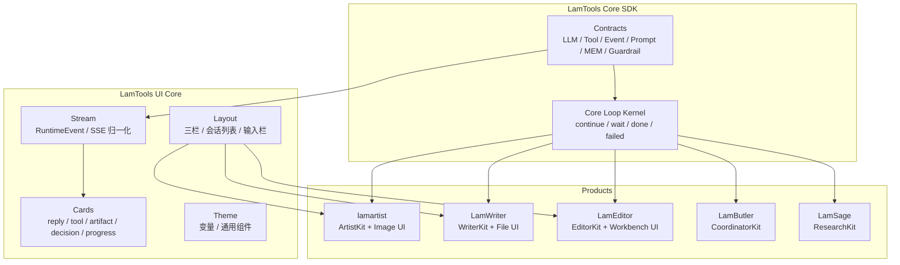

# LamTools Core SDK 完整抽调计划

> **⚠️ 历史参考文档**
> 本文档记录了 Core SDK 提取的原始规划过程。部分阶段描述（特别是阶段 9/10 的双轨并存、环境变量开关、旧 Runtime 对照路径）已过时。当前状态：
> - **CoreLoopKernel 是唯一运行时主路径**，不再有双轨开关
> - **RuntimeKit** 实际接口见 `core/src/lamtools_core/kernel/kit.py`（10 个方法，无 `tools` 字段）
> - **HookSet** 承载成员差异化逻辑，见 `core/src/lamtools_core/kernel/hooks.py`
> - 旧 `ArtistRuntime`/`WriterRuntime` 已删除
> - 环境变量 `LAMARTIST_ARTIST_CORE_KERNEL` / `LAMWRITER_CORE_KERNEL` 已不存在
> - `core/references/` 目录已删除
>
> 以 `docs/plans/single-track-runtime.md` 和 `docs/platform-hook-slot-protocol.md` 为准。

本文档定义从当前 `E:\LamTools\core` 状态到 LamTools 家族底座完全完工的整体计划。

目标不是做一个“工具包集合”，而是形成一套可长期复用的运行语言：

- 后端共享 `LamTools Core SDK`：LLM、Tool、Event、Prompt、MEM、Guardrail、Core Loop Kernel。
- 前端共享 `LamTools UI Core`：布局、会话、输入、事件流、过程卡、决策卡、通用设置。
- 各产品只保留自己的业务 Runtime Kit、业务工具、业务 UI 和人格。

## 1. 当前状态

已完成：

- `E:\LamTools\core` 已作为独立 git 仓库创建（后迁入 monorepo）。
- `references/Artist` 和 `references/writer` 已复制核心参考文件。
- 第一轮审计文档已完成（已归档）。
- 第二轮已实现 SDK 第一版骨架。
- 第三轮 review 已完成（已归档）。
- 当前 SDK 方向是协议骨架，不包含 Artist / Writer 业务实现。

尚未完成：

- Artist 尚未接入 Core SDK。
- Writer 尚未接入 Core SDK。
- Core Loop Kernel 尚未实现。
- 前端 UI Core 尚未设计。
- Core SDK 尚未独立发布或被产品正式依赖。

## 2. 最终目标

最终状态应该是：

```text
LamTools/
├── core/                # 通用运行语言和运行内核
│   ├── src/lamtools_core/
│   └── ui/
├── members/
│   ├── Artist/          # Artist Runtime Kit、图像工具、视觉工作区、谱系、图片 UI
│   ├── writer/          # Writer Runtime Kit、文件工具、命令工具、Git、工程验证、文件 UI
│   ├── editor/          # 新成员
│   ├── mate/            # 新成员
│   └── butler/          # 新成员
└── docs/
```

完成后，新成员不应再从零实现 LLM client、工具协议、事件协议、Prompt 片段、记忆接口、Guardrail、运行循环骨架。

## 3. 总体架构



核心原则：

- Core SDK 不知道 Artist。
- Core SDK 不知道 Writer。
- Core SDK 不知道 FastAPI、SQLite、WebView、Vue。
- Core SDK 不直接生图、不改文件、不跑命令。
- Core SDK 只表达模型调用、工具调用、事件、上下文、记忆、约束、循环状态。
- 产品通过 Runtime Kit 注入业务能力。

## 4. 分层模型

最终应保持四层：

| 层级 | 职责 | 不做什么 |
| --- | --- | --- |
| Core Contract | 通用协议和类型 | 不含业务工具 |
| Core Loop Kernel | 共享 while loop 骨架 | 不含图像、文件、Git 等业务判断 |
| Runtime Kit | 各成员业务上下文、工具、解析、验收、写回 | 不重新发明底层协议 |
| Product Shell | API、数据库、前端、桌面壳 | 不包含通用运行内核 |

### 4.1 Core Contract

已存在或应完善的模块：

```text
lamtools_core.llm
lamtools_core.tool
lamtools_core.event
lamtools_core.prompt
lamtools_core.mem
lamtools_core.guardrail
lamtools_core.runtime
```

职责：

- 定义稳定协议。
- 保持轻量。
- 可序列化。
- 可被 Artist / Writer / Editor 直接使用。

### 4.2 Core Loop Kernel

Core Loop Kernel 负责共享主循环骨架：

```text
load state
build context
call model
parse decision
execute tools
append tool results
verify
decide continue / wait / done / failed
writeback
emit events
loop or stop
```

它不判断“图像是否像 logo”，也不判断“文件是否测试通过”。这些由 Runtime Kit 提供。

### 4.3 Runtime Kit

每个成员提供自己的 Kit：

> **⚠️ 已过时** — 实际 RuntimeKit 接口见 `core/src/lamtools_core/kernel/kit.py`。当前有 10 个方法（含 `on_run_start`、`build_model_request`、`format_tool_result_for_model`、`on_run_end`），无 `tools: ToolRegistry` 字段。

```python
class RuntimeKit(Protocol):
    name: str
    tools: ToolRegistry

    async def build_context(self, state, turn): ...
    async def parse_model_output(self, output, context): ...
    async def execute_tool(self, call, context): ...
    async def verify(self, state, turn, tool_results): ...
    async def decide_next(self, state, decision, verification): ...
    async def writeback(self, state, result): ...
```

Artist Kit 负责：

- 视觉上下文。
- 参考图选择。
- 生图和修图工具。
- 画面验收。
- 视觉工作区。
- 图像谱系。

Writer Kit 负责：

- 项目上下文。
- 文件工具。
- 命令工具。
- Git。
- 权限。
- 完成验证。
- 修复循环。

## 5. 后端抽调路线

### 阶段 0：保护现场

目标：

- 确保抽调仓库独立。
- 确保 Artist / Writer 不被误改。

产物：

- `E:\LamTools\core`
- `references/Artist`
- `references/writer`
- git 初始提交

成功标准：

- `E:\LamTools\members\Artist` 和 `E:\LamTools\members\writer` 工作区不因 Core 抽调变脏。
- Core 仓库能独立提交。

状态：已完成。

### 阶段 1：SDK 骨架 Review

目标：

- 审查第二轮 OpenCode 实现。
- 保证第一版 SDK 是干净协议层。

产物：

- `docs/core-loop-kernel-design.md`

成功标准：

- Python 版本为 `>=3.14`。
- SDK 源码不 import `references`。
- SDK 源码不 import `app.*`。
- SDK 源码没有 Artist / Writer / Artist 专用命名。
- 测试通过：`py -3.14 -m pytest`。

状态：已完成。

### 阶段 2：Core Loop Kernel 设计

目标：

- 明确 Runtime 骨架如何合并。
- 把“Kernel + RuntimeKit”写成可实现方案。

产物：

- `docs/core-loop-kernel-design.md`

必须回答：

- Kernel 负责什么。
- Kit 负责什么。
- 状态如何表达。
- 工具结果如何回写给模型。
- 验收如何插入循环。
- `continue / wait / done / failed` 如何判定。
- 事件如何从业务事件映射到 Core Event。
- 如何避免 `if artist / if writer`。

成功标准：

- 文档能指导实现，不只是概念图。
- 没有 Artist / Writer 业务字段进入 Kernel。
- 能解释 Artist 和 Writer 两边如何接入。

### 阶段 3：完善 Core Contract

目标：

- 把第一版骨架补到可被真实产品引用。

重点模块：

- `lamtools_core.llm`
- `lamtools_core.tool`
- `lamtools_core.event`
- `lamtools_core.prompt`
- `lamtools_core.mem`
- `lamtools_core.guardrail`
- `lamtools_core.runtime`

成功标准：

- public 类型从对应模块导出。
- 所有核心模型可构造、可序列化。
- Tool registry 可注册和查找。
- Event 可转换为 dict。
- Prompt assembler 顺序稳定。
- 测试不依赖 references。

### 阶段 4：实现 Core Loop Kernel

目标：

- 实现共享主循环骨架，但不接业务。

建议结构：

```text
src/lamtools_core/kernel/
  __init__.py
  loop.py
  kit.py
  state.py
  policy.py
  errors.py
```

核心产物：

- `CoreLoopKernel`（含 repair_prompt 注入、assistant history 回写、cancel 支持）
- `RuntimeKit` 协议
- `LoopDecision`
- `LoopPhase`（idle / plan / execute / verify）
- `LoopPolicy`
- `RuntimeStateStore` 协议
- `VerificationResult`（含 attempt / max_attempts）

进入 Core 的中性概念（从 Writer 经验提炼）：

| 概念 | 理由 | Core 位置 |
| --- | --- | --- |
| LoopPhase (idle/plan/execute/verify) | 任何产品都有规划→执行→验收三阶段 | KernelStep.phase, RuntimeState.position |
| Repair prompt 注入 | 验收失败后修复是通用模式 | Kernel 主循环 |
| VerificationResult.attempt/max_attempts | 修复次数跟踪 | VerificationResult |
| Assistant response to history | 模型需要看到自己先前的输出 | Kernel 主循环 |
| Cancel signal | 任何运行时都需要取消 | Kernel.cancel() |

留在 RuntimeKit 的 Writer 业务概念：

| 概念 | 理由 | 留在哪 |
| --- | --- | --- |
| WriterLoopPosition | 绑定 TaskPlan 业务模型 | WriterKit |
| TaskPlan / TaskPlanStep | 业务计划模型 | WriterKit |
| PlanningDepth / TaskComplexity | 业务复杂度评估 | WriterKit |
| CompletionVerifier 实现 | 业务验收器（跑 pytest、npm build 等） | WriterKit |
| Drift detection / doom loop | 专有防护策略 | WriterKit |
| Forced action / hard cap | 专有防护策略 | WriterKit |
| Design agent / design session | 业务设计流水线 | WriterKit |

成功标准：

- Kernel 可用 mock Kit 跑完整 loop。
- Kernel 不包含业务工具。
- Kernel 不包含前端/数据库依赖。
- Kernel 可发 Core Event。
- 单元测试覆盖 `continue / wait / done / failed`。
- 单元测试覆盖 repair loop（verify→fail→repair→verify→pass→done）。
- 单元测试覆盖 LoopPhase 变化。
- 单元测试覆盖 cancel。
- 单元测试覆盖 assistant response 回写 history。
- Kernel 源码不出现 Artist / Writer / Artist。

### 阶段 5：Artist 最小接入 Event / Tool

目标：

- 让 Artist 低风险接入 Core。
- 不改变 Artist 行为。

接入范围：

- `lamtools_core.event`
- `lamtools_core.tool`

不接入：

- LLM client。
- Runtime Kernel。
- Prompt。
- MEM。

执行方式：

- 建一个薄 adapter，把现有 Artist 事件映射为 Core Event，再映射回前端现有事件形态。
- 建一个 DTO 映射，把 Artist tool call / tool result 映射为 Core ToolCall / ToolResult。
- 不迁移图像工具执行逻辑。

成功标准：

- Artist 真实生图流程行为不变。
- 前端事件显示不变。
- 现有 Artist 单元测试通过。
- 至少一条多轮 mock 或真实测试通过。

### 阶段 6：Writer 最小接入 Event / Tool

目标：

- Writer 对齐同一 Core Event / Tool。
- 不改变 Writer 行为。

成功标准：

- Writer 工具过程仍可正常显示。
- Writer decision / step / reply 事件能映射到 Core EventTag。
- 文件读写、命令、验收流程不退化。
- Writer 测试通过。

### 阶段 7：统一 LLM Client

目标：

- 把模型调用底座统一到 Core。
- 修复“每个项目各自处理 JSON / tool / stream / timeout”的重复问题。

接入顺序：

1. DTO 转换：产品请求转 Core `LLMRequest`。
2. 非流式响应：provider 响应转 Core `LLMResponse`。
3. 流式文本：统一 `LLMStreamEvent`。
4. 流式 tool call：统一合并和输出。
5. JSON mode：统一兼容策略。
6. 超时和重试：统一 policy。

成功标准：

- Artist / Writer 都能通过 Core LLM 协议调用模型。
- 不再各自修 provider JSON/tool 兼容问题。
- 真实模型 smoke test 通过。

状态：Core 协议层已完成。已提供 OpenAI-compatible adapter、payload/response/stream/tool call 归一化 helper、transport retry policy 类型。尚未接入 Artist / Writer 主链路。

### 阶段 8：Prompt / MEM / Guardrail 接入

目标：

- 把上下文、记忆、前置检查接口统一。
- 业务内容仍留产品侧。

接入原则：

- Core 提供片段和接口。
- Artist / Writer 提供具体片段内容。
- Core 不写 Artist system prompt。
- Core 不写 Writer 执行纪律。
- Core 不写具体 guardrail 规则。

成功标准：

- Prompt 组装顺序统一。
- MEM entry/query/hit 形态统一。
- Guardrail result 形态统一。
- 业务规则仍在产品侧。

状态：Core 协议层已完成。已补 Prompt 序列化和预算 helper、MEM budget 和 prompt fragment helper、Guardrail pipeline。尚未接入 Artist / Writer 主链路。

### 阶段 9：Artist 接入 Core Loop Kernel

目标：

- Artist Runtime 变成 `ArtistKit + CoreLoopKernel`。

迁移方式：

> **⚠️ 已过时** — 当前为单轨策略，旧 Runtime 不再作为对照路径保留。见 `docs/plans/deletion-list.md`。

1. 保留旧 Artist Runtime 作为对照路径。
2. 抽出 ArtistKit：
   - context
   - parser
   - tools
   - verifier
   - policy
   - writeback
3. Kernel 先跑一条简单生图链路。
4. 再跑修改链路。
5. 再跑多轮品牌套系链路。
6. 旧 Runtime 退出主路径。

成功标准：

- “画一只猫”真实/ mock 测试通过。
- “传图问是什么”测试通过。
- 多轮品牌视觉测试关键 turn 通过。
- 图像谱系不退化。
- 视觉工作区 active target 不退化。
- 完成状态不再依赖 max steps 兜底。

状态：已开始。

> **⚠️ 已过时** — CoreLoopKernel 现已是唯一主路径，环境变量开关已移除。见 `docs/plans/single-track-runtime.md`。

Artist 已新增实验性 `ArtistKit + CoreLoopKernel` 路径，并通过默认关闭的环境变量 `LAMARTIST_ARTIST_CORE_KERNEL=1` 接到 `handle_turn`。当前只覆盖文本回复、ask_user/finish、简单 direct generate_image；主路径默认仍使用旧 Artist Runtime。

### 阶段 10：Writer 接入 Core Loop Kernel

目标：

- Writer Runtime 变成 `WriterKit + CoreLoopKernel`。

迁移方式：

> **⚠️ 已过时** — 当前为单轨策略，旧 Runtime 不再作为对照路径保留。见 `docs/plans/deletion-list.md`。

1. 保留旧 Writer Runtime 作为对照路径。
2. 抽出 WriterKit：
   - context
   - parser
   - tools
   - verifier
   - policy
   - writeback
3. 先跑只读任务。
4. 再跑文件修改任务。
5. 再跑测试修复任务。
6. 再跑需要 decision 的任务。

成功标准：

- 文件读写工具可用。
- 命令工具可用。
- 权限判断可用。
- 完成校验可用。
- 修复循环可用。
- SSE 断开不误判完成。

### 阶段 11：清理后端重复实现

目标：

- 删除 Artist / Writer 中重复的底层协议。

清理对象：

- 重复 LLM DTO。
- 重复 Tool DTO。
- 重复 Event envelope。
- 重复 Prompt 基础模型。
- 重复 MEM 基础模型。
- 重复 Guardrail 基础结果。

不清理：

- 业务工具。
- 业务 prompt。
- 业务 verifier。
- 业务事件构造函数。
- 业务 UI。

成功标准：

- 没有双事实源。
- Artist / Writer 都 import `lamtools_core`。
- 删除旧代码后测试仍通过。

### 阶段 12：后端全链路测试

目标：

- 确认 Core 化没有破坏真实任务。

Artist 测试：

- 直接生图。
- 参考图识别。
- 局部修改。
- 多图套系。
- 多轮 active target。
- 完成验收。

Writer 测试：

- 只读问答。
- 文件创建。
- 文件修改。
- 命令执行。
- 测试失败修复。
- decision/wait。
- 完成校验。

成功标准：

- e2e 不使用 mock。
- mock 只用于 pipeline / unit。
- 两边真实任务通过。
- 回归问题记录清楚。

## 6. 前端抽调路线

前端要抽，但必须晚于后端 Event / Tool / RuntimeStatus 稳定之后。

原因：

- 前端共享包依赖后端事件形态。
- 后端事件未定时抽前端，会抽到临时结构。
- 前端先抽会增加返工。

### 阶段 13：UI Core 设计

目标：

- 明确前端哪些通用，哪些业务专用。

产物：

- `docs/ui-core-extraction-design.md`

应该抽：

- 三栏布局。
- 会话列表。
- 输入栏。
- 消息气泡。
- SSE / RuntimeEvent 状态管理。
- 工具过程卡。
- 决策点卡。
- 通用产物卡外壳。
- 设置/API Provider 配置。
- 主题变量。

不应该抽：

- Artist 图片批量展示。
- Artist 参考图。
- Artist 谱系。
- Artist 视觉工作区。
- Writer 文件 diff。
- Writer 终端输出。
- Writer Git 图。
- Writer 任务树。
- 产品专用导航和业务文案。

成功标准：

- Artist / Writer UI 差异被清楚分类。
- UI Core 不绑定单一产品。
- UI Core 的输入是 Core EventTag / RuntimeEvent，而不是某个产品的临时事件名。

### 阶段 14：UI Core 骨架

目标：

- 建前端共享包。

建议路径：

```text
E:\LamToolsUICore
```

或临时放：

```text
E:\LamTools\core\ui-core
```

最终建议独立仓库。

建议模块：

```text
src/
  event/
    normalizeRuntimeEvent.ts
    eventTags.ts
  stream/
    useRuntimeStream.ts
    runtimeStreamStore.ts
  chat/
    ChatShell.vue
    MessageList.vue
    Composer.vue
    ReplyBubble.vue
  cards/
    ToolCard.vue
    DecisionCard.vue
    ArtifactShell.vue
    ProgressCard.vue
  layout/
    ThreePaneLayout.vue
    SessionList.vue
  settings/
    ProviderSettings.vue
  theme/
    variables.css
```

成功标准：

- UI Core 可被两个前端引用。
- 不包含 Artist / Writer 业务卡内容。
- 组件样式和 LamWriter 骨架保持一致。

### 阶段 15：事件流 UI 统一

目标：

- Artist / Writer 前端都用同一套事件标签处理。

统一标签：

```text
reply
tool
artifact
decision
progress
state
error
done
debug
```

成功标准：

- 两边事件先归一化，再渲染。
- 前端不按 `artist_*` / `writer_*` 到处分叉。
- 产品业务事件只在 adapter 层转换。

### 阶段 16：通用聊天 UI 抽调

目标：

- 抽出会话基础体验。

抽出：

- 消息列表。
- 回复气泡。
- 输入栏。
- 会话空态。
- 流式 reply 渲染。
- 多段聊天回复。

成功标准：

- Artist / Writer 基础聊天体验一致。
- 产品只扩展业务产物显示。

### 阶段 17：通用过程卡抽调

目标：

- 抽工具过程、进度、决策、产物外壳。

抽出：

- `ToolCard`
- `ProgressCard`
- `DecisionCard`
- `ArtifactShell`
- `DebugLogPanel`

保留产品侧：

- Image artifact content。
- File diff content。
- Terminal output content。
- Git graph content。

成功标准：

- 普通过程统一。
- 业务内容可插槽扩展。
- 不再一条条图片消息占满聊天流。

### 阶段 18：设置/API 管理抽调

目标：

- 统一 API provider、模型、默认模型设置。

抽出：

- provider form。
- model form。
- default model selector。
- key 保存状态。
- 测试连接 UI。

成功标准：

- Artist / Writer 配置体验一致。
- 设置刷新后不丢。
- 业务默认模型名由产品配置，不写死在 UI Core。

### 阶段 19：产品 UI 回接

目标：

- Artist / Writer 接入 UI Core。

成功标准：

- Artist 图片工作流不退化。
- Writer 文件工作流不退化。
- 两边基础布局一致。
- 两边消息流一致。
- 业务扩展清晰。

## 7. 正式化和发布

### 阶段 20：SDK 正式化

目标：

- Core SDK 从实验仓库变成正式共享依赖。

产物：

- README。
- API 文档。
- 迁移文档。
- 版本号。
- 测试矩阵。
- 发布脚本。

成功标准：

- Artist / Writer 都能通过本地 editable install 或发布包引用。
- 新成员可以只依赖 Core 启动。
- Core API 有稳定版本。

### 阶段 21：家族启动模板

目标：

- 新成员可以快速创建。

产物：

- Runtime Kit 模板。
- Product Shell 模板。
- UI Core 接入模板。
- 测试模板。

成功标准：

- 新建一个成员不需要复制 Artist / Writer。
- 只需要实现自己的 Kit、业务工具和业务 UI。

## 8. 迁移顺序总览

推荐顺序：

```text
1. Core Loop Kernel 设计
2. Core Contract 完善
3. Kernel 单元测试
4. Artist 最小接 event/tool
5. Writer 最小接 event/tool
6. Artist/Writer 接 LLM DTO
7. Artist/Writer 接 Prompt/MEM/Guardrail 接口
8. Artist 接 Kernel
9. Writer 接 Kernel
10. 清理重复后端实现
11. 后端 e2e
12. UI Core 设计
13. UI Core 骨架
14. 前端事件流统一
15. 通用聊天 UI
16. 通用过程卡
17. 设置/API UI
18. 产品 UI 回接
19. Core 正式发布
```

不要反过来做。尤其不要在后端事件协议稳定前抽前端。

## 9. 风险和控制

| 风险 | 表现 | 控制方式 |
| --- | --- | --- |
| 过早合并业务 Runtime | Core 里出现 image/git/file 等业务字段 | 只合 Kernel，业务走 Kit |
| 抽象过度 | 每个 hook 太碎，接入困难 | 用 RuntimeKit 聚合能力 |
| 适配壳过多 | Core 只是搬运字段 | 先统一协议，再迁移主路径 |
| 前端过早抽 | 后端事件一变，UI Core 返工 | 后端 Event 稳定后再抽 UI |
| 双事实源 | Artist / Writer 各有一套 Core 类型 | 接入后删除旧重复实现 |
| 业务退化 | 生图、文件工具、验收出问题 | 每阶段保留旧路径对照和 e2e |

> **⚠️ 已过时** — 当前为单轨策略，不保留旧路径对照。
| 模型兼容问题 | JSON/tool/stream 又分裂 | LLM adapter 集中在 Core |
| 命名污染 | Core 出现 Artist / Writer | review 用 rg 硬查 |

## 10. 执行约束

每一轮都遵守：

- 只在当前目标仓库工作。
- 修改 Artist / Writer 前必须明确这是接入阶段。
- 不批量替换。
- 不把 references 当源码 import。
- 不把业务 Runtime 搬进 Core。
- 每个阶段有独立 commit。
- 每个阶段完成后跑最贴近的测试。
- 遇到 Core 与业务边界冲突时，优先保持 Core 干净，把差异留在 Runtime Kit。
