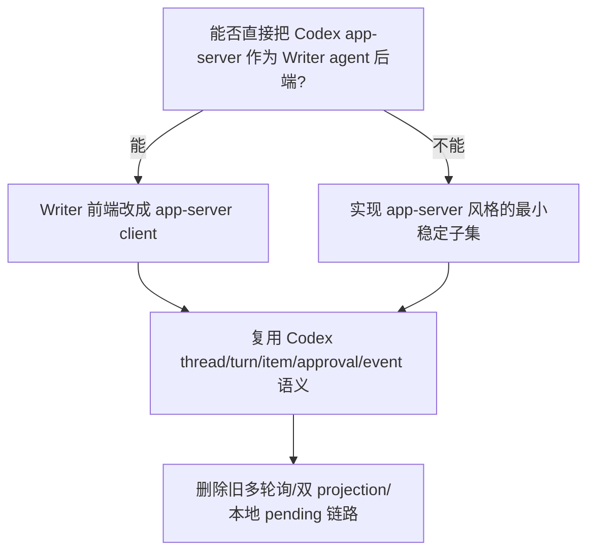
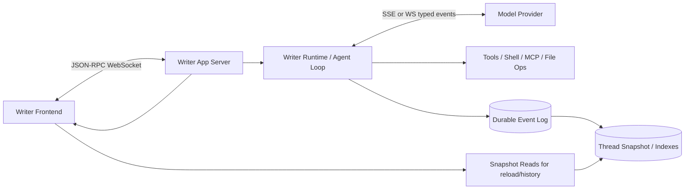
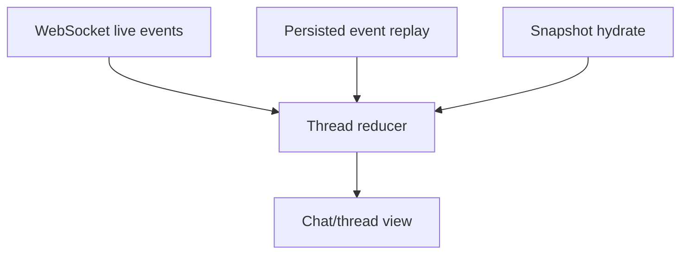
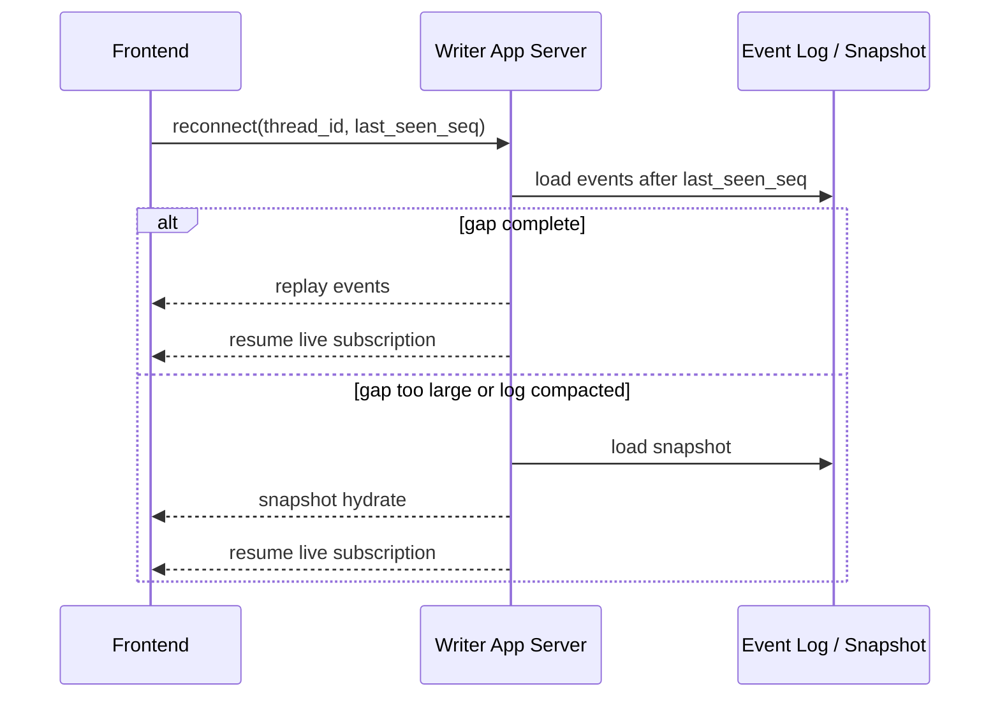

# OpenAI/Codex Realtime Alignment Research

更新时间：2026-06-24

## 不可丢失的任务约束

本文件是 Writer 前后端实时显示与运行链路整改的基准文档。后续如果上下文被压缩，必须以本节恢复原始目标。

用户明确要求：

1. 调查 OpenAI/Codex 成熟前端、后端方案，不做“差不多对齐”。
2. 每一次调查都记录在同一份文档里。
3. 每次记录后自审：如果内容不全、不完备，就继续补查并修改。
4. 目标是直接采用成熟方案作为 Writer 的可靠上限，不为了保留旧实现而拖慢未来开发。
5. 本阶段已进入整改实现；目标、代码和验收都必须继续以本文为基准，不允许退回旧链路补丁。

## 结论摘要

本整改目标的来源顺序必须固定：

```text
OpenAI/Codex 官方方案
  -> Writer 必须遵守的产品与协议约束
  -> LamTools 当前代码差异审计
  -> 删除、重构或少量保留
```

不能反过来从 LamTools 现有代码推导目标。任何 Writer 与 OpenAI/Codex 不一致的地方，都必须满足一个更高门槛：它不是为了兼容旧实现、减少改动量或绕过当前 bug，而是在 Writer 的本地产品边界内比 OpenAI 方案更简单、更完备、更稳定。不能证明这一点，就按 OpenAI/Codex 方案一致化。

Writer 应对齐的成熟方案不是“后端写 DB，前端用多个接口高频轮询 DB”。OpenAI/Codex 的公开成熟形态是：

```text
一个运行连接
  -> 初始化
  -> thread start/resume/read
  -> turn start/steer/interrupt
  -> 服务端持续推送 thread/turn/item 事件
  -> 客户端用同一个 reducer 渲染 live 与 replay
  -> 后端持久化事件日志与快照，用于刷新、恢复、审计
```

也就是说：

- 实时主链路：单条结构化事件流。
- 历史与恢复：持久化 event log / snapshot。
- 前端职责：渲染服务端事实，提交用户动作，维护纯 UI 状态。
- 后端职责：运行 agent loop、规范化 provider 事件、执行工具、处理审批、落库、推送事件。
- DB 职责：恢复、回放、审计、分页，不承担直播中的高频显示主链路。

这与 Writer 旧设计里的“通知 -> 重读多个 DB projection -> 前端重新拼”不同。旧方案虽然强调“事实来自后端”，但把直播路径做长了，也造成请求风暴、状态不同步、消息吞掉、工具过程缺失等风险。

## 官方资料源

| 来源 | 作用 | 结论 |
|---|---|---|
| OpenAI Codex App Server 文档 | Codex 丰富客户端的本地协议 | JSON-RPC 双向通信，thread/turn/item 为核心，运行事件通过通知流推送；`turn/start` 后继续读通知，`turn/steer` 追加到当前 in-flight turn，`turn/interrupt` 请求取消，最终由 `turn/completed` 给终态 |
| OpenAI Codex App Server README | 与官方文档交叉验证 | README 同样强调初始化、turn/start、item 事件、审批请求、bounded queue |
| OpenAI Responses Streaming 文档与 OpenAPI | provider 层 typed events | 输出不是纯字符串，而是 typed semantic event：created、output item added、content part added、text delta、done、completed |
| OpenAI Function Calling Streaming 文档 | 工具参数流式化 | 工具调用先有 `response.output_item.added`，随后有 arguments delta/done；不应等完整 JSON 后才显示工具 |
| OpenAI Realtime/WebSocket 文档 | 低延迟双向传输 | WebSocket 是低层双向事件连接，适合服务端到服务端；浏览器音频更推荐 WebRTC |
| OpenAI ChatKit 文档 | 产品化前端形态 | 前端 UI 通过会话 token 接入，widgets/actions 可以让服务端 stream 新 thread items |

参考链接：

- https://developers.openai.com/codex/app-server
- https://github.com/openai/codex/tree/main/codex-rs/app-server
- https://developers.openai.com/api/docs/guides/streaming-responses
- https://developers.openai.com/api/docs/guides/function-calling#streaming
- https://developers.openai.com/api/docs/guides/realtime-websocket
- https://developers.openai.com/api/docs/guides/chatkit
- https://developers.openai.com/api/docs/guides/custom-chatkit#use-actions
- https://developers.openai.com/api/docs/guides/chatkit-actions#in-response-to-user-interaction-with-widgets

## 调查记录

### Pass 1: Codex app-server 协议

OpenAI Codex app-server 是给 VS Code extension 等丰富客户端使用的本地接口。它不是“前端轮询多个 REST 接口”的形态，而是双向 JSON-RPC 2.0。

关键事实：

1. 连接建立后必须先 `initialize`，再发 `initialized`。
2. 新会话用 `thread/start`，继续旧会话用 `thread/resume`，读取历史用 `thread/read` 或 `thread/turns/list`。
3. 用户发起一次工作用 `turn/start`。
4. 运行中补充输入用 `turn/steer`，它追加到当前 in-flight turn，不创建新 turn。
5. 停止当前 turn 用 `turn/interrupt`。
6. `turn/start` 立即返回 accepted turn，真正运行时后端继续推 `turn/started`、`item/started`、`item/*/delta`、`item/completed`、`turn/completed`。
7. `ThreadItem` 是显示层核心对象，常见类型包括：
   - `userMessage`
   - `agentMessage`
   - `plan`
   - `reasoning`
   - `commandExecution`
   - `fileChange`
   - `mcpToolCall`
   - `dynamicToolCall`
   - `collabToolCall`
   - `webSearch`
   - `imageView`
   - `contextCompaction`
8. item 有统一生命周期：`item/started` 创建显示块，delta 更新显示块，`item/completed` 给最终权威状态。
9. 命令输出有 `command/exec/outputDelta`，进程输出有 `process/outputDelta`。
10. WebSocket 模式有 bounded queues；入口饱和时返回 `-32001 "Server overloaded; retry later."`，客户端应指数退避加 jitter。

对 Writer 的要求：

- 运行中展示必须以 item 生命周期为主，不等工具完成后一次性补一块。
- live 和 replay 必须复用同一套 item reducer。
- 历史读取是 snapshot/replay，不是直播主链路。
- 前端不能用本地 running/pending 覆盖 thread/turn/item 事件事实。

### Pass 2: Codex 审批流程

OpenAI app-server 把审批当作 server-initiated JSON-RPC request，不当作工具报错。

命令审批顺序：

1. `item/started`：先出现 pending `commandExecution`，包含 command、cwd、commandActions 等可显示信息。
2. `item/commandExecution/requestApproval`：服务端向客户端发审批请求，带 `threadId`、`turnId`、`itemId`、可用决策。
3. 客户端响应一次 decision，例如 accept、acceptForSession、decline、cancel。
4. `serverRequest/resolved`：确认请求已被回答或清理。
5. `item/completed`：给最终命令状态和输出。

文件改动审批同理：

1. `item/started` 出现 `fileChange`。
2. `item/fileChange/requestApproval` 请求决策。
3. 客户端响应。
4. `serverRequest/resolved`。
5. `item/completed` 给最终结果。

对 Writer 的要求：

- 审批卡片必须挂在对应 item 上，不能在过程区生成两个不一致卡片。
- 用户点击后应立即进入本地“已提交，等待服务端确认”的 UI 状态，防止重复点击。
- 服务端收到决策后必须落库并推 `serverRequest/resolved` 等价事件。
- 最终展示以 `item/completed` 为准，同时保留用户选择过的 decision。

### Pass 3: Responses API streaming

Responses API 的 streaming 不是普通字符串流，而是 typed semantic events。

典型顺序：

```text
response.created
response.in_progress
response.output_item.added
response.content_part.added
response.output_text.delta
response.output_text.done
response.content_part.done
response.output_item.done
response.completed
```

工具调用参数也支持流式：

```text
response.output_item.added
response.function_call_arguments.delta
response.function_call_arguments.done
```

对 Writer 的要求：

- 后端应把 provider typed events 规范化为 Writer runtime items。
- 前端不直接解析 provider 原始 event。
- 工具调用不能等参数 JSON 完成后才显示，`output_item.added` 时就应创建工具块。
- `response.completed` 才代表 provider 层一次模型响应结束；Writer 的 turn 完成还要等工具、审批、持久化、收尾事件结束。

### Pass 4: Realtime / WebSocket

OpenAI Realtime WebSocket 是持久双向事件连接。服务端通过同一 socket 收发 JSON 事件；浏览器音频场景推荐 WebRTC，但服务端到服务端或本地桥接场景 WebSocket 是低层、稳定、成熟的方案。

对 Writer 的要求：

- Writer 前端与 Writer 后端之间应使用一条 WebSocket JSON-RPC 或等价双向事件连接。
- SSE 可以流式下发，但审批、steer、interrupt、配置变更等都需要反向请求；最终会逼出 REST+SSE 双链路。
- 如果保留 SSE，只能作为过渡，不应作为目标上限。
- 本地 WebSocket 必须有 localhost/origin/token 限制，不能裸暴露。

### Pass 5: ChatKit 前端形态

ChatKit 是 OpenAI 公开的 agentic chat UI 层。它把前端拆成：

```text
应用后端创建会话 token
  -> 前端挂载 ChatKit UI
  -> UI 展示 thread items、工具调用、附件、思考可视化
  -> widget/action 发送到服务端
  -> 服务端可继续 stream 新 thread items 或更新 widget
```

对 Writer 的要求：

- 前端要像 ChatKit 一样消费高层 thread items，不理解 agent loop 内部细节。
- 按钮、审批、引用、排队、引导属于 UI action，但 action 结果必须由后端确认并形成事件。
- 文件、工具、附件、可视化应作为结构化 item 或 artifact，不塞进文本正文里。

### Pass 6: 与 Writer 现有设计的冲突点

现有 `writer-db-transcript-design.md` 的核心价值是“事实来自后端，前端不要猜”。这点是可靠的。

但它把实时显示表达为：

```text
provider typed event -> backend accumulator -> atomic DB flush -> transcript revision -> frontend snapshot
```

这在“刷新一致性”上正确，在“直播低延迟”上不是 OpenAI/Codex 成熟主链路。OpenAI 的成熟链路是：

```text
provider event -> runtime item event -> push to client + append durable log/snapshot
```

DB 应该是持久化事实源，不应该是每个直播 token 的 UI 唯一路由。否则链路变成：

```text
provider -> runtime -> DB -> revision -> frontend refetch -> projection -> render
```

这会产生：

- 请求风暴；
- browser `ERR_INSUFFICIENT_RESOURCES`；
- 直播与刷新不一致；
- 首次可见消息延迟；
- 队列消息被吞或重复派发；
- 工具过程需要等 DB projection 才出现；
- 多 endpoint 状态彼此覆盖。

因此新目标不是“回到前端本地猜”，而是“后端推送权威事件，同时后端持久化同一事件”。

## Writer 目标架构

### 直接使用优先级

用户要求的是“直接使用成熟方案”，不是随意仿制。因此实施前必须先做这个决策：



优先级：

1. 优先评估直接嵌入或桥接 OpenAI Codex app-server。
2. 如果产品边界、授权、工具体系、Writer 自有能力导致不能直接嵌入，则实现协议等价的 Writer app-server 子集。
3. “协议等价”不是保留旧实现后补字段，而是按 thread/turn/item/server-request/event-log 重新收敛主链路。
4. 不允许在旧 DB polling 主链路上继续叠加补丁，然后声称已对齐 OpenAI。

直接使用 Codex app-server 的评估项：

| 项目 | 要回答的问题 |
|---|---|
| 认证 | Writer 是否能复用 Codex/ChatGPT/OpenAI auth，还是必须保持自有 provider 配置 |
| 工具 | Writer 自有工具能否作为 MCP/dynamic tool 接入 |
| 工作区 | Writer work_root 与 Codex thread cwd/runtime workspace roots 是否能一一映射 |
| 历史 | Writer 现有 session 是否需要迁移到 Codex thread history |
| UI | Writer 是否只保留自有界面，把 Codex app-server 作为运行后端 |
| 分发 | 用户机器上是否稳定存在可调用的 Codex app-server |

如果任意关键项无法满足，才进入“实现 app-server 风格子集”。进入子集实现后，也必须保持 OpenAI 的业务语义，不回到旧链路。

### 总体链路



核心原则：

1. UI 只连一条运行主链路。
2. 运行事件由后端主动推送。
3. 所有推送事件同时 append 到持久化日志。
4. 刷新、重连、分页从持久化日志或 snapshot 恢复。
5. live/replay 共用同一个 reducer 和同一套 item schema。
6. 多 endpoint polling 只允许作为临时诊断工具，不允许成为产品主链路。

### 业务对象层级

| 层级 | 业务含义 | OpenAI 对齐 | Writer 落地 |
|---|---|---|---|
| Workspace / Work root | 项目根目录与权限边界 | thread cwd / runtime workspace roots | work_root |
| Thread / Session | 一段持续会话 | Thread | session |
| Turn | 用户一次请求及其后续 agent 工作 | Turn | turn |
| Item | 运行中可显示、可审计的最小业务块 | ThreadItem | user message、agent message、reasoning、tool、approval、file change |
| Delta | item 的增量内容 | item delta / response delta | text delta、args delta、stdout delta |
| Request | 服务端向客户端要决策 | server-initiated JSON-RPC request | approval、ask、upload、permission |
| Event Log | 可回放事实 | rollout/history | writer event ledger |
| Snapshot | 快速读取投影 | thread/read / turns/list | transcript/session projection |

### 事件协议

Writer 不需要照搬 OpenAI 每个字段，但必须保留等价语义。

最小事件集：

| 事件 | 作用 |
|---|---|
| `connection/initialized` | 客户端和服务端完成握手 |
| `thread/started` | 新会话创建或加载 |
| `thread/status/changed` | session 显示状态变化 |
| `turn/accepted` | 后端接受用户输入，返回 turn id |
| `turn/started` | turn 进入实际运行 |
| `turn/steered` | 当前 turn 接受引导输入 |
| `turn/interrupted` | 用户要求停止，等待终态事件 |
| `turn/completed` | turn 进入终态，含 usage、duration、final status |
| `item/started` | 新显示块出现 |
| `item/delta` | 文本、思考摘要、工具参数、stdout/stderr 等增量 |
| `item/requestApproval` | 需要用户决策 |
| `serverRequest/resolved` | 决策请求已被回答或清理 |
| `item/completed` | item 最终权威状态 |
| `queue/itemAccepted` | 输入已进入排队区 |
| `queue/itemDispatched` | 排队项已被后端派发成 turn |
| `queue/itemUpdated` | 编辑、删除、引导、失败等状态变化 |
| `error` | 协议级或运行级错误 |

事件字段要求：

| 字段 | 要求 |
|---|---|
| `event_id` | 全局唯一，支持去重 |
| `seq` | thread 内单调递增，决定展示时序 |
| `thread_id` | 必填 |
| `turn_id` | turn 相关事件必填 |
| `item_id` | item 相关事件必填 |
| `parent_item_id` | 并行/嵌套时必填，避免子代理、工具输出挂错块 |
| `client_message_id` | 用户提交生成，用于避免吞消息和重复提交 |
| `created_at` | 后端事件创建时间 |
| `payload` | 结构化正文 |

### live 与 replay 的唯一 reducer



规则：

1. live event、replay event、snapshot hydrate 都进入同一 reducer。
2. reducer 只处理业务 item，不做 provider 事件解析。
3. reducer 必须幂等：重复 event_id 不重复显示。
4. reducer 必须按 seq 排序：晚到事件不能破坏创建顺序。
5. 刷新后页面与刷新前页面只允许动画/展开状态不同，不允许业务内容不同。

### 事件落库、推送与重连

实时稳定的关键不是“推得快”，而是“推送与恢复看到的是同一份事实”。

事件处理顺序：

```text
运行事实产生
  -> 分配 thread 内 seq
  -> 写入 durable event log
  -> 推送给当前订阅客户端
  -> 更新 snapshot/projection index
```

规则：

1. 业务事件原则上先落 durable log，再推送。否则客户端看见过的事件可能在刷新后丢失。
2. 只有明确标为 ephemeral 的传输事件可以不入库，例如临时 socket ping、媒体传输细节。
3. 每个事件都有 `event_id` 和 `seq`，客户端用它去重和排序。
4. 客户端保存每个 thread 的 `last_seen_seq`。
5. WebSocket 重连后，客户端请求从 `last_seen_seq + 1` 开始 replay。
6. 如果服务端无法提供完整 gap replay，则返回 snapshot hydrate，并带新的 `snapshot_seq`。
7. 客户端 reducer 对 replay event 与 live event 一视同仁。
8. 如果客户端收到 seq gap，必须暂停增量渲染并请求补齐，不能靠本地猜顺序。
9. snapshot 只用于恢复和分页，不替代 running 时的事件主链路。

重连流程：



### 状态模型

OpenAI app-server 有 `inProgress`、`completed`、`failed`、`interrupted` 等原始终态/中间态。Writer 用户态只显示四类：

| Writer 显示状态 | 底层事实 |
|---|---|
| `running` | 有 active turn，且后端可以自动推进：模型流、工具执行、持久化收尾、recovery flush |
| `waiting` | 有 active turn，但存在未 resolved 的 server request，需要用户介入 |
| `completed` | turn 正常终结，最终回复 item 已完成 |
| `failed` | turn 已终结但没有正常最终回复，或被 interrupt/cancel/错误终结 |

注意：

- Stop 不是状态来源；Stop 只是发 `turn/interrupt`。后续显示 failed/completed 取决于最终事件。
- cancel/interrupted 不作为 Writer 顶层状态暴露，映射到 failed，但保留 `raw_end_reason`。
- session 不需要独立状态机；前端显示最新 turn 的投影状态。
- waiting 不是一个 item；它是 unresolved request 导致的 turn 状态。对应审批/ask/upload 卡片仍是 item/request。
- `idle` 只用于没有任何 turn 的新会话。只要会话已经有 turn，显示状态就必须来自最新 turn：`running`、`waiting`、`completed` 或 `failed`。

### 用户输入与排队

OpenAI 原生能力里，运行中补充输入对应 `turn/steer`。Writer 还需要“下一轮排队”，这是产品需求，可以在 OpenAI 模型上做一层清晰扩展。

规则：

1. 空闲时发送：调用 `turn/start`。
2. 运行中发送且用户选择“引导”：调用 `turn/steer`，带 expected turn id。
3. 运行中普通发送：创建 queue item，不写 transcript。
4. waiting 时普通发送：创建 queue item；如果用户选择“引导”，也必须挂到 active turn 并由后端确认。
5. completed 后：后端自动认领 FIFO 第一条 queue item，复用 `turn/start` 创建下一 turn。
6. failed 后：队列保留，不自动派发，等待用户修复或重试。

提交可靠性：

- 前端生成 `client_message_id`。
- 后端返回 accepted 事件后，前端才能清空输入框。
- 如果连接断开，前端用同一 `client_message_id` 查询/重试，不能重复创建。
- UI 不再显示本地假消息；用户消息必须来自 `turn/accepted` 或后续 `userMessage` item。

### 工具与命令显示

工具过程必须以 item 为单位流式显示。

命令执行：

```text
item/started commandExecution
item/requestApproval?
serverRequest/resolved?
item/delta stdout/stderr
item/completed commandExecution
```

MCP / 动态工具：

```text
item/started mcpToolCall/dynamicToolCall
item/delta arguments/content/progress
item/completed result/error
```

文件改动：

```text
item/started fileChange
item/requestApproval?
serverRequest/resolved?
item/completed fileChange
```

规则：

- 工具块在开始时立即出现。
- stdout/stderr/参数/result 都按 delta 更新。
- 最终是否成功只看 `item/completed`。
- 工具输出过大时，事件里放摘要和 artifact id，完整内容走 lazy load。

### artifact 与文件

Artifact 不直接塞进 DB 大字段。

推荐字段：

| 字段 | 作用 |
|---|---|
| `artifact_id` | 稳定引用 |
| `thread_id` / `turn_id` / `item_id` | 归属 |
| `kind` | image、pdf、text、diff、command_output 等 |
| `name` | 用户可见文件名 |
| `path` | 后端校验后的本地路径 |
| `mime_type` | 预览方式 |
| `size_bytes` | 懒加载判断 |
| `created_at` | 排序与审计 |

前端只展示小卡片和必要预览；点击打开、引用、预览都必须回到后端校验归属和路径。

### 持久化策略

Writer 默认数据库仍可使用：

```text
C:/Users/Administrator/AppData/Roaming/LamWriter/lamwriter.db
```

但数据库角色需要调整：

| 用途 | 是否直播主链路 |
|---|---|
| append event log | 是运行事实，但不是 UI 轮询入口 |
| snapshot / projection | 刷新、重连、分页 |
| queue item | 可靠排队与恢复 |
| approval decision | 审计与刷新后显示 |
| artifact index | 懒加载与权限校验 |
| UI 每 250ms 轮询多个 endpoint | 不允许作为目标架构 |

建议仍然一个 Writer DB，不按 session 拆 DB。原因：

- 跨 session 列表、检索、归档、指标更简单。
- SQLite WAL 足以支持本地单用户高频 append。
- 每个 session 一个 DB 会让迁移、索引、备份、清理复杂化。

### 传输选择

目标方案：

| 传输 | 用途 | 结论 |
|---|---|---|
| WebSocket JSON-RPC | Writer 前端与后端主链路 | 推荐 |
| stdio JSONL | CLI/桌面内嵌 app-server | 可选 |
| SSE | 只下行通知 | 不作为最终目标 |
| REST | snapshot、artifact、配置、历史分页 | 保留 |
| DB polling | 临时降级或诊断 | 不能作为产品主链路 |

为什么不用 SSE 作为目标：

- 审批、turn/steer、interrupt 都需要前端到后端的响应。
- REST+SSE 会重新形成双通道和时序问题。
- OpenAI Codex app-server 的成熟形态是双向 JSON-RPC。

### 资源与背压

必须删除请求风暴。

目标资源模型：

1. 一个前端 session 只保留一个主 WebSocket。
2. snapshot/history 使用按需 REST。
3. 服务端对 ingress/outbound 使用 bounded queue。
4. 饱和时返回 retryable overload，前端指数退避。
5. 前端不能在 running 时并发刷 transcript、queue、messages、session、status 多个 endpoint。
6. active event flush 可小批量合并，但合并窗口应可测，目标不超过 100ms。

### 可观察性

每个 turn 必须记录：

| 指标 | 说明 |
|---|---|
| submit_at | 前端点击或回车时间 |
| accepted_at | 后端接受并返回 turn/queue id |
| run_started_at | agent loop 开始 |
| provider_request_at | 发出模型请求 |
| provider_first_event_at | provider 首事件 |
| first_item_visible_at | 前端首个 item 可见 |
| first_text_delta_at | 首个正文 delta |
| approval_requested_at | 审批请求出现 |
| approval_decision_at | 用户决策 |
| item_completed_at | item 完成 |
| turn_completed_at | turn 完成 |

这些时间用于区分：

- 我们自己的启动成本；
- provider 首 token 慢；
- 前端渲染慢；
- 持久化慢；
- 网络/连接慢。

## 必须删除的旧链路

| 旧链路 | 问题 | 处理 |
|---|---|---|
| 前端本地 pending message 进聊天区 | 造成假发送、吞消息 | 删除 |
| browser memory queue | 刷新丢失、不可审计 | 删除 |
| SSE store 覆盖 running/status | 刷新前后状态不一致 | 删除 |
| live/replay 两套 transcript builder | 工具显示、顺序、折叠不一致 | 删除 |
| 多 endpoint active polling | 请求风暴和高延迟 | 删除 |
| DB revision 高频轮询作为直播主链路 | 链路过长 | 改为 event stream |
| 前端从 id/text 猜 block 类型 | 类型错挂、重复块 | 删除 |
| 工具完成后补全过程块 | 运行中不可见 | 改为 item/started + delta |
| approval 当作 tool error | 用户无法决策 | 改为 server request |
| stop 直接写 failed | 状态来源错误 | 改为 interrupt action + final event |

删除标准：只要某段代码能在没有后端 event/item 事实时显示业务内容，就应删除。

## 实施路线

### 阶段 1：协议骨架

1. 定义 Writer app-server event schema。
2. 后端建立 WebSocket JSON-RPC 主连接。
3. 前端建立单连接 client。
4. 增加 event ledger append。
5. 实现 live/replay 共用 reducer。

### 阶段 2：turn 与 item

1. `turn/start` 返回 accepted turn。
2. agent loop 推 `turn/started`。
3. provider typed events 规范化成 item 事件。
4. 支持 agentMessage、reasoning、commandExecution、fileChange、mcpToolCall。
5. `turn/completed` 统一终态。

### 阶段 3：审批与工具

1. 命令、文件、MCP 审批都改成 server request。
2. 点击后立即锁定 decision UI。
3. 落库 decision。
4. 推 `serverRequest/resolved`。
5. `item/completed` 作为最终权威。

### 阶段 4：排队与引导

1. 空闲发送走 `turn/start`。
2. 运行中引导走 `turn/steer`。
3. 普通运行中发送走 queue item。
4. backend dispatcher FIFO 派发。
5. idempotency 防重复发送。

### 阶段 5：删除旧链路

1. 删除本地 pending message。
2. 删除 browser queue。
3. 删除 SSE running 覆盖。
4. 删除多 endpoint active polling。
5. 删除 live/replay 双 builder。
6. 删除 DB-only live refetch 路径。

### 阶段 6：验收与压测

1. 用真实前端连续发送、排队、自动派发、审批、工具、刷新。
2. 用长上下文任务复现旧 20s-60s 延迟场景。
3. 记录每段延迟分解。
4. 检查浏览器 network：主链路只应有一个 WebSocket 和按需 REST。
5. 刷新前后事件 replay 与 live view 一致。

## 验收标准

| 项目 | 标准 |
|---|---|
| 发送可见性 | 点击发送到 accepted/queued 可见不超过 300ms；理想小于 150ms |
| 首个运行块 | `turn/started` 或首个 `item/started` 到 UI 可见不超过 200ms |
| 工具显示 | 工具开始时立即显示，输出按 delta 更新 |
| 审批 | 审批请求出现时 UI 可决策；点击后立即锁定，不可重复提交 |
| 排队 | running/waiting 普通发送只进入 queue tray，不进 transcript |
| 自动派发 | completed 后 500ms 内尝试派发 FIFO 第一项 |
| 重复点击 | 同一 approval/request 只能被服务端接受一次 |
| 刷新一致性 | live 与 replay 业务内容、顺序、状态一致 |
| 资源占用 | 一个活跃会话一个主连接，无多 endpoint 轮询风暴 |
| 顺序 | 所有块按后端 seq 排序，嵌套输出不串到其他 item |
| 失败状态 | interrupt/cancel/error 映射为 failed，并保留 raw reason |
| provider 慢 | provider 超过 1.2s 无 delta 时，UI 可显示运行中 item，但不得伪造事实 |

## 自审记录

### 审查 1：资料是否覆盖完整？

清单：

- Codex rich client 协议：已覆盖。
- turn/thread/item 层级：已覆盖。
- item lifecycle：已覆盖。
- tool / command / file change：已覆盖。
- approval request：已覆盖。
- provider streaming：已覆盖。
- function call streaming：已覆盖。
- realtime transport：已覆盖。
- ChatKit 前端形态：已覆盖。
- Writer 旧设计冲突：已覆盖。

结论：架构层资料完整。

### 审查 2：是否足以交给工程师实现？

工程师还需要两类细节：

1. Writer 自己的事件 TypeScript/Python schema。
2. 当前代码删除点的文件级清单。

本文件已经给出业务协议、状态机、事件集、传输选择、删除标准、验收标准。实现前应再产出一份工程拆分计划，但不应再讨论“要不要继续 DB-only 直播链路”。

结论：足以作为整改基准；下一步不是继续补旧方案，而是按本文设计写工程计划。

### 审查 3：是否仍有不确定性？

不确定性：

- GitHub `git clone/ls-remote` 当前连接不稳定，但 raw README 已成功读取，并与 OpenAI Docs MCP 内容一致。
- OpenAI app-server 的完整字段会随 Codex 版本变化；Writer 不应盲目复制所有字段，而应复制语义模型，并为自己的事件协议做版本化 schema。
- 是否能直接嵌入真实 Codex app-server 还需要工程评估；如果不能嵌入，才实现 app-server 风格子集。

处理：

- 实现时优先参考当前安装 Codex 可生成的 schema，或在 Writer 内定义最小稳定子集。
- 不把 experimental 字段作为第一版硬依赖。
- 工程计划第一项必须是“直接嵌入 Codex app-server 可行性评估”，不允许默认自研。

结论：不影响本文核心架构判断。

## 最终判断

本轮调查后的明确结论：

1. Writer 应采用 OpenAI/Codex app-server 风格的单主连接、结构化事件流、持久化 event log。
2. DB-backed snapshot 应用于刷新、重连、分页、审计，不再作为直播显示主链路。
3. 前端应像 ChatKit/Codex rich client 一样消费 thread/turn/item 事件，不解析 provider 原始流，不从本地状态伪造业务内容。
4. 工具、审批、文件、artifact、排队、引导都必须进入同一运行事件模型。
5. 旧的多轮询、多 projection、SSE running override、本地 pending/queue 逻辑应在整改中删除。
