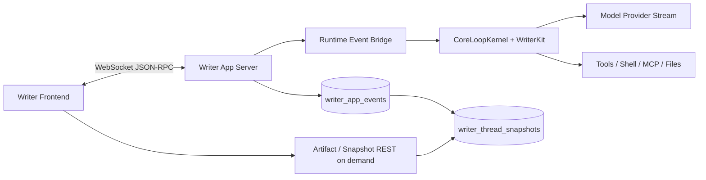
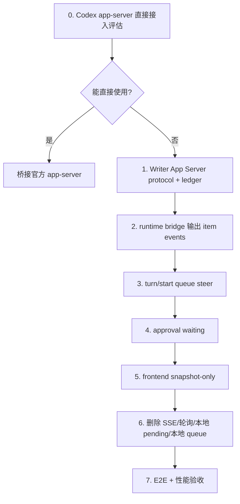

# Writer App Server Implementation Plan

更新时间：2026-06-30

维护标注（2026-06-30）：本文是 Writer App Server 整改的执行计划和历史裁决依据，其中“前端单 reducer”是当时为解决 live/replay 分歧提出的过渡方案。后续精简已经把产品主线进一步收敛为 **后端唯一 snapshot reducer + 前端 snapshot hydration/selectors**：`members/writer/frontend/src/appServer/reducer.ts` 已删除，当前前端不再 replay app-server events。

## 目的

本文件是给工程师直接执行的整改方案。目标不是继续修补 Writer 现有的 SSE、DB 轮询、前端 pending、前端 queue、live/replay 双投影链路，而是把 Writer 的实时运行链路对齐 OpenAI Codex app-server 的成熟形态：

```text
一个双向运行连接
  -> initialize
  -> thread/session start/resume/read
  -> turn start/steer/interrupt
  -> 后端持续推送 thread/turn/item/request 事件
  -> 前端渲染后端权威 snapshot
  -> 后端把同一批事件 append 到 durable event log
  -> snapshot 只服务刷新、重连、分页、审计
```

必须同时满足：

1. 先评估能否直接嵌入或桥接官方 Codex app-server；不可行时才实现 Writer App Server 子集。
2. 不再把 DB polling 当成直播显示主链路。
3. 不再让前端本地状态伪造用户消息、运行状态、工具过程、审批结果或队列内容。
4. live、resume 与刷新后的 UI 必须来自同一份后端 snapshot 语义；前端不得恢复第二套事件 reducer。
5. 旧的重复链路必须删除，不允许作为“兼容兜底”继续参与业务显示。

参考基准文档：

- `docs/openai-codex-realtime-alignment-research.md`
- `docs/writer-db-transcript-design.md`，只继承“后端事实为准”和状态推导原则；废弃“DB 投影作为直播主路”的结论。
- `docs/writer-queued-input-and-realtime-design.md`，只继承“排队是后端事实”和状态/排队规则；废弃“轮询 transcript/queue 作为成熟实时方案”的结论。

官方参考：

- https://developers.openai.com/codex/app-server
- https://github.com/openai/codex/tree/main/codex-rs/app-server
- https://developers.openai.com/api/docs/guides/streaming-responses
- https://developers.openai.com/api/docs/guides/function-calling#streaming
- https://developers.openai.com/api/docs/guides/realtime-websocket
- https://developers.openai.com/api/docs/guides/chatkit

## 目标来源与裁决规则

本整改目标不能由实现者自行脑补，也不能以“当前代码能跑”为准。目标只能来自以下四类事实，并按顺序裁决：

1. OpenAI/Codex 官方 app-server 的交互模型、协议语义和成熟产品表现。
2. 本文档已经固化的 Writer 产品目标、状态规则、队列规则、审批规则和验收指标。
3. 真实浏览器端到端测试得到的可复现数据。
4. 当前代码实现，只能作为待验证材料，不能反过来定义正确设计。

如果实现与 OpenAI/Codex 官方方案不一致，工程师必须证明 Writer 的方案在本产品约束下更完整、更简单、更稳定；证明不了，就按官方方案收敛。

如果实现与本文档不一致，不能把不一致解释成“已完成”。必须先更新设计文档并说明理由，再改实现和验收。

如果测试数据与主观判断不一致，以测试数据为准。延迟、状态、顺序、审批、队列、刷新一致性都必须有可复现证据。

交付时“完成”的含义是：本文档验收清单全部通过，且没有仍参与产品主链路的旧路径、脏事件来源、双状态投影或本地伪造业务事实。

## 命名边界

不要把我们的实现命名为 `Codex App Server`。这个名字只指 OpenAI 官方组件。

| 名称 | 含义 |
|---|---|
| Codex app-server | OpenAI 官方参考实现和协议来源 |
| Writer App Server | Writer 自己的 app-server 风格实现 |
| Lam App Server Protocol | 未来如果 Writer 和 Artist 共用，再抽出的共享协议名 |

第一版只做 Writer，不放进 `core/`。只有 Artist 也需要同一协议时，才按 monorepo 原则抽到 `core/`。

## 不可协商约束

1. 前端只做两件事：提交用户动作、渲染后端事件事实。
2. 后端是唯一业务事实生产者：turn、item、delta、queue、approval、artifact、status 都由后端生成事件。
3. DB 是 durable event log 和 snapshot，不是 live UI 的高频读取中转站。
4. 所有事件都有 `event_id` 与 thread 内单调 `seq`。
5. 所有用户输入都有 `client_message_id`，用于去重和重试。
6. 工具和命令必须在开始时出现 item，输出用 delta 持续更新。
7. 审批、ask、upload、permission 都是 server request，不是工具报错。
8. 用户点击审批后，UI 立即锁定该请求；后端只接受一次决策。
9. Stop 只是 `turn/interrupt` 动作，不直接写最终状态。
10. `running`、`waiting`、`completed`、`failed` 是从底层事实推导出来的显示状态。
11. running/waiting 时普通发送进入后端 queue tray；只有“引导本轮”进入 active turn。
12. completed 后后端自动派发 FIFO 第一条 queued input；failed 后不自动派发。
13. 刷新前后业务内容、顺序、状态必须一致。
14. 如果某段旧代码能在没有后端 item/event 事实时显示业务内容，必须删除。

## 总体架构



核心路线：

1. 前端打开一个 WebSocket JSON-RPC 连接。
2. 连接完成 `initialize` / `initialized`。
3. 前端用 `thread/start` 或 `thread/resume` 选择会话。
4. 用户发送时调用 `turn/start`；运行中引导调用 `turn/steer`；停止调用 `turn/interrupt`。
5. 后端把 runtime/provider/tool 事实规范化成 `thread/*`、`turn/*`、`item/*`、`queue/*`、`serverRequest/*` 事件。
6. 后端先 append durable event log，再推给订阅前端，再更新 snapshot。
7. 前端只 hydrate 后端 snapshot，并通过 selectors 输出 UI 需要的 messages、queue、approval、status、artifacts。
8. REST 只保留历史分页、artifact、配置、健康检查等按需能力。

## 直接使用 Codex App Server 的可行性门槛

实施第一步不是写 Writer WebSocket，而是评估能不能直接用官方 Codex app-server。

### 必做验证

在仓库根目录执行并记录结果：

```powershell
codex app-server --help
codex app-server generate-ts --out tmp/codex-app-server-schema
codex app-server --listen ws://127.0.0.1:0
```

如果端口不能设为 `0`，改用一个空闲本地端口，例如 `127.0.0.1:7005`。

验证项：

| 项 | 通过标准 | 失败后的处理 |
|---|---|---|
| 本机可启动 | `codex app-server` 可被进程管理器稳定启动 | 记录错误，进入 Writer App Server 子集实现 |
| schema 可生成 | 能生成当前 Codex 版本的 TS/JSON schema | 记录缺失，进入子集实现 |
| auth 可接入 | Writer 能使用现有 OpenAI/Codex 认证，或能作为 host 提供凭证 | 不能接入则进入子集实现 |
| workspace 可映射 | Writer `work_root` 能映射到 Codex `cwd` / workspace roots | 不能映射则进入子集实现 |
| tools 可迁移 | Writer 工具能通过 MCP/dynamic tool/文件 API 接入 | 不能迁移则进入子集实现 |
| history 可接受 | Writer session 可以迁移或直接读 Codex thread history | 不能接受则进入子集实现 |
| UI 可保持 | Writer 前端能作为 rich client 使用 app-server event | 不能保持则进入子集实现 |

输出文件：

```text
docs/writer-codex-app-server-feasibility.md
```

该文件必须明确写出：

```text
decision: direct | writer-subset
reason:
blocking_items:
evidence:
```

只有 `decision: writer-subset` 且有证据说明不能直接接入时，才进入后续自研子集。不能跳过此门槛。

### 如果 decision 是 direct

直接桥接官方 Codex app-server 时，工程路线改为：

1. Writer 后端只做 host/process manager：
   - 启动和停止 `codex app-server`；
   - 管理本地 loopback WebSocket 地址；
   - 管理 token 或 bearer auth；
   - 把 Writer work_root 映射为 Codex `cwd`。
2. Writer 前端直接作为 app-server client：
   - 使用 Codex 生成的 TypeScript schema；
   - 连接官方 app-server；
   - 消费官方 thread/turn/item/server request events；
   - 保留 Writer 的视觉层和业务入口。
3. Writer 自有工具必须通过 Codex 支持的 MCP/dynamic tool/file-system surface 接入。
4. 旧 Writer SSE、DB polling、前端 pending、browser queue 仍然必须删除。
5. Writer 原 DB 只保留本产品额外 metadata；运行历史以官方 app-server history 为准，除非可行性文档证明必须同步一份索引。

如果 direct 路线进入实现后发现任一关键能力不可落地，不能临时绕回旧 SSE/轮询；必须更新 `docs/writer-codex-app-server-feasibility.md`，把 decision 改为 `writer-subset`，再从阶段 1 开始。

## 目标模块

### 后端模块

新增 Writer 专属模块，不放入 `core/`：

```text
members/writer/backend/app/app_server/
  __init__.py
  protocol.py          # JSON-RPC request/response/event schema
  router.py            # FastAPI WebSocket endpoint
  connection.py        # initialize、request routing、bounded queue、reconnect
  ledger.py            # durable event append/read/gap replay
  snapshot.py          # event -> thread state snapshot
  reducer.py           # 后端 snapshot reducer，可被测试复用
  runtime_bridge.py    # CoreLoopKernel/WriterKit event -> app-server event
  queue.py             # queued input 状态机和 FIFO dispatch
  approvals.py         # server request / decision / idempotency
  artifacts.py         # artifact 索引、打开、引用、权限校验
  metrics.py           # turn/item 延迟与 usage 记录
```

修改入口：

```text
members/writer/backend/app/main.py
members/writer/backend/app/database.py
members/writer/backend/app/models/
members/writer/backend/app/routers/session.py
members/writer/backend/app/services/writer_service.py
```

### 前端模块

新增：

```text
members/writer/frontend/src/appServer/
  protocol.ts          # 与后端 schema 对齐的 TS 类型
  client.ts            # WebSocket JSON-RPC client
  snapshot.ts          # 后端 snapshot 的默认字段补齐
  selectors.ts         # snapshot -> ChatThread/Composer/Queue/Status
  store.ts             # Pinia store，只持有后端 snapshot 和纯 UI 状态
```

修改入口：

```text
members/writer/frontend/src/views/CoreWorkbenchView.vue
members/writer/frontend/src/api/index.ts
members/writer/frontend/src/runtime/transcript.ts
members/writer/frontend/src/runtime/transcriptProjectionProtocol.ts
members/writer/frontend/src/runtime/sessionStatus.ts
core/ui/src/components/ChatThread.vue
```

`ChatThread.vue` 只允许做展示组件，不允许理解 Writer agent loop。

## 协议

### JSON-RPC 外壳

请求：

```json
{ "id": 1, "method": "turn/start", "params": {} }
```

响应：

```json
{ "id": 1, "result": {} }
```

错误：

```json
{ "id": 1, "error": { "code": -32001, "message": "Server overloaded; retry later." } }
```

通知：

```json
{ "method": "item/delta", "params": {} }
```

服务端请求用户决策：

```json
{ "id": 90, "method": "item/requestApproval", "params": {} }
```

客户端只能响应同一个 `id` 一次：

```json
{ "id": 90, "result": { "decision": "approve_once" } }
```

### Schema 同步

协议 schema 只能有一个后端来源。第一版用 Python/Pydantic 定义，生成 JSON Schema，再生成前端 TypeScript 类型。

规则：

1. `protocol.py` 是 schema 源头。
2. `src/appServer/protocol.ts` 必须由脚本生成或由测试校验与 JSON Schema 一致。
3. 禁止前后端手写两份互不校验的事件类型。
4. schema 变化必须带 migration note，并更新 reducer 测试。
5. 每个事件 payload 必须有 `type` 或 method 级别的 discriminant，前端不能靠字段存在与否猜类型。

建议脚本：

```text
members/writer/backend/scripts/generate_app_server_schema.py
members/writer/frontend/scripts/check-app-server-schema.mjs
```

### 连接安全与背压

Writer App Server 是本地产品接口，但仍然不能裸暴露。

规则：

1. WebSocket 默认只监听 `127.0.0.1`。
2. 浏览器连接必须带一次性 capability token 或 signed bearer token。
3. 后端校验 Origin；非本地受信 Origin 拒绝。
4. initialize 前不接受任何业务请求。
5. 每个连接有 inbound bounded queue 和 outbound bounded queue。
6. inbound 满时返回 `-32001 Server overloaded; retry later.`。
7. outbound 满时断开慢客户端；客户端用 `last_seen_seq` replay 恢复。
8. 不允许为了慢客户端无限缓存内存事件。

### 事件公共字段

每个可落库事件必须包含：

| 字段 | 说明 |
|---|---|
| `event_id` | 全局唯一，用于幂等 |
| `protocol_version` | 第一版固定为 `writer.app_server.v1` |
| `seq` | thread/session 内单调递增 |
| `thread_id` | Writer session id |
| `turn_id` | turn 相关事件必填 |
| `item_id` | item 相关事件必填 |
| `parent_item_id` | 嵌套工具、子 agent、artifact 输出必须填写 |
| `client_message_id` | 用户输入相关事件必填 |
| `created_at` | 后端事件创建时间 |
| `payload` | 结构化业务内容 |

`seq` 只由后端 ledger 分配，前端不得生成。

### 事件提交顺序

所有 durable event 统一按这个顺序处理：

```text
runtime fact
  -> ledger transaction allocates seq and commits event
  -> push committed event to subscribed WebSocket clients
  -> apply event to snapshot
```

如果 push 失败，不回滚 ledger；客户端重连后从 `last_seen_seq + 1` replay。这样可以保证用户看见过的业务事实刷新后仍然存在。

### 最小方法集

| 方法 | 行为 |
|---|---|
| `initialize` | 建立连接，声明 clientInfo、lastSeenSeq、capabilities |
| `thread/start` | 创建 session/thread，并订阅它 |
| `thread/resume` | 订阅已有 session/thread，触发 gap replay 或 snapshot hydrate |
| `thread/read` | 读取 snapshot，不让该连接成为运行订阅者 |
| `thread/list` | 读取 session 列表与最新状态 |
| `turn/start` | 空闲时创建新 turn；返回 accepted 后才清空输入 |
| `turn/steer` | active turn 内追加引导输入 |
| `turn/interrupt` | 请求停止当前 turn，不直接写 failed |
| `queue/create` | running/waiting/failed 时创建 queued input |
| `queue/update` | 编辑未派发 queued input |
| `queue/delete` | 取消 queued input |
| `queue/dispatchNext` | 请求后端检查是否可派发 |
| `approval/respond` | 响应 server request；幂等，只接受一次 |
| `artifact/read` | 按 artifact id 懒加载元数据或预览 |
| `artifact/open` | 后端校验路径后用本地应用打开 |

### 最小事件集

| 事件 | 触发时机 |
|---|---|
| `connection/initialized` | 初始化完成 |
| `thread/started` | session 创建或加载 |
| `thread/status/changed` | 最新 turn 投影状态变化 |
| `turn/accepted` | 用户输入已被后端接受，返回 turn id |
| `turn/started` | runtime 真正开始自动推进 |
| `turn/steered` | 引导输入被接受 |
| `turn/interrupted` | stop 请求已记录 |
| `turn/completed` | turn 到达 terminal 状态 |
| `item/started` | 显示块创建 |
| `item/delta` | 文本、思考、工具参数、stdout/stderr、进度增量 |
| `item/requestApproval` | 需要用户决策 |
| `serverRequest/resolved` | 用户决策已记录或请求已关闭 |
| `item/completed` | item 最终状态 |
| `queue/itemAccepted` | 输入进入 queue tray |
| `queue/itemUpdated` | 编辑、取消、失败、过期、引导状态变化 |
| `queue/itemDispatched` | queued input 被派发成新 turn |
| `artifact/created` | artifact 索引创建 |
| `error` | 协议或运行错误 |

## 状态模型

Writer UI 只显示四类 turn 状态：

```text
running | waiting | completed | failed
```

底层事实推导顺序：

```text
has completed final reply item -> completed
else has terminal failure fact -> failed
else has unresolved server request -> waiting
else has active producer lease -> running
else -> failed
```

规则：

1. `waiting` 不是 item 类型，而是 unresolved server request 导致的 turn 状态。
2. `ask`、审批、上传、选择、权限都走同一种 waiting 机制。
3. `cancel`、`interrupted`、`stopped` 不作为顶层状态暴露；终态映射为 failed，并保留 `raw_end_reason`。
4. session 不独立建状态机；session display status 等于最新 turn 状态。
5. `idle` 只用于没有任何 turn 的新会话；有 turn 的会话完成后显示 `completed`，失败后显示 `failed`，不能把 completed 混成 idle。
6. cached status 只是快照字段；与事实冲突时，事实优先。

## 持久化

Writer 默认 SQLite 仍然使用：

```text
C:/Users/Administrator/AppData/Roaming/LamWriter/lamwriter.db
```

新增 canonical 表：

### `writer_app_events`

append-only durable event log，是 replay 的事实源。

| 字段 | 类型 | 说明 |
|---|---|---|
| `event_id` | text primary key | 全局唯一 |
| `thread_id` | text not null | session id |
| `seq` | integer not null | thread 内单调递增 |
| `turn_id` | text null | turn id |
| `item_id` | text null | item id |
| `parent_item_id` | text null | 父 item |
| `client_message_id` | text null | 用户输入幂等键 |
| `method` | text not null | 事件名 |
| `payload_json` | text not null | 事件 payload |
| `created_at` | datetime not null | 后端事件时间 |
| `persisted_at` | datetime not null | DB 写入时间 |

唯一约束：

```text
unique(thread_id, seq)
unique(thread_id, client_message_id, method) where client_message_id is not null and method in turn/queue accepted events
```

索引：

```text
(thread_id, seq)
(thread_id, turn_id, seq)
(thread_id, item_id, seq)
(client_message_id)
```

### `writer_thread_snapshots`

快照是 derived cache，可由 `writer_app_events` 重建。

| 字段 | 说明 |
|---|---|
| `thread_id` | session id |
| `snapshot_seq` | 已应用到哪个 seq |
| `snapshot_json` | 后端 thread snapshot state 的压缩 JSON |
| `updated_at` | 更新时间 |

### `writer_app_requests`

server request 的幂等状态表，用于审批、ask、upload、permission。

| 字段 | 说明 |
|---|---|
| `request_id` | JSON-RPC server request id |
| `thread_id` / `turn_id` / `item_id` | 归属 |
| `kind` | approval、ask、upload、decision |
| `status` | open、responding、resolved、expired、failed |
| `options_json` | 可选项 |
| `response_json` | 用户决策，点击后必须落库 |
| `created_at` / `resolved_at` | 时间 |

### `writer_artifacts`

只存索引，不存大文件。

| 字段 | 说明 |
|---|---|
| `artifact_id` | 稳定 id |
| `thread_id` / `turn_id` / `item_id` | 归属 |
| `kind` | image、pdf、text、diff、command_output、binary |
| `name` | 文件名 |
| `path` | 后端校验后的路径 |
| `mime_type` | 类型 |
| `size_bytes` | 大小 |
| `content_hash` | 可选 |
| `created_at` | 时间 |

### 旧表处理

现有 transcript/queue 表只能作为迁移输入或短期对照。完成后：

1. `WriterTranscriptTurn`、`WriterTranscriptBlock`、`WriterActiveProducer` 等旧投影表不再作为 live/replay 主事实。
2. `WriterQueuedInput` 不再作为前端查询主事实；queue 状态来自 app events + snapshot。
3. 如果保留旧表，只能作为 migration read model，并必须标注 deprecated。
4. 不允许新代码同时写旧表和新 event log 后再分别被 UI 读取。

## 后端执行步骤

### 阶段 0：直接使用评估

产出 `docs/writer-codex-app-server-feasibility.md`。

通过则进入“直接桥接 Codex app-server”路线；失败则进入阶段 1。

### 阶段 1：协议与 ledger

目标：

- 建立 WebSocket JSON-RPC endpoint。
- 建立 event schema。
- 建立 append-only ledger。
- 建立后端 reducer 和 snapshot。

任务：

1. 新增 `members/writer/backend/app/app_server/protocol.py`。
2. 新增 `members/writer/backend/app/app_server/router.py`，路径建议为 `/api/app-server`.
3. 新增 `members/writer/backend/app/app_server/connection.py`，实现：
   - 单连接 initialize gate；
   - request id -> response；
   - server request id -> client response；
   - outbound bounded queue；
   - `-32001` overload 错误；
   - ping/close/reconnect。
4. 新增 `writer_app_events`、`writer_thread_snapshots`、`writer_app_requests`、`writer_artifacts` models 和 migration。
5. 新增 `ledger.append_event(thread_id, method, payload, ...)`：
   - 在一个 DB 事务内分配 `seq`；
   - 写入 event；
   - 返回完整 event；
   - 同一 `event_id` 重试必须幂等。
6. 新增 `snapshot.apply_event(event)` 和 `snapshot.load(thread_id)`。
7. 写测试：
   - seq 单调；
   - 重复 event_id 不重复写；
   - gap replay 按 seq 返回；
   - snapshot 可由 event log 重建。

阶段验收：

```text
pytest members/writer/backend/tests/test_writer_app_server_protocol.py
pytest members/writer/backend/tests/test_writer_app_event_ledger.py
```

### 阶段 2：Runtime Bridge

目标：

把现有 `CoreLoopKernel + WriterKit` 的 runtime/provider/tool 事实转换为 app-server item events。

任务：

1. 新增 `runtime_bridge.py`，只在这里理解 Writer runtime 内部事件。
2. 统一生成：
   - `turn/started`
   - `item/started`
   - `item/delta`
   - `item/completed`
   - `turn/completed`
3. provider typed event 映射：
   - reasoning delta -> reasoning item delta；
   - output text delta -> agentMessage item delta；
   - function/tool args delta -> toolCall item delta；
   - response completed -> 当前 model call 完成，不等于 turn 一定完成。
4. tool 映射：
   - shell/MCP/file start -> `item/started`；
   - stdout/stderr/progress -> `item/delta`；
   - result/error -> `item/completed`。
5. runtime 的每个事件必须先 append ledger，再 push socket，再更新 snapshot。
6. 禁止在 `writer_service.py` 中继续直接拼 UI block。

阶段验收：

- 命令执行时，前端收到的第一条工具事件必须是 `item/started`，不能等命令完成。
- 大块 provider delta 到来时，ledger 中也应按真实 provider delta 或后端 flush delta 记录，不允许前端自行拆业务事实。

### 阶段 3：turn/start、queue、steer

目标：

解决发送延迟、吞消息、排队重复派发。

任务：

1. `turn/start` 请求字段：

```json
{
  "thread_id": "s1",
  "client_message_id": "uuid",
  "input": [{ "type": "text", "text": "..." }],
  "work_root": "E:/..."
}
```

2. 空闲时：
   - 后端立即 append `turn/accepted`；
   - push `turn/accepted`；
   - 创建 userMessage item；
   - 启动 runtime。
3. running/waiting/failed 时普通发送不走 `turn/start`，走 `queue/create`。
4. `queue/create` 立即 append `queue/itemAccepted` 并返回，前端收到后才清空输入框。
5. completed 后由后端 dispatcher 自动认领 FIFO 第一项：
   - append `queue/itemDispatched`；
   - 复用 `turn/start` 内部逻辑创建下一 turn；
   - 不能写一条队列专用运行路径。
6. `turn/steer`：
   - 只允许 active turn；
   - append `turn/steered`；
   - 如果当前 model request 已发出，只进入下一次 model call 上下文；
   - 如果未消费前 turn 终结，append `queue/itemUpdated` with `guidance_expired`。
7. client 重试同一 `client_message_id`：
   - 已 accepted 则返回原 turn/queue id；
   - 未接受才创建新事实。

阶段验收：

- 点击发送到 `turn/accepted` 或 `queue/itemAccepted` UI 可见 < 300ms。
- completed 到自动派发下一条 queue < 500ms。
- 连续三次回车不会重复派发同一 queue item。
- failed 状态不自动派发 queue。

### 阶段 4：审批与 waiting

目标：

危险命令、文件改动、ask tool、upload 都走同一 server request 机制。

任务：

1. 工具需要审批时：
   - append `item/started`，工具块先显示；
   - append and send `item/requestApproval`；
   - 写 `writer_app_requests(status=open)`；
   - turn status 投影为 waiting。
2. 前端展示审批卡时只显示一处：挂在对应 item 上。
3. 点击任一决策后：
   - 前端立即把按钮锁定为 submitting；
   - 后端用事务把 request 从 open 改为 responding/resolved；
   - append `serverRequest/resolved`；
   - append `item/delta` 或 `item/completed` 表示后续结果。
4. 决策选项：
   - `approve_once`：本次执行；
   - `approve_for_session`：本 session 同类动作免问；
   - `deny`：拒绝，原工具不执行；
   - `other_guidance`：不执行原工具，把用户输入作为 guidance 进入 active turn。
5. 重复点击：
   - 同一个 `request_id` 后端只接受第一次；
   - 后续响应返回已 resolved 的最终 decision；
   - 不得再次执行工具。
6. 刷新后：
   - 已做过的决策必须显示为已选择；
   - unresolved request 仍显示可决策。

阶段验收：

- 删除文件命令在高危审批模式下必须出现审批。
- 审批卡不重复。
- 点击后 < 300ms 进入锁定/已提交态。
- 重复点击三个不同按钮只产生一个服务端 decision。

### 阶段 5：前端 snapshot-only

目标：

移除前端直播态、回放态和本地事件 reducer 的重复解释，只保留后端权威 snapshot。

任务：

1. 新增 `src/appServer/client.ts`：
   - WebSocket 连接；
   - initialize；
   - request/response map；
   - server request handler；
   - exponential backoff with jitter；
   - last_seen_seq reconnect。
2. 新增 `src/appServer/snapshot.ts`：
   - 输入后端 snapshot；
   - 补齐可选集合字段默认值；
   - 不解释 event；
   - 不做 item lifecycle 推导；
   - 不维护第二套 queue/approval/artifact 状态机。
3. 新增 selectors：
   - `selectChatMessages`
   - `selectLatestTurnStatus`
   - `selectQueueTray`
   - `selectComposerMode`
   - `selectApprovalCards`
4. `CoreWorkbenchView.vue` 改为只读 app-server store 和 selectors。
5. 删除以下前端业务职责：
   - `sseStore.running` 决定输入/状态；
   - `sseStore.activityFeed` 生成聊天过程；
   - `pendingLocalMessages`；
   - browser memory queue；
   - 多 endpoint active polling；
   - 从 id/text 猜 block 类型；
   - 从 position 猜 final reply。
6. 文字打字动画只在 selector/view 层处理：
   - 只能延迟显示已经收到的文本；
   - 不改变 snapshot state；
   - 首个可见字符不得因动画额外延迟超过 50ms；
   - 单次视觉突增目标不超过 20 个中文字或 40 个 ASCII 字符。

阶段验收：

- 刷新前后 ChatThread 业务内容一致。
- 运行中和完成后工具块一致。
- 前端 network 中每个 active session 只有一个 WebSocket 主连接，REST 只按需出现。
- 禁用 WebSocket 后，历史 snapshot 可以读，但不能伪装成 live streaming。

### 阶段 6：删除旧链路

必须删除或下线的 Writer 旧入口：

| 文件 | 处理 |
|---|---|
| `members/writer/frontend/src/stores/sse.ts` | 删除 Writer UI 对它的依赖；迁移 CLI/TUI 后删除文件 |
| `members/writer/frontend/src/composables/useSSE.ts` | Writer 前端不再使用；若仅旧测试使用，删除或移到 legacy test helper |
| `members/writer/frontend/src/runtime/transcriptProjectionProtocol.ts` | 不再作为 live/replay patch 协议；UI 主线由 app-server snapshot + selectors 替代 |
| `members/writer/frontend/src/runtime/sessionStatus.ts` | 不再从 SSE/旧 snapshot 推导发送路径；由 app-server selector 替代 |
| `members/writer/frontend/src/api/index.ts` | 移除 `/chat` SSE、`/queued-inputs` 主链路方法；保留 config/artifact/history REST |
| `members/writer/backend/app/services/task_manager.py` | Writer 主链路替换为 app-server connection hub；迁移 CLI/TUI 后删除 |
| `members/writer/backend/app/routers/session.py` | 移除 `/sessions/events`、`/sessions/{id}/chat` SSE 主入口和 queued-input REST 主入口 |
| `members/writer/backend/app/services/transcript_service.py` | 不再做 live 主投影；如保留，只作为 migration/snapshot 导入工具 |
| `members/writer/backend/app/services/queued_input_service.py` | 由 app-server queue event reducer 替代 |
| `members/writer/backend/writer_tui/backend/sse.py` | TUI 迁移到 app-server client 后删除 |
| `members/writer/backend/writer_cli/__main__.py` | CLI 运行入口迁移到 app-server transport，不再读 SSE |

保留但不能碰的范围：

- `core/src/lamtools_core/sse/` 如果 Artist 或模板仍使用，不在本次 Writer 删除范围。
- Artist SSE 不在本次整改范围。

删除验收：

```powershell
rg -n "EventSource|startStream|readSSEStream|writer_reply_delta|writer_part|/chat|/queued-inputs|activityFeed|sseStore.running|pendingLocalMessages|queuedWriterTasks" members/writer/frontend members/writer/backend
```

允许命中：

- 历史文档；
- migration 注释；
- 明确标记为 legacy 且不被产品入口 import 的测试 helper。

产品代码不允许命中旧主链路。

## 前端交互规则

### Composer

1. 输入框高度：
   - 默认一行；
   - 输入到 3 行显示 3 行；
   - 最多显示 5 行；
   - 超过 5 行时输入区内部滚动；
   - running/idle 切换不能造成高度突变。
2. 按钮：
   - idle 且有文本：显示 `send`；
   - running/waiting 且无文本：显示 `stop`；
   - running/waiting 且有文本：显示 `send`，点击后默认创建 queued input；
   - failed 且有文本：显示 `send`，默认进入 queue，不自动运行。
3. 输入框清空：
   - 只有收到 `turn/accepted` 或 `queue/itemAccepted` 后才能清空；
   - request timeout 或连接断开时，文本必须保留。

### Queue Tray

1. 只显示后端 queue events/snapshot。
2. 不显示“排队”二字，按 FIFO 显示 `1.`、`2.`。
3. 每项同一行显示文本、编辑、引导、删除。
4. 文本超出到编辑按钮前用省略号。
5. 图标按钮默认无外框，hover 时才有轻样式。
6. 编辑只允许 queued 状态。
7. 引导通过 queue row 上的引导按钮触发，只允许 running/waiting active turn。
8. 普通 send 不弹引导选择框，避免增加一个新的交互分叉。

### Approval Card

1. 只挂在对应 tool/file item 内，不再有上下两个卡片。
2. 决策按钮包含：
   - 本次同意；
   - 本会话同意；
   - 拒绝；
   - 其他。
3. 选择“其他”时显示输入区，提交后作为 `other_guidance`，不执行原工具。
4. 点击任一决策后立即锁定。
5. 已完成决策刷新后必须显示用户选择。

## 测试计划

### 后端单元测试

新增测试：

```text
members/writer/backend/tests/test_writer_app_server_protocol.py
members/writer/backend/tests/test_writer_app_event_ledger.py
members/writer/backend/tests/test_writer_app_snapshot_reducer.py
members/writer/backend/tests/test_writer_app_queue.py
members/writer/backend/tests/test_writer_app_approvals.py
members/writer/backend/tests/test_writer_app_runtime_bridge.py
```

必须覆盖：

1. initialize 前请求返回 not initialized。
2. 重复 initialize 返回 already initialized。
3. seq 单调且 gap replay 正确。
4. snapshot 可从 event log 重建。
5. queue FIFO、dispatching 锁、重复 dispatch 防护。
6. client_message_id 重试不重复创建 turn/queue。
7. approval request 只能 resolve 一次。
8. Stop 只产生 interrupt fact，最终状态由事实推导。
9. stale active producer 启动恢复后映射 failed。
10. 工具 started/delta/completed 顺序固定。

### 前端单元测试

新增测试：

```text
members/writer/frontend/tests/appServer/snapshot.test.ts
members/writer/frontend/tests/appServer/selectors.test.ts
members/writer/frontend/tests/appServer/client.test.ts
```

必须覆盖：

1. 后端 snapshot hydrate 后默认字段完整。
2. 同一 snapshot 经 selectors 输出稳定 UI 结构。
3. snapshot seq 单调推进，断线恢复时由后端补齐或返回新 snapshot。
4. 后端 item/started snapshot 可立即生成工具块。
5. 后端 item/delta snapshot 追加到正确 item，不串到并行 item。
6. final reply 由明确 item 标记决定，不靠位置猜。
7. queue tray 与 transcript 分离。
8. approval click 后立即锁定，resolved 后显示已选择。
9. 新会话显示 idle；已有 turn 的会话 completed 后 selector 显示 completed。
10. typewriter animation 不改变 snapshot state。

### 集成测试

新增测试：

```text
members/writer/backend/tests/test_writer_app_server_ws_integration.py
members/writer/frontend/scripts/writer-app-server-e2e.mjs
```

场景：

1. idle 发送，300ms 内可见 user accepted。
2. 复杂任务运行中发送第二条，进入 queue tray。
3. 第一条 completed 后 500ms 内自动派发第二条。
4. 第三条在 idle 后立即发送，不丢失、不延迟 20s-60s。
5. 删除文件触发审批，点击 approve 后工具执行并显示输出。
6. 审批点击三次，只接受一次。
7. 刷新页面后内容、顺序、审批决策、工具状态一致。
8. WebSocket 断开后 last_seen_seq replay 补齐。
9. provider 返回大 delta 时 UI 通过动画平滑展示，但事件事实不被拆假。

### 性能验收

记录每个 turn 的时间点：

| 时间点 | 来源 |
|---|---|
| `client_submit_at` | 前端点击/回车 |
| `server_received_at` | app-server 收到请求 |
| `accepted_event_at` | ledger 写入 accepted |
| `accepted_visible_at` | 前端 selector 可见 |
| `runtime_started_at` | runtime start |
| `provider_request_at` | 发起 API |
| `provider_first_event_at` | provider 首事件 |
| `first_item_event_at` | 首个 item 事件落库 |
| `first_item_visible_at` | 首个 item 可见 |
| `approval_requested_at` | 审批事件 |
| `approval_decision_at` | 用户决策 |
| `approval_resolved_visible_at` | UI 显示已决策 |
| `turn_completed_at` | turn completed |
| `queue_dispatched_at` | 自动派发 |

硬指标：

| 指标 | 上限 |
|---|---|
| 用户点击到 accepted/queued 可见 | 300ms |
| 后端 event append 到前端可见 | 200ms |
| completed 到 queue dispatch | 500ms |
| 审批点击到 UI 锁定 | 100ms |
| 审批点击到 resolved 可见 | 700ms |
| 任意两段前端显示间隔 | 若 provider 有事件，不超过 1.2s |
| active session 主连接数 | 1 个 WebSocket |
| active polling | 0 个产品主链路轮询 |

如果 provider 本身超过 1.2s 不发 delta，必须在日志里证明是 provider 间隔，不允许归因给前端。

## 迁移顺序



每个阶段完成后必须：

1. 运行本阶段测试。
2. 对照本文“不可协商约束”自审。
3. 标记并删除本阶段暴露的旧链路。
4. 更新 `docs/writer-app-server-implementation-log.md`，记录：
   - 改了什么；
   - 删了什么；
   - 还剩什么债务；
   - 哪些验收已通过；
   - 哪些验收未通过。

## 债务判定

遇到代码时按三类处理：

| 类别 | 定义 | 处理 |
|---|---|---|
| 可靠 | 与 Codex app-server 语义一致，且通过测试 | 复用 |
| 存疑 | 服务某个需求，但协议/链路自研且未证明成熟 | 收敛到 app-server 模型或记录待替换 |
| 债务 | 增加复杂度、双路径、伪造事实、只修表象 | 删除 |

典型债务：

1. 前端本地 pending message。
2. 前端 memory queue。
3. SSE store 改变 running/status。
4. live builder 与 replay builder 分离。
5. DB revision 高频轮询作为直播主路。
6. 工具完成后才补显示块。
7. 审批当作 tool error。
8. stop 直接写 failed。
9. final reply 用位置或内容猜。
10. 发送失败时清空输入框。

## 验收清单

交付前必须全部为 yes：

| 检查项 | yes/no |
|---|---|
| 已完成 Codex app-server 直接使用评估并记录证据 |  |
| 如果自研，已说明为什么不能直接用官方 app-server |  |
| Writer 前端只有一个 WebSocket 主连接 |  |
| DB event log 可重建 snapshot |  |
| live、resume、refresh 共用同一后端 snapshot 语义 |  |
| 工具 started 时立即显示，delta 持续更新 |  |
| 审批是 server request，不是 tool error |  |
| 审批决策刷新后仍显示 |  |
| queue tray 来自后端事件，不来自浏览器变量 |  |
| completed 后 FIFO 自动派发 < 500ms |  |
| failed 后不自动派发 |  |
| Stop 不直接写 failed |  |
| session 状态来自最新 turn 投影 |  |
| 删除了 Writer 旧 SSE 主链路 |  |
| 删除了前端本地 pending message |  |
| 删除了前端本地 queue |  |
| 删除了多 endpoint active polling |  |
| 浏览器 network 无请求风暴 |  |
| 旧 20s-60s 吞消息场景已复现并通过 |  |
| 长上下文复杂任务流式展示已记录 provider/backend/frontend 分段数据 |  |
| 所有新增测试通过 |  |

## 自审 Pass 1：是否可无歧义执行

结论：本文件已经明确了目标架构、命名、模块、协议、事件、状态、持久化、迁移、删除范围和验收指标。工程师不需要再判断“继续 SSE 还是改 WebSocket”，也不需要判断“DB 轮询是否仍是主链路”。

仍需在执行时产生的文档：

1. `docs/writer-codex-app-server-feasibility.md`
2. `docs/writer-app-server-implementation-log.md`

这两个是执行记录，不是方案缺口。

## 自审 Pass 2：是否存在过度设计

检查结果：

1. 没有把协议放进 `core/`，避免未证明共享前抽象。
2. 只定义 Writer 必需的最小 JSON-RPC 方法，不照搬所有 Codex experimental 方法。
3. DB 只新增 event log、snapshot、request、artifact 四类事实，不再同时维护复杂 live polling 投影。
4. Queue、approval、artifact 都进入同一事件模型，没有单独开产品支线。
5. 前端只有 client、snapshot、selectors、store 四层，符合“小接口、深模块”原则。

结论：没有为了对齐而复制整套 Codex 全量功能；复杂度集中在 Writer App Server 模块内部，外部接口小。

## 自审 Pass 3：是否遗漏用户已发现的问题

| 用户问题 | 方案覆盖点 |
|---|---|
| failed/running/idle 三状态不同步 | 状态只由 turn facts 推导 |
| 刷新前后工具显示不一致 | 后端 snapshot + 前端 selectors 共用同一语义 |
| 工具过程看不到 | item/started 立即显示 |
| 删除文件不弹审批 | approval server request |
| 审批卡重复 | 审批只挂对应 item |
| 审批后刷新不显示选择 | decision 落库并 replay |
| 点击同意后延迟无反馈 | UI 本地锁定 + resolved event |
| 运行中发送被吞 | queue/create accepted 后才清空输入 |
| completed 后发送延迟 20s-60s | session idle selector + app-server accepted 事件 |
| 连续回车重复发送 | client_message_id + queue dispatch lock |
| DB 轮询造成大块跳出 | WebSocket event stream 主链路 |
| provider delta 大块 | 记录 provider/backend/frontend时间，动画只平滑已到文本 |
| 输入框高度突变 | composer 规则明确 |
| Stop 卡片复杂 | send/stop 同按钮状态切换 |

结论：已覆盖当前已知问题，并且覆盖的是根因链路，不是单点补丁。

## 自审 Pass 4：是否还有会让执行者分叉的表达

发现并修正了四个潜在歧义：

1. direct 路线原本只写了“先评估”，没有写清楚评估通过后怎么执行；已补充官方 Codex app-server 直接桥接路线。
2. running/waiting 时 send 原本写成“queue 或 guidance 选择”，可能导致工程师新增弹窗分叉；已改为普通 send 默认创建 queued input，引导只能通过 queue row 的引导按钮触发。
3. schema 原本没有规定单一来源，可能造成前后端手写两套类型；已补充后端 schema 为源、前端生成或校验的规则。
4. WebSocket 安全和背压原本散落在阶段描述里；已补充 loopback、Origin、capability token、bounded queue、overload、slow client replay 规则。

结论：这些修正后，工程师不应再需要自行判断 direct 路线、send 行为、schema 所属权或连接安全策略。

## 最终执行判断

可以 hand off 给另一个工程师执行。执行时不得绕过阶段 0，不得保留 Writer 旧 SSE/轮询/本地 pending/本地 queue 作为产品主链路。任何临时兼容代码都必须写进 implementation log，并在阶段 6 删除。
