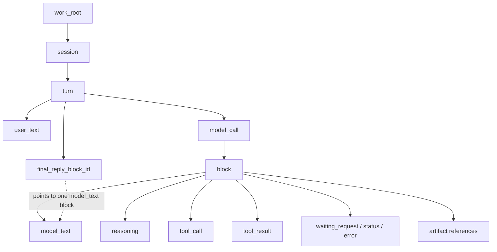

# Writer DB Transcript Design

## Purpose

This design makes the Writer display chain stable by enforcing one source of
truth:

```text
backend structured facts -> database -> transcript API -> frontend rendering
```

The frontend must not infer business facts from transport events, text content,
ids, timing gaps, or local temporary state. If the UI can show something, the
backend must have already persisted that fact in a structured form.

The design exists to solve these concrete problems:

- live display and refreshed replay diverge;
- reasoning, tool calls, process bars, artifacts, and final replies are
  assembled by multiple frontend paths;
- frontend code guesses run ownership from ids or text;
- session/turn state can show `failed` while the backend is still active;
- historical running blocks produce fake durations;
- tool details and artifacts are hard to audit because they are embedded in ad
  hoc display state.

The target result is not a smarter frontend. The target result is a simpler
display chain where every visible fact has one durable backend source.

## Non-Goals

- The database is not a UI cache.
- SSE is not a display data source.
- The frontend does not reconstruct model semantics from raw deltas.
- The frontend does not decide whether a block is reasoning, text, tool call,
  tool result, artifact, metric, waiting request, or final reply.
- The first implementation does not need a separate messages table.

SSE, polling, or any future notification mechanism may trigger a refetch, but
none of them may construct transcript content.

## Ownership

| Concern | Owner | Reason |
|---|---|---|
| Work root ownership | Backend + DB | It is a persisted project fact. |
| Session membership | Backend + DB | It defines conversation scope. |
| User turn grouping | Backend + DB | It is a business grouping, not a UI grouping. |
| Model call boundaries | Backend + DB | Only the runtime knows when a model call starts and ends. |
| Block type | Backend + DB | Only the runtime knows if a block is reasoning, model text, tool call, result, status, or error. |
| Final reply identity | Backend + DB | A turn has exactly one final reply pointer, not a second frontend decision. |
| Ordering | Backend + DB | Ordering must be stable across live display, refresh, and replay. |
| Status | Backend + DB | State is derived from runtime progress and persisted facts. |
| Metrics | Backend + DB | Token usage, duration, and call count are runtime facts. |
| Artifact identity | Backend + DB | Artifacts need indexing, audit, and lazy loading. |
| Rendering | Frontend | UI decides presentation only. |
| Expand/collapse | Frontend | This is local view preference, not business fact. |

## Conceptual Hierarchy

| Level | Object | Meaning | Required Purpose |
|---|---|---|---|
| 1 | `work_root` | A filesystem project root. | Separates projects and their runtime history. |
| 2 | `session` | A continuous conversation under a work root. | Groups user turns in one conversational context. |
| 3 | `turn` | One user message through one Writer final reply, waiting state, or failure. | Defines the business unit shown as one user/assistant exchange. |
| 4 | `model_call` | One LLM request inside a turn. | Captures repeated model calls caused by tool use, verification, waiting recovery, or repair. |
| 5 | `block` | One structured runtime output unit inside a model call. | Stores reasoning, model text, tool call, tool result, status, error, or artifact references. |
| 6 | `artifact` | A file-like output attached to a block. | Stores file identity and path without bloating transcript rows. |



## Text And Final Reply

`model_text` is the text body produced by a specific model call. It may appear
in the middle of a turn or at the end of a turn.

`final reply` is not a separate text copy and not a separate display path. A
turn marks its final reply by pointing to exactly one completed `model_text`
block:

```text
turn.final_reply_block_id -> blocks.id where blocks.type = model_text
```

Rules:

1. A turn may have zero or one `final_reply_block_id`.
2. A completed turn must have exactly one `final_reply_block_id`.
3. The final reply block must belong to the same turn.
4. The final reply block should belong to the last model call that completes
   the turn.
5. The final reply block is rendered outside the collapsible process area.
6. Other `model_text` blocks remain inside their owning model call in process
   order.
7. No frontend code may decide that a text block is final by position, content,
   or lack of tool calls.

This keeps the concept explicit without duplicating assistant text.

## Status Model

Turn status is intentionally small and must stay stable when new tools or
interaction types are added:

```text
running | waiting | completed | failed
```

The status is derived from persisted backend facts. It is not guessed by the
frontend.

Status is a projection, not the source of truth. Stored status values may be
kept for audit, history, search, or display cache, but the current turn status
must be derived from the underlying facts whenever the transcript is projected.
If a cached status conflicts with facts, facts win.

Actions, tools, event names, and transport events do not own status. They only
create or update durable facts. The current facts project to the visible status:

```text
action/event -> durable fact changes -> status projection
```

The implementation must not do this:

```text
action/event -> directly set authoritative status
```

For example, user stop does not mean "set failed because stop was clicked".
User stop closes active producers and records an interruption fact. If the turn
then has no final reply and no open waiting request, the projected status is
`failed`.

The first split is terminality:

| Class | States | Meaning |
|---|---|---|
| Non-terminal | `running`, `waiting` | The turn is not resolved yet. It still expects either autonomous progress or user intervention. |
| Terminal | `completed`, `failed` | The turn is resolved. It will not continue unless the user starts a new turn or explicitly retries. |

The second split is progress mode:

| Status | Meaning |
|---|---|
| `running` | Non-terminal. The backend can autonomously advance the turn now: model call, tool execution, recovery step, or stream flush is active. |
| `waiting` | Non-terminal. The turn is blocked by a persisted user-interaction gate, so the backend must not advance it until the user responds. |
| `completed` | Terminal. The turn has a completed `final_reply_block_id`. |
| `failed` | Terminal. The turn ended without a final reply, including user stop, unrecoverable runtime failure, stale crash recovery, or exhausted retries. |

The bottom-level facts are:

| Fact | Meaning |
|---|---|
| `final_reply_block_id` | A completed final model text block exists. |
| `terminal_failure` | Runtime recorded an unrecoverable stop/failure for this turn. |
| `open_waiting_request` | A durable gate asks the user to decide, approve, upload, answer, or provide missing input. |
| `active_producer` | A live backend producer lease is advancing model/tool/runtime work without user intervention. |

Derivation order:

```text
has final_reply_block_id -> completed
else has terminal_failure -> failed
else has open_waiting_request -> waiting
else has active_producer -> running
else -> failed
```

This gives every turn exactly one state at all times.

The order matters. `waiting` outranks `running` because a process may still be
alive while blocked on a user gate; that must not be presented as autonomous
progress. `completed` and `failed` are terminal and should not transition back
to `running`; a retry creates a new turn or an explicit retry record.

Terminal states are "closed judgments":

- `completed` requires a completed final reply block belonging to the turn.
- `failed` requires a terminal failure fact and no final reply.
- non-terminal turns must never be finalized only because a cached status says
  so.

### User Gates And Waiting

`waiting` is not specific to `ask`. Any durable request for user intervention
uses the same state.

Examples:

| Scenario | Durable Fact | Turn Status |
|---|---|---|
| Model asks a question | `waiting_request(kind = ask)` | `waiting` |
| Tool needs permission to remove a file | `waiting_request(kind = permission)` | `waiting` |
| Tool needs a user-uploaded asset | `waiting_request(kind = upload)` | `waiting` |
| Tool needs a user decision between options | `waiting_request(kind = decision)` | `waiting` |

These are not separate statuses. They are different waiting request kinds.
They should drive the turn-level waiting state and the user action area. They
should not be rendered as duplicate process rows when the producing tool or
model block already represents the process step.

`ask` may be implemented as a tool, but the tool type does not directly decide
the turn status:

```text
model_call emits ask tool_call
backend executes ask tool
backend persists waiting_request block
turn becomes waiting
user answers
backend resumes work
turn becomes running
```

While the backend is still executing the ask tool and writing the waiting
request, the turn is `running`. Once the request is persisted and the backend is
waiting for the user, the turn is `waiting`.

The same rule applies to permission prompts and upload prompts. While the
backend is preparing the prompt, the turn is `running`; once the prompt is
persisted and the next step belongs to the user, the turn is `waiting`.

`waiting` does not mean a tool is still running. It means the turn is unresolved
but blocked behind a durable user gate.

The producing tool/model block remains part of the process. The waiting state
belongs to the turn.

### Permission Approval Gate

Permission approval is a user gate, not a tool failure.

When a tool call requires user approval:

1. The backend persists the tool call as a process block with `status =
   waiting`.
2. The backend persists exactly one `waiting_request` block with
   `request_kind = permission`, linked to the same `tool_call_id`.
3. The backend must not execute the tool before the request is approved.
4. The backend must not emit a `tool_result` or blocked/error result while the
   request is still open.
5. The turn status projects to `waiting`.
6. The frontend renders the waiting request as a decision card and sends the
   user's decision to a structured waiting-request API.
7. Approval closes the waiting request, executes the original stored tool call,
   persists the real tool result, and continues the same turn.
8. Denial closes the waiting request and records a terminal failure reason such
   as `user_denied_permission`.

This applies to dangerous commands such as file deletion. The visible warning
is not an error message; it means the tool has not completed yet because the
next required actor is the user.

### Crash And Recovery

Crash/restart handling should use the same facts, not special-case "restart".

On backend startup or session reload:

1. If a turn has a final reply, it is `completed`.
2. If a turn has an open waiting request, it is `waiting`.
3. If a turn has a valid recoverable active producer and the backend resumes it,
   it is `running`.
4. If a turn has no final reply, no open waiting request, and no recoverable
   active producer, it is `failed`.

This covers sudden shutdown, backend crash, frontend crash, and abandoned stale
running records without introducing restart-specific states.

### Active Producers And User Gates

The status model depends on two generic low-level facts:

```text
active_producer
open_waiting_request
```

An `active_producer` is backend-owned autonomous work. It can be a model stream,
tool execution, recovery worker, or transcript flush. It should have a real
runtime owner and a heartbeat/lease so crash recovery can tell whether it is
still alive.

An `open_waiting_request` is a persisted user gate. It means the next required
step belongs to the user, not to the autonomous backend loop. This covers
permission approval, stop/continue decisions, file upload, missing input,
option selection, and ask-style questions.

The key invariant:

```text
if user input is required before progress can continue, the turn is waiting.
```

This remains true even if the request was created by a tool. Tool identity is
not the state machine.

### Terminal Resolution

`completed` and `failed` must be decided from durable facts:

| Result | Required Fact |
|---|---|
| `completed` | `turn.final_reply_block_id` points to a completed `model_text` block in the same turn. |
| `failed` | A terminal failure fact exists and the turn has no final reply. |

Terminal failure should record a reason, such as:

```text
user_stop | runtime_error | model_retries_exhausted | tool_failure |
stale_after_restart | cancelled_by_policy
```

The reason explains what happened, but it does not create more terminal states.

### Session Status

Session does not need its own independent state machine. A session is a
conversation container; the user-facing status of that container should be a
projection of the latest turn.

```text
session_display_status = latest_turn.status
```

If the session has no turns, its display status is `idle`.

| Condition | Session Display Status |
|---|---|
| Latest turn is `running` | `running` |
| Latest turn is `waiting` | `waiting` |
| Latest turn is `failed` | `failed` |
| Latest turn is `completed` | `idle` |
| No turn exists | `idle` |

`completed` is meaningful for a turn, not for the whole session. After the
latest turn completes, the conversation is simply idle and ready for the next
user message.

Any stored session status is only a display cache. It must not override the
latest turn projection.

## Database Shape

The durable schema should use relational rows for ownership, ordering, state,
and indexes. JSON should be used only for local flexible payloads.

### `work_roots`

| Column | Purpose |
|---|---|
| `id` | Stable work root id. |
| `path` | Absolute filesystem root. |
| `display_name` | Human-readable label. |
| `created_at` | Creation timestamp. |
| `updated_at` | Last update timestamp. |

### `sessions`

| Column | Purpose |
|---|---|
| `id` | Stable session id. |
| `work_root_id` | Parent work root. |
| `title` | Session title. |
| `status_cache` | Optional display cache projected from the latest turn: `idle`, `running`, `waiting`, or `failed`. Not authoritative. |
| `transcript_revision` | Monotonic revision incremented by committed transcript writes. |
| `created_at` | Creation timestamp. |
| `updated_at` | Last update timestamp. |

### `turns`

| Column | Purpose |
|---|---|
| `id` | Stable turn id. |
| `session_id` | Parent session. |
| `sequence` | Turn order inside the session. |
| `user_text` | User message text for this turn. |
| `status_cache` | Optional cached projection for search/display. Not authoritative. |
| `final_reply_block_id` | Unique pointer to the final `model_text` block, nullable until completion. |
| `started_at` | Turn start timestamp, usually when user execution begins. |
| `last_state_changed_at` | Timestamp of the latest status change. |
| `terminal_at` | Terminal timestamp for `completed` or `failed`, nullable for non-terminal turns. |
| `terminal_reason` | Failure/completion reason for terminal turns, nullable while non-terminal. |
| `error` | Turn-level terminal error text, if any. |

### `model_calls`

| Column | Purpose |
|---|---|
| `id` | Stable model call id. |
| `turn_id` | Parent turn. |
| `sequence` | Call order inside the turn. |
| `provider` | Model provider. |
| `model` | Model id/name. |
| `status` | `pending`, `running`, `completed`, `failed`, or `cancelled`. |
| `started_at` | API request start timestamp. |
| `completed_at` | API request terminal timestamp. |
| `input_tokens` | Provider-reported input tokens, nullable if unknown. |
| `output_tokens` | Provider-reported output tokens, nullable if unknown. |
| `error` | Terminal error text, if any. |
| `metadata_json` | Optional provider/runtime metadata. |

### `blocks`

| Column | Purpose |
|---|---|
| `id` | Stable block id. |
| `turn_id` | Parent turn, duplicated for efficient queries. |
| `model_call_id` | Parent model call. |
| `parent_block_id` | Optional parent block for nested work such as sub-agents or tool-owned child output. |
| `producer_id` | Stable runtime producer id that emitted this block. |
| `sequence` | Block order inside the model call. |
| `event_sequence` | Optional global monotonic order for audit/debugging. |
| `type` | Structured type: `reasoning`, `model_text`, `tool_call`, `tool_result`, `waiting_request`, `status`, `error`, `compaction`. |
| `status` | `pending`, `running`, `completed`, `failed`, `cancelled`, or `waiting`. |
| `content` | Text content or short preview. |
| `request_kind` | For `waiting_request` blocks: `ask`, `permission`, `upload`, `decision`, or another user-gate kind. |
| `response_json` | User response for `waiting_request` blocks after the gate is closed. |
| `tool_name` | Tool name for tool blocks. |
| `tool_call_id` | Stable tool call id connecting call/result blocks. |
| `tool_args_json` | Tool input arguments. |
| `tool_result_preview` | Small result preview. |
| `error` | Block-level error text. |
| `started_at` | Block start timestamp. |
| `updated_at` | Last delta/update timestamp. |
| `completed_at` | Block terminal timestamp. |
| `duration_ms` | Backend-computed block duration after completion; for waiting requests, time from gate open to user response. |
| `metadata_json` | Optional block-specific metadata. |

### `active_producers`

Active producers represent backend work that can autonomously advance a turn.
They are facts used to derive `running`.

| Column | Purpose |
|---|---|
| `id` | Stable producer id. |
| `turn_id` | Parent turn. |
| `model_call_id` | Related model call, nullable for non-model producers. |
| `parent_block_id` | Owning process block, nullable. |
| `kind` | `model_stream`, `tool_execution`, `sub_agent`, `runtime_recovery`, `flush`. |
| `started_at` | Producer start timestamp. |
| `heartbeat_at` | Last known alive timestamp. |
| `closed_at` | Producer close timestamp, nullable while active. |
| `close_reason` | `completed`, `failed`, `waiting`, `cancelled`, or `stale`. |
| `recoverable` | Whether the backend may resume it after restart. |

### `artifacts`

Artifacts are file-like references, not large inline transcript payloads.

| Column | Purpose |
|---|---|
| `id` | Stable artifact id. |
| `turn_id` | Parent turn. |
| `block_id` | Parent block. |
| `file_name` | Display file name. |
| `file_path` | Absolute local path or managed storage path. |
| `file_type` | Coarse type such as `image`, `pdf`, `text`, `diff`, `report`, or `binary`. |
| `mime_type` | Optional MIME type. |
| `size_bytes` | Size for preview/loading decisions. |
| `content_hash` | Optional deduplication and audit hash. |
| `created_at` | Creation timestamp. |
| `metadata_json` | Artifact-specific metadata. |

## Indexes

The schema must support fast live refresh and historical replay.

| Index | Purpose |
|---|---|
| `sessions(work_root_id, updated_at)` | Load sessions by project. |
| `sessions(transcript_revision)` | Detect transcript changes. |
| `turns(session_id, sequence)` | Load transcript order. |
| `turns(session_id, status_cache)` | Find cached active or blocked turns; transcript projection must still derive current status from facts. |
| `model_calls(turn_id, sequence)` | Load call order in a turn. |
| `blocks(turn_id, sequence)` | Load all blocks in a turn. |
| `blocks(model_call_id, sequence)` | Load call-local blocks. |
| `blocks(parent_block_id, sequence)` | Load nested child blocks without mixing owners. |
| `blocks(producer_id, event_sequence)` | Attach streamed output to the producer that emitted it. |
| `blocks(tool_call_id)` | Pair tool call/result blocks. |
| `blocks(status, updated_at)` | Inspect active/stuck blocks. |
| `blocks(type, updated_at)` | Audit reasoning/tool/error blocks. |
| `active_producers(turn_id, closed_at)` | Derive running state and recover stale work. |
| `active_producers(heartbeat_at)` | Detect stale producers after crash/restart. |
| `artifacts(turn_id)` | Load artifacts for a turn. |
| `artifacts(block_id)` | Lazy-load artifacts for a block. |
| `artifacts(content_hash)` | Deduplicate file outputs where useful. |

## Streaming Write Model

The backend must continuously write structured facts while the model streams.

```text
provider typed event -> backend accumulator -> atomic DB flush -> transcript revision -> frontend snapshot
```

Mature model APIs expose typed streaming events, not just raw text. The backend
should normalize provider events into Writer blocks and then persist those
blocks. The frontend should never parse provider events.

Rules:

1. The backend creates a `turn` when a user message starts execution.
2. The backend creates a `model_call` when an LLM request starts.
3. The backend inserts a block identity row as soon as block ownership, type,
   and order are known.
4. The backend updates block content as deltas arrive.
5. The backend records real timestamps for API start/end, tool start/end, block
   start/update/end, waiting start/end, state changes, and terminal resolution.
6. The backend updates token metrics when provider usage arrives.
7. The backend marks blocks/model calls/turns terminal or waiting when their
   producers stop.
8. The backend writes artifacts as file references linked to blocks.
9. Every committed transcript write increments `sessions.transcript_revision`.

Delta storage must be update-oriented, not token-row-oriented.

| Stream Fact | Storage Behavior |
|---|---|
| Reasoning delta | Insert/update one `reasoning` block content and `updated_at`. |
| Text delta | Insert/update one `model_text` block content and `updated_at`. |
| Tool call args delta | Insert/update one `tool_call` block `tool_args_json`. |
| Tool call starts | Insert/update `tool_call` block with `running` status. |
| Tool result arrives | Insert/update one `tool_result` block and linked artifacts. |
| User gate request persisted | Insert/update `waiting_request` block with `request_kind`, close or pause the owning producer, and update `last_state_changed_at`; projection becomes `waiting` because an open waiting request exists. |
| User answers waiting request | Close the waiting block with `response_json`, create/resume an active producer, and update `last_state_changed_at`; projection becomes `running` if the backend can autonomously continue. |
| Final reply decided | Set `turn.final_reply_block_id` to an existing completed `model_text` block. |
| Usage arrives | Update `model_calls.input_tokens/output_tokens`. |
| User stops turn | Close active producers and record terminal interruption facts. Projection becomes `failed` only if no final reply and no open waiting request remain. |
| Runtime stops without final reply or waiting request | Record terminal failure facts, set `terminal_at`, and close active producers. Projection becomes `failed` from those facts. |

To avoid excessive writes, the backend may batch deltas and flush every
100-250 ms, but each flush must be atomic and must preserve the same durable
structure.

## Snapshot Consistency

The transcript endpoint must return coherent snapshots while streaming writes
are happening.

Rules:

1. Transcript projection reads in one DB transaction.
2. Each committed transcript write increments `sessions.transcript_revision`.
3. The transcript response includes `revision`.
4. The frontend replaces its displayed snapshot only when the response revision
   is newer than the current one.
5. Polling only changes read cadence; it does not create a second display path.

With SQLite, WAL mode should be used for better read/write coexistence. Readers
should see a stable committed snapshot instead of half a write.

## Tool Call Pairing

Tool calls and tool results are blocks with a shared `tool_call_id`.

Rules:

1. A `tool_call` block may have zero or one terminal `tool_result` block.
2. Streaming tool args update the `tool_call` block until dispatch.
3. A `tool_result` block references the same `tool_call_id`.
4. A failed tool execution is represented as a `tool_result` block with
   `failed` status or an explicit `error` block attached to the same
   `tool_call_id`.
5. Multiple files/logs produced by one tool result are artifacts attached to the
   result block, not competing result blocks.

## Ordering And Ownership

Ordering is chronological, but chronology must not overwrite ownership.

The backend should assign:

```text
event_sequence: global order across the whole transcript
sequence: order among siblings under the same parent
parent_block_id / producer_id: ownership of nested or parallel work
```

Rules:

1. Earlier emitted events get smaller `event_sequence`.
2. Blocks under the same parent get sibling `sequence`.
3. A child event from a sub-agent/tool must be attached to the same
   `producer_id` and parent block that created it.
4. Parallel work is displayed by creation time at the parent level, then by
   local order inside each owner.

Example:

```text
event 1: create sub-agent 1 block
event 2: create sub-agent 2 block
event 3: sub-agent 1 emits reasoning -> child of sub-agent 1
event 4: sub-agent 2 emits text -> child of sub-agent 2
```

The global timeline records all four events in order. The nested transcript
must not attach event 3 to sub-agent 2 only because sub-agent 2 was created
more recently.

## Metrics

The process bar is a turn summary:

```text
x s, x calls, x total input tokens, x total output tokens
```

Rules:

| Metric | Source |
|---|---|
| Duration | Turn total wall-clock duration from `turn.started_at` to `turn.terminal_at`; for non-terminal `running` or `waiting`, backend computes current duration from server time. Waiting time counts. |
| Call count | Count of `model_calls` in the turn. |
| Input tokens | Sum known `model_calls.input_tokens`; unknown if none are known. |
| Output tokens | Sum known `model_calls.output_tokens`; unknown if none are known. |

Missing values are returned as null/unknown by the backend and displayed as `X`
by the frontend. The frontend must not invent metrics.

Each visible process item should also carry its own duration where meaningful:

| Item | Duration |
|---|---|
| Reasoning | Reasoning block `completed_at - started_at`, or backend current duration while streaming. |
| Model text | Text block `completed_at - started_at`, or backend current duration while streaming. |
| Tool call/result | Tool execution timestamps. |
| Waiting request | User gate close time minus gate open time. |
| Model call | API response end minus API request start. |

The process bar uses total turn duration. Expanded details may show per-item
durations. The frontend formats durations but does not calculate historical
duration from wall clock guesses.

## Transcript API

The frontend should not join raw tables. The backend should expose one
presentation-neutral transcript endpoint:

```text
GET /api/sessions/{session_id}/transcript
```

Shape:

```json
{
  "session_id": "s1",
  "status": "running",
  "revision": 42,
  "turns": [
    {
      "turn_id": "t1",
      "sequence": 1,
      "status": "running",
      "user_text": "Implement this change",
      "final_reply_block_id": null,
      "metrics": {
        "duration_ms": 8000,
        "model_call_count": 2,
        "input_tokens": 1200,
        "output_tokens": 300
      },
      "model_calls": [
        {
          "model_call_id": "c1",
          "sequence": 1,
          "status": "completed",
          "metrics": {
            "input_tokens": 700,
            "output_tokens": 100
          },
          "blocks": [
            {
              "block_id": "b1",
              "parent_block_id": null,
              "producer_id": "p1",
              "sequence": 1,
              "event_sequence": 10,
              "type": "reasoning",
              "status": "completed",
              "content": "Short reasoning preview or full allowed content",
              "is_final_reply": false,
              "duration_ms": 1200,
              "tool": null,
              "waiting_request": null,
              "artifacts": []
            },
            {
              "block_id": "b2",
              "parent_block_id": null,
              "producer_id": "p1",
              "sequence": 2,
              "event_sequence": 11,
              "type": "model_text",
              "status": "running",
              "content": "Streaming text so far",
              "is_final_reply": false,
              "duration_ms": 900,
              "tool": null,
              "waiting_request": null,
              "artifacts": []
            }
          ]
        }
      ]
    }
  ]
}
```

Minimum block contract:

| Field | Purpose |
|---|---|
| `block_id` | Stable block identity. |
| `parent_block_id` | Nested owner, nullable for top-level call blocks. |
| `producer_id` | Runtime producer that emitted this block. |
| `sequence` | Local order under the parent/model call. |
| `event_sequence` | Global chronological order. |
| `type` | Backend-defined block type. |
| `status` | Backend-defined block lifecycle. |
| `content` | Text content or short preview. |
| `is_final_reply` | True only when this block id equals `turn.final_reply_block_id`. |
| `duration_ms` | Backend-computed duration, nullable if unknown. |
| `tool` | Tool name/args/result metadata for tool blocks. |
| `waiting_request` | User gate metadata for waiting blocks or waiting-producing tool results. |
| `artifacts` | Artifact ids and compact file metadata. |

Projection rule:

```text
if block.id == turn.final_reply_block_id:
  render it as the final reply
  do not render the same text again inside the collapsible process area
else:
  render it in its owning model call/process position
```

Artifact detail should be loaded by id when needed:

```text
GET /api/artifacts/{artifact_id}
```

The transcript includes artifact ids, file names, file types, paths, and small
display metadata. It does not need to inline full file content.

## Frontend Responsibilities

The frontend may:

- poll `/transcript`;
- render turns, model calls, blocks, metrics, and artifacts;
- keep local expand/collapse state;
- show the latest turn's artifact previews and older turns as compact file
  rows;
- request artifact detail or open a local artifact when the user asks.

The frontend must not:

- infer `turn_id`, `model_call_id`, or `run_id`;
- infer block type from text;
- infer final reply from position, content, or lack of tool calls;
- calculate historical duration from wall clock time;
- merge SSE deltas into display blocks;
- generate tool calls or tool results from transport events;
- maintain separate live/replay transcript builders.
- render queued user input as transcript content before the backend starts a
  turn and the transcript projection contains that turn.

Queued input is a separate input-control concern, not transcript content. It
must be persisted through its own queue projection and dispatched by the
backend before it can become a turn. See
`docs/writer-queued-input-and-realtime-design.md`.

## Queued Input Boundary

Queued input exists beside the transcript, not inside it.

Rules:

1. A user input submitted while the latest turn is `running` or `waiting`
   creates a queue item, not a transcript message.
2. A user input submitted while the session is `failed` stays parked in the
   queue until the user resolves or retries; it must not auto-dispatch.
3. A queue item becomes transcript content only after the backend dispatches it
   through the normal turn-start path and persists `turn.user_text`.
4. Automatic dispatch is backend-owned. The frontend may request a dispatch
   check, but it must not decide that a queued item has become a sent message.
5. Guidance input attaches to the current active turn and is consumed by a
   future model call inside that turn. If the turn ends before consumption, it
   must remain visibly unconsumed rather than being silently treated as a final
   instruction.

This keeps transcript rendering honest: if the DB does not contain a turn, the
chat view cannot show a user message.

## Real-Time Refresh

The simplest stable real-time behavior is polling.

| State | Refresh Behavior |
|---|---|
| Session selected | Fetch transcript immediately. |
| User sends message | Fetch immediately, then enter active refresh. |
| Running | Poll transcript at a frontend policy interval. |
| Waiting/failed/completed | Fetch once more, then stop high-frequency polling. |
| Idle | No high-frequency polling. |

Polling is not a second display path. It only controls how often the frontend
reads the same backend transcript.

SSE can be removed from the display path. If retained later, it may only be a
notification that a transcript refetch should happen.

## Artifact Storage And Display

Artifacts should remain simple file references unless a stronger need appears.

```text
blocks: searchable runtime context and compact artifact references
artifacts: file identity, path, type, and metadata
files: actual content on disk
```

Display rules:

- The latest turn may show compact previews.
- Older turns should default to file name + file type/icon.
- Clicking opens the file with the local application.
- Right-click can expose actions such as "reference".
- If the file is missing, the backend reports it as missing; the frontend does
  not guess.

Path rules:

- Artifact reads must reference an artifact id already stored in DB.
- The artifact must belong to the current session/work root.
- The backend resolves and validates the real path before opening or returning
  metadata.
- Paths should be inside the work root or a managed artifact directory.

Cleanup is not a first-order problem if DB rows only store file references.
Future cleanup can follow session deletion or explicit artifact deletion without
changing the transcript model.

## Completeness Argument

This hierarchy is complete because every user-visible fact has one durable
source:

| UI Fact | Durable Source |
|---|---|
| User message | `turn.user_text`. |
| Final reply | `turn.final_reply_block_id` pointing to one `model_text` block. |
| Intermediate model text | `blocks.type = model_text` not referenced as final. |
| Reasoning | `blocks.type = reasoning`. |
| Tool call | `blocks.type = tool_call`. |
| Tool result | `blocks.type = tool_result`. |
| Waiting request | `blocks.type = waiting_request` plus `turn.status = waiting`. |
| Error | `blocks.type = error` or model/turn error fields. |
| Process order | `turn.sequence`, `model_calls.sequence`, `blocks.sequence`. |
| Audit chronology | `blocks.event_sequence` and timestamps. |
| Process bar duration | Total turn duration from `turn.started_at` to terminal time, or backend-computed current duration while non-terminal. |
| Call count | Count of `model_calls` in a turn. |
| Input/output tokens | Sum of known `model_calls.input_tokens/output_tokens`. |
| Artifact display | `artifacts.file_name`, `file_type`, and `file_path`. |
| Artifact open/reference | `GET /api/artifacts/{id}` or local open action by artifact id. |

No visible fact requires frontend guessing.

## Elegance Argument

The design is elegant because:

1. It mirrors the actual domain: project, session, user turn, model call, block,
   artifact.
2. It keeps each module deep: the backend owns complex runtime semantics behind
   a small transcript interface.
3. It removes duplicated live/replay logic.
4. It gives debugging a single path: inspect DB facts, then inspect transcript
   projection.
5. It supports future block types without changing ownership or grouping.
6. It keeps files on disk and DB rows small.
7. It treats missing durable facts as backend contract defects, not frontend
   display puzzles.
8. It removes the separate message-table requirement from the first design so
   there is no competing source for user text or final reply.

## Subtractive Migration Direction

The current system should migrate by replacing old paths, not by layering a new
path beside them.

1. Add durable `turn`, `model_call`, `block`, `active_producer`, and `artifact`
   facts with explicit ownership, order, lifecycle facts, and revision.
2. Implement `/transcript` from DB facts using transactional snapshot reads.
3. Make `ChatThread` consume only transcript output.
4. Delete frontend currentParts/draft/runtime-event projection for reasoning,
   text, tools, final reply, metrics, and artifacts.
5. Delete fallback code that guesses ownership or type from ids/text.
6. Delete independent final-reply text storage; final reply is only
   `turn.final_reply_block_id`.
7. Keep messages-table work out of the first implementation unless a later
   protocol need proves it is necessary.

Each phase must preserve the rule that frontend display comes from backend
persisted facts only.

## Acceptance Criteria

- Refresh before/after a run shows the same transcript.
- Running display and historical replay use the same transcript projection.
- A user turn contains all model calls for that user message.
- Each model call contains its own reasoning/text/tool blocks.
- A turn has at most one final reply, represented by
  `turn.final_reply_block_id`.
- Final reply renders outside the collapsible process area; intermediate
  `model_text` renders inside its model call.
- `running`, `waiting`, `completed`, and `failed` are derived consistently from
  backend facts.
- No action, tool name, event name, or transport event directly owns status.
  Tests should verify the underlying facts that project to the status.
- Ask, permission, upload, and decision waits are represented as persisted
  `waiting_request` blocks, not as indefinitely running tools.
- Process bar values come from persisted/backend-computed metrics and unknowns
  display as `X`.
- Tool calls and artifacts can be traced to their block and model call.
- Missing `turn_id`/`model_call_id`/block type fails visibly in backend
  validation or tests; the frontend does not guess.
- Artifacts are referenced by id and path, not stored as large transcript
  payloads.
- SSE can be disabled without changing transcript rendering semantics.
