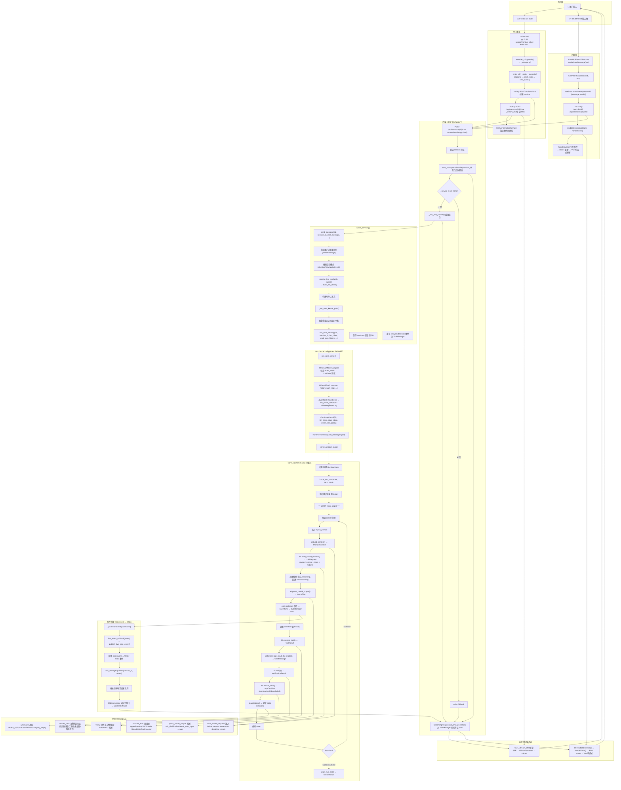

# Writer 全链路流程

## Mermaid 图

维护标注（2026-07-02 Step 12 后）：本文件下方图示仍保留旧 Writer SSE / TaskManager / `cmd_quick` 时代的历史链路，只能用于理解迁移前问题。当前运行主线是 app-server websocket / session API 加 Core `RunItemEvent` 投影；旧 Writer TaskManager、旧 Writer SSE -> CoreEvent 反向适配、旧 runtime-events REST 查询入口已经删除。

维护标注（2026-06-30）：本文件保留为历史链路审计。当前 Writer CLI 已删除 `quick/chat/agent/tool/debug/message/step` 旁路，普通运行入口为 app-server `run/resume/watch/cancel` 主线；旧 `/chat`、TaskManager/SSE、`cmd_run -> cmd_quick` 描述不再代表当前实现。

## 环节清单（用于断点检测）

以下按 Mermaid 图中顺序列出每个环节及其关键文件和函数。

| # | 环节 | 关键文件 | 关键函数/代码 |
|---|------|---------|--------------|
| B1 | writer.cmd 启动 | `writer.cmd` | `py -3.14 scripts/member_cli.py writer %*` |
| B2 | member_cli 路由 | `scripts/member_cli.py` | `main()` → `_writer(args)` |
| B3 | CLI 命令解析 | `members/writer/backend/writer_cli/__main__.py` | `cmd_run()` → `cmd_quick()` |
| B4 | CLI 创建 session | 同上 | `_request_json("POST", "/api/sessions", ...)` |
| B5 | CLI SSE 流 | 同上 | `_stream_chat()` → aiohttp POST `/api/sessions/{id}/chat` |
| B6 | CLI 格式化 | 同上 | `CliRunFormatter.format()` |
| C1 | UI 发送消息 | `frontend/src/views/CoreWorkbenchView.vue` | `handleSendMessage(text)` |
| C2 | UI 触发运行 | 同上 | `runWriterTask(sessionId, text)` |
| C3 | UI SSE Store | `frontend/src/stores/sse.ts` | `startStream(sessionId, chatRequest)` |
| C4 | UI API 调用 | `frontend/src/api/index.ts` | `chat()` → `fetch POST /api/sessions/{id}/chat` |
| C5 | UI SSE 解析 | `frontend/src/composables/useSSE.ts` | `readSSEStream(stream, onEvent, signal)` |
| C6 | UI 事件处理 | `frontend/src/stores/sse.ts` | `handleEvent(sessionId, event)` |
| D1 | 后端 chat 路由 | `backend/app/routers/session.py` | `chat()` |
| D2 | 验证 session | 同上 | `select(WriterSession).where(...)` |
| D3 | 订阅 TaskManager | `backend/app/services/task_manager.py` | `subscribe(session_id, replay=False)` |
| D4 | 服务可用性检查 | `backend/app/routers/session.py` | `if _service is not None:` |
| D5 | 后台运行任务 | 同上 | `_run_and_publish()` |
| D6 | echo 回退 | 同上 | `_echo()` |
| D7 | SSE StreamingResponse | 同上 | `StreamingResponse(event_generator(), media_type="text/event-stream")` |
| E1 | send_message | `backend/app/services/writer_service.py` | `send_message()` |
| E2 | 保存用户消息 | 同上 | `WriterMessage(...)` → `db.add()` → `db.commit()` |
| E3 | 推断交互模式 | 同上 | `_infer_interaction_mode(user_message)` |
| E4 | 解析 LLM 配置 | `backend/app/services/llm_config_service.py` | `resolve_llm_config(db, "writer")` |
| E5 | 附件上下文 | `backend/app/services/writer_service.py` | `_session_attachment_context()` |
| E6 | 核心内核路径 | 同上 | `_run_core_kernel_path()` |
| E7 | 加载历史 | 同上 | `select(WriterMessage)...limit(21)` |
| E8 | run_core_kernel | `backend/app/core/writer/core_kernel_adapter.py` | `run_core_kernel()` |
| F1 | 适配器入口 | 同上 | `run_core_kernel()` |
| F2 | LLM 适配器 | 同上 | `WriterLLMClientAdapter(writer_client=llm_client)` |
| F3 | WriterKit 构造 | 同上 | `WriterKit(tool_executor=..., ...)` |
| F4 | EventSink | 同上 | `_EventSink` 类 |
| F5 | Kernel 构造 | 同上 | `CoreLoopKernel(kit=..., llm_client=..., ...)` |
| F6 | TurnInput | 同上 | `RuntimeTurnInput(user_message=goal, ...)` |
| F7 | kernel.run() | `core/src/lamtools_core/kernel/loop.py` | `CoreLoopKernel.run()` |
| G1 | 加载状态 | 同上 | `state_store.get()` / `RuntimeState(...)` |
| G2 | on_run_start | `backend/app/core/writer/core_kernel_adapter.py` | `WriterKit.on_run_start()` |
| G3 | 追加用户消息 | `core/src/lamtools_core/kernel/loop.py` | `history.append(ChatMessage(role="user", ...))` |
| G5 | 取消检查 | 同上 | `self._cancel_event.is_set()` |
| G6 | repair注入 | 同上 | `history.append(ChatMessage(role="user", content=f"[verification feedback]\n{...}"))` |
| G7 | build_context | `backend/app/core/writer/core_kernel_adapter.py` | `WriterKit.build_context()` |
| G8 | build_model_request | 同上 | `WriterKit.build_model_request()` |
| G9 | 调用模型 | `core/src/lamtools_core/kernel/loop.py` | `_stream_model()` / `_call_model()` |
| G10 | parse_model_output | `backend/app/core/writer/core_kernel_adapter.py` | `WriterKit.parse_model_output()` |
| G11 | emit 事件 | `core/src/lamtools_core/kernel/loop.py` | `_emit_reply()` / `_emit_tool_started()` / `_emit_tool_finished()` |
| G12 | 追加 assistant | 同上 | `history.append(ChatMessage(role="assistant", ...))` |
| G13 | execute_tool | `backend/app/core/writer/core_kernel_adapter.py` | `WriterKit.execute_tool()` |
| G14 | format_tool_result | 同上 | `WriterKit.format_tool_result_for_model()` |
| G15 | verify | 同上 | `WriterKit.verify()` |
| G16 | decide_next | 同上 | `WriterKit.decide_next()` |
| G17 | writeback | 同上 | `WriterKit.writeback()` |
| G18 | 保存状态 | `core/src/lamtools_core/kernel/loop.py` | `state_store.save(state)` |
| G20 | on_run_end | `backend/app/core/writer/core_kernel_adapter.py` | `WriterKit.on_run_end()` |
| H1 | 构建 LLM 请求 | 同上 | `WriterKit.build_model_request()` |
| H2 | 解析模型输出 | 同上 | `WriterKit.parse_model_output()` |
| H3 | 执行工具 | 同上 | `WriterKit.execute_tool()` |
| H4 | 验证 | 同上 | `WriterKit.verify()` |
| H5 | 决定下一步 | 同上 | `WriterKit.decide_next()` |
| H6 | 写回 | 同上 | `WriterKit.writeback()` |
| I1-I6 | 事件桥接 | `backend/app/services/writer_service.py` | `_publish_live_core_event()` |
| J1 | CLI 响应 | `backend/writer_cli/__main__.py` | `_stream_chat()` |
| J2 | UI 响应 | `frontend/src/stores/sse.ts` | `handleEvent()` |

---

## 断点分析

### ✅ B1: writer.cmd → member_cli.py
- **状态**: 正常
- `writer.cmd` 调用 `py -3.14 "%~dp0scripts\member_cli.py" writer %*`
- 假设系统有 Python 3.14，如果版本不对会失败
- **风险**: Python 版本硬编码为 3.14

### ✅ B2: member_cli.py 路由
- **状态**: 正常
- `main()` 通过 `sys.argv[0]` 的 stem 名字 (`writer`/`artist`) 或第一个参数来路由
- `writer.cmd` 传入 `writer` 作为第一个参数，走 `_writer(args)`

### ✅ B3: CLI 命令解析
- **状态**: 正常
- `cmd_run()` 函数调用 `cmd_quick()` 函数
- 两个函数逻辑几乎相同：创建 session + 发送 chat + 流式读取

### ✅ B4-B5: CLI HTTP 请求 + SSE
- **状态**: 正常
- 使用 aiohttp 发送 HTTP 请求
- 默认 `DEFAULT_BASE_URL = "http://127.0.0.1:6173"`
- **风险**: 后端必须在运行中

### ⚠️ D4: 服务可用性检查 (关键断点)
- **状态**: 需要验证
- `session.py:chat()` 中 `if _service is not None:` 
- `_service` 在 `main.py:_on_startup()` 中通过 `writer_orchestrate(settings)` 设置
- 如果 startup 失败（DB 连接、配置问题），`_service` 为 None → echo fallback
- **验证**: 需要确认 startup 日志中 "Writer service initialized" 是否出现

### ✅ D5: 后台任务
- **状态**: 正常
- `_run_and_publish()` 创建独立 DB session，更新 session 上下文，调用 `_service["send_message"]()`
- 异常被 catch 并 publish 为 `writer_error` 事件

### ✅ E4: LLM 配置解析
- **状态**: 正常
- `resolve_llm_config(db, "writer")` 从 DB 查找 route=`writer` 的配置
- 如果没找到，回退到 route=`default`
- 如果都没有 → `RuntimeError("No LLM provider/model configured in DB")`
- **风险**: 首次启动需要 seed 配置（从 .env 或手动配置）

### ✅ E8-F7: run_core_kernel → kernel.run()
- **状态**: 正常
- `run_core_kernel()` 组装所有组件：
  - WriterLLMClientAdapter (桥接 Writer 的 chat_full → Core 的 complete)
  - WriterKit (实现 RuntimeKit 协议)
  - CoreLoopKernel
  - _EventSink (桥接 CoreEvent → live_event_callback → TaskManager)
- 所有依赖通过参数注入，无隐式全局依赖

### ✅ G9: 模型调用
- **状态**: 正常
- 优先尝试 streaming (`llm_client.stream()`)
- 如果 `NotImplementedError` → 回退到 `llm_client.complete()`
- 注意：`WriterLLMClientAdapter.stream()` 抛出 `NotImplementedError`
- 这意味着当前 Writer 路径总是走非 streaming 回退

### ⚠️ G9 细节: Streaming 不可用
- `WriterLLMClientAdapter.stream()` 明确 `raise NotImplementedError`
- `CoreLoopKernel._stream_model()` 捕获 `NotImplementedError` 返回 None → 回退到 `_call_model()`
- 这意味着前端不会收到 `runtime.reply_delta` 事件（流式文本增量）
- 只有最终 `runtime.reply` 事件（完整回复）
- **影响**: CLI/UI 的实时打字效果缺失

### ✅ G10: parse_model_output
- **状态**: 正常
- `WriterKit.parse_model_output()` 处理：
  - 纯文本回复 → done
  - ask_clarification / needs_user_input → wait
  - tool_calls → continue

### ✅ G13: execute_tool
- **状态**: 正常
- 分发到：
  - AgentRuntime (`*_agent` tools)
  - MCPToolRegistry (MCP 工具)
  - ReadWriteToolExecutor (文件操作)

### ✅ G15-G16: verify + decide_next
- **状态**: 正常
- verify: 文件存在性检查 + stub/TODO 检测
- decide_next: 漂移检测（连续读取、重复工具、失败级联、路径穷尽）

### ✅ I1-I6: 事件桥接
- **状态**: 正常
- `_EventSink.emit()` → `live_event_callback(event)` → `_publish_live_core_event()`
- 翻译 CoreEvent → Writer SSE 事件 → `task_manager.publish()`
- TaskManager 推送到所有订阅者队列
- SSE generator 从队列取出，yield SSE frame

### ✅ J1-J2: 客户端响应
- **状态**: 正常
- CLI: `_stream_chat()` 解析 SSE → `CliRunFormatter.format()` → stdout
- UI: `readSSEStream()` → `handleEvent()` → Pinia stores → Vue 响应式

### 🔴 发现的问题

#### 🔴 1. CLI 交互决策流程断裂（严重）
- **文件**: `writer_cli/__main__.py:994-1005` 的 `_resume_session()` 
- **问题**: CLI 在收到 `writer_decision` 或 `writer_waiting_for_user` 事件后，调用 `_resume_session()` → POST `/api/sessions/{id}/resume`
- **后端状态**: `routers/session.py:463-472` 明确返回 404: "Legacy runtime resume is no longer supported"
- **影响**: 当 Writer 需要用户决策（如 plan_ready、waiting_for_user、decision_point）时，CLI 交互流程完全断裂
  - `_request_json()` 在 4xx 状态码时抛出 `CliError`
  - 异常向上传播 → `_stream_chat` → `cmd_quick` → `cmd_run`
  - 整个 CLI 运行失败
- **对比**: 前端 (`app.js:175`) 正确使用 `POST /api/sessions/{id}/chat` 来处理 resume（和初始消息同一端点）
- **修复方向**: CLI 的 `_resume_session()` 应改为 `POST /api/sessions/{id}/chat`，与前端保持一致

#### ⚠️ 2. LLM Streaming 不可用（中等影响）
- **文件**: `core_kernel_adapter.py:149-151` 的 `WriterLLMClientAdapter.stream()`
- **问题**: `stream()` 方法直接抛出 `NotImplementedError`
- **结果**: `CoreLoopKernel._stream_model()` 捕获异常后回退到 `_call_model()`（非流式）
- **影响**: 前端/CLI 不会收到 `runtime.reply_delta` 事件，无法获得实时逐字打字效果；只能等完整回复后一次性展示
- **注意**: 这不是功能性断点，是体验降级

#### ⚠️ 3. Python 版本硬编码（低影响）
- `writer.cmd`: `py -3.14` 
- `member_cli.py`: `PY = ["py", "-3.14"]`
- 如果环境只有 Python 3.12/3.13，CLI 无法启动
- 如果使用虚拟环境或 `python` 命令代替 `py` launcher，也会失败

#### ⚠️ 4. 后端未启动时 CLI 无自启动能力
- CLI 是纯 HTTP 客户端，依赖后端已在运行
- `DEFAULT_BASE_URL = "http://127.0.0.1:6173"`
- 与一些 AI 编程工具（如 Claude Code）不同，Writer CLI 没有内置的后台 daemon 管理

---

### ✅ 验证通过的环节

全链路共 **40+ 个环节**，逐一对比代码确认连接点：

| 段 | 环节数 | 状态 |
|----|--------|------|
| CLI 路径 (B1-B6) | 6 | ✅ 全部通畅（除上述断点 1） |
| UI 路径 (C1-C6) | 6 | ✅ 全部通畅 |
| 后端 HTTP (D1-D7) | 7 | ✅ 全部通畅 |
| writer_service (E1-E10) | 10 | ✅ 全部通畅 |
| Kernel Adapter (F1-F7) | 7 | ✅ 全部通畅 |
| CoreLoopKernel (G1-G20) | 16 | ✅ 全部通畅（除 streaming 降级） |
| WriterKit 业务 (H1-H6) | 6 | ✅ 全部通畅 |
| 事件桥接 (I1-I6) | 6 | ✅ 全部通畅 |
| 响应回客户端 (J1-J2) | 2 | ✅ 全部通畅 |

核心的 Kernel/Kit 架构设计良好：
- **Kernel 不认产品名** — `CoreLoopKernel` 无任何 Writer/Artist 分支
- **Kit 是唯一注入点** — `WriterKit` 实现 `RuntimeKit` 协议，注入 persona、tools、验证、决策
- **事件桥接清晰** — CoreEvent → `_publish_live_core_event()` → Writer SSE 事件 → TaskManager → SSE stream
- **状态持久化** — `_WriterCoreStateStore` 将 Core 的 RuntimeState 嵌入 Writer session state
