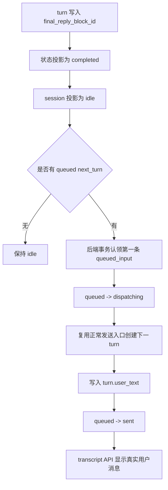

# Writer Queued Input And Realtime Design

## 目的

这份设计要同时解决三件事：

1. 根除旧前端本地消息造成的假发送、假运行、刷新前后不一致。
2. 建立可持久化、可恢复、可审计的排队输入。
3. 让运行中补充指令可以进入下一次模型调用，而不是被渲染成一条假的用户消息。

核心规则不变：

```text
后端事实 -> 数据库 -> API 投影 -> 前端渲染
```

排队输入不是聊天正文。只有当后端真正创建 turn，并把用户文本写入 transcript 后，它才是聊天正文。

## 成熟产品对齐

这不是照搬某一个产品的界面，而是借成熟产品的底层边界：

| 来源 | 可借鉴点 | Writer 落地 |
|---|---|---|
| OpenAI Responses conversation state | 通过上一轮响应继续下一轮上下文，而不是让前端拼上下文。 | 排队项只能在当前 turn 结束后，由后端启动为下一 turn。 |
| OpenAI background response | 后台任务有 `queued`、`in_progress`、终态等可观察状态。 | 排队状态必须是 DB 事实，不能藏在浏览器变量里。 |
| OpenAI streaming responses | 流式输出是 typed event 和 delta，不是前端猜正文。 | 后端把 delta 持续落成结构化 transcript，前端只读投影。 |
| Claude Code streaming input | 支持连续输入、顺序处理、运行中打断/补充和用户授权。 | 队列和引导输入都要作为交互事实被持久化，不直接混入 transcript。 |

参考：

- https://developers.openai.com/api/docs/guides/conversation-state
- https://developers.openai.com/api/docs/guides/background
- https://developers.openai.com/api/docs/guides/streaming-responses
- https://code.claude.com/docs/en/agent-sdk/streaming-vs-single-mode
- https://code.claude.com/docs/en/agent-sdk/user-input

## 术语

| 术语 | 含义 |
|---|---|
| `transcript` | 已经进入会话历史的事实：turn、模型调用、正文、思考、工具、等待、产物、指标。 |
| `queued_input` | 用户已经提交，但还没有开始一个新 turn 的文本。 |
| `guidance_input` | 用户在当前 turn 运行中补充的指令，目标是进入当前 turn 的下一次模型调用。 |
| `latest_turn` | 当前 session 里最新的一轮用户请求。session 的显示状态来自它。 |
| `active_turn` | 状态为 `running` 或 `waiting` 的 latest turn。 |
| `queue_dispatcher` | 后端队列派发器，负责在合适时机把队列项启动成新 turn。 |

## 会话状态与排队关系

session 不需要自己的独立状态机。前端显示 session 状态时，只投影 latest turn：

| latest turn 状态 | session 显示状态 | 新输入默认处理 |
|---|---|---|
| 无 turn | `idle` | 立即启动新 turn |
| `completed` | `idle` | 立即启动新 turn，或自动派发队列第一项 |
| `running` | `running` | 创建排队项 |
| `waiting` | `waiting` | 创建排队项，也允许转为引导输入 |
| `failed` | `failed` | 创建排队项但不自动派发 |

关键点：

1. `running` 和 `waiting` 都是非空闲阶段，新输入默认进入队列。
2. `completed` 是 turn 的终态，投影到 session 后是 `idle`。
3. `failed` 是终态，但不是可自动继续的状态，所以队列继续寄存。
4. 前端不能用 SSE 记忆、旧事件回放、本地 pending 状态覆盖这个判断。

## 排队触发

用户按发送时，前端先读取后端投影出来的 session 状态，然后执行：

```text
if status == idle:
  调用正常发送入口，由后端创建 turn
else:
  调用 queued-inputs 入口，后端创建 queued_input
```

这里的“非空闲”包括：

- `running`
- `waiting`
- 未来任何还没有终结、不能开启新 turn 的状态

`failed` 虽然不是非终结状态，但为了避免用户误以为已经发送成功，也不直接进入 transcript。它创建 queue item，等用户处理失败后再手动发送或自动条件满足后派发。

## 前端展示

排队项显示在输入栏上方，不显示在聊天正文里。

示意：

```text
待发送
[排队] 请把上一步改成更简洁的版本              引导本轮 | 编辑 | 移除
[排队] 继续检查剩下的测试失败                 引导本轮 | 编辑 | 移除

[ 输入框 ............................................. ][发送]
```

规则：

1. transcript 区域只渲染 transcript API。
2. queue tray 只渲染 queued-inputs API。
3. 排队项不能使用用户消息气泡样式，避免让用户误以为已经发送。
4. 刷新页面后，排队项仍由 DB 恢复。
5. 排队项被后端接受为新 turn 后，才会从 transcript 中显示为真实用户消息。

## 后端派发

自动派发必须由后端负责，不能由前端根据本地状态拼出来。

派发条件：

```text
latest_turn.status == completed
and session projected status == idle
and exists queued_input(status = queued, mode = next_turn)
```

派发流程：



约束：

1. 同一个 session 同一时间只能有一个 `dispatching`。
2. FIFO：按 `position`、`created_at`、`id` 稳定排序。
3. 派发必须复用正常发送入口，不能新造一条“队列专用执行链”。
4. 认领和状态变更必须在 DB 事务里完成，避免重复派发。
5. 如果派发失败，queue item 标记为 `failed`，保留错误原因，不写入 transcript。
6. 后端启动时要做一次轻量 reconcile：如果 session 已经 idle 且存在 queued item，继续派发，避免进程崩溃后队列卡死。

前端可以请求“立即派发下一条”，但这只是触发后端检查条件。是否能派发仍由后端按 DB 事实决定。

## 引导本轮

“引导本轮”不是新 turn。它的意思是：把这段话作为当前 active turn 的补充指令，放进下一次模型调用上下文。

可用条件：

```text
latest_turn.status in {running, waiting}
and active_turn exists
```

流程：

```mermaid
sequenceDiagram
  participant UI as 前端
  participant API as 后端 API
  participant DB as 数据库
  participant Loop as Writer 循环
  UI->>API: 引导本轮(queue item id)
  API->>DB: mode=guidance, target_turn_id=active_turn, status=guidance_pending
  Loop->>DB: 下一次模型调用前读取未消费 guidance
  Loop->>DB: guidance_pending -> guidance_consumed
  Loop->>API: 继续写 transcript delta
```

规则：

1. 引导输入不创建用户消息气泡。
2. 引导输入不自动变成下一 turn。
3. 如果当前模型请求已经发出，它不能强行插进这一次请求，只能进入下一次模型调用。
4. 如果 active turn 在它被消费前已经终结，它变成 `guidance_expired`，前端显示“未进入模型，可改为排队”。
5. 一旦 `guidance_consumed`，它不再自动派发为新 turn。

这条规则很重要：系统不能假装模型已经看到了实际上没看见的补充指令。

## 队列表结构

推荐新增表：`writer_queued_inputs`。

| 字段 | 作用 |
|---|---|
| `id` | 稳定队列项 ID。 |
| `session_id` | 所属 session。 |
| `text` | 用户输入文本。 |
| `mode` | `next_turn` 或 `guidance`。 |
| `status` | `queued`、`dispatching`、`sent`、`guidance_pending`、`guidance_consumed`、`guidance_expired`、`cancelled`、`failed`。 |
| `position` | session 内 FIFO 顺序。 |
| `target_turn_id` | 引导输入挂到哪个 active turn，普通排队为空。 |
| `created_at` | 创建时间。 |
| `updated_at` | 更新时间。 |
| `dispatching_at` | 开始派发时间。 |
| `dispatched_at` | 后端接受为新 turn 的时间。 |
| `consumed_at` | 引导输入进入模型上下文的时间。 |
| `error` | 派发或消费失败原因。 |
| `metadata_json` | 少量扩展信息。 |

索引：

| 索引 | 作用 |
|---|---|
| `(session_id, status, position)` | 读取可见队列和下一条可派发项。 |
| `(target_turn_id, status)` | 读取 active turn 的待消费引导输入。 |
| `(session_id, mode, status)` | 派发器快速找下一条普通队列。 |

## API

前端只需要一个小接口面：

```text
GET    /api/sessions/{session_id}/queued-inputs
POST   /api/sessions/{session_id}/queued-inputs
PATCH  /api/sessions/{session_id}/queued-inputs/{id}
DELETE /api/sessions/{session_id}/queued-inputs/{id}
POST   /api/sessions/{session_id}/queued-inputs/{id}/dispatch
POST   /api/sessions/{session_id}/queued-inputs/{id}/guidance
POST   /api/sessions/{session_id}/queued-inputs/dispatch-next
```

| 接口 | 行为 |
|---|---|
| `GET` | 返回当前 session 未终结或需要用户处理的队列项。 |
| `POST` | 创建排队项，不创建 turn，不写 transcript。 |
| `PATCH` | 只允许编辑 `queued` 状态的文本。 |
| `DELETE` | 标记为 `cancelled`。 |
| `dispatch` | 请求后端把指定项派发为下一 turn；后端必须重新校验 session 是否 idle。 |
| `guidance` | 把指定项改为当前 active turn 的引导输入。 |
| `dispatch-next` | 请求后端按 FIFO 派发下一项；主要用于 reconcile 或手动触发。 |

## 实时显示

实时显示仍然只读 DB 投影，不恢复双链路。

```text
后端流式 delta -> 批量落库 -> revision 更新 -> 前端重新读取 transcript/queue projection
```

第一阶段可以保留轮询，但它只是读取频率，不是显示来源。

成熟目标：

1. 后端每次 transcript 或 queue 写入后更新 revision。
2. 前端通过轻量通知知道“有新 revision”，再读取 DB-backed projection。
3. 通知不携带正文，不携带工具详情，不携带状态判断。
4. 关闭通知后，轮询仍能得到同样的画面，只是延迟不同。

过大的轮询间隔会造成“大块一跳”的观感。设计目标不是让前端接管 delta，而是让后端更高频、更小批次地提交 DB，并用较短的 active transcript polling 或 revision 通知缩短读取延迟。当前 active polling 目标为 250ms 级别；未来即使改为 SSE revision 通知，前端也仍然只读取 DB-backed projection。

## 必须删除的旧链路

这些不是兼容层，是债务，落地时必须拔掉：

| 旧内容 | 问题 | 处理 |
|---|---|---|
| 本地 `pendingLocalMessages` 渲染进 transcript | 造成“看起来发了，DB 没有”的假消息。 | 删除 transcript 合并入口。 |
| 本地 `queuedWriterTasks` | 浏览器内存队列，刷新丢失，无法审计。 | 删除，换成 DB 队列。 |
| SSE 回放影响 `running` | 已完成 session 会被旧事件误判为运行中。 | SSE 只能通知刷新，不能决定状态。 |
| `sseStore.running` 覆盖 transcript status | 前端内存压过 DB 事实。 | 删除覆盖逻辑。 |
| 发送时先插本地用户气泡 | 破坏“DB 事实才显示”的规则。 | 发送成功后等待 transcript 显示。 |
| running/replay 两套 transcript 组装 | 刷新前后不一致的根因。 | 只保留 transcript projection。 |

删除标准：如果某段代码在 DB 没有对应事实时仍能让 UI 显示业务内容，它就必须删除。

## 状态仍需重点审计的问题

这些是后续实现时最容易再次出问题的地方：

| 风险 | 为什么危险 | 正确处理 |
|---|---|---|
| cached status 和事实冲突 | 历史字段可能停在 `failed` 或 `running`。 | 投影时事实优先，cache 只做展示缓存。 |
| stop 直接写 failed | stop 是动作，不是状态来源。 | stop 关闭 active producer；无 final reply、无 waiting gate 时才投影 failed。 |
| waiting 没有 durable gate | 刷新后不知道在等谁。 | permission、ask、upload、decision 都要落成 waiting_request。 |
| active producer 没有租约 | 后端崩溃后可能永久 running。 | producer 必须有 heartbeat/closed_at，启动时清理 stale。 |
| guidance 被静默丢失 | 用户以为模型看到了补充指令。 | 未消费就终结时标记 `guidance_expired`。 |
| 自动派发重复触发 | completed 事件、刷新、reconcile 可能同时触发。 | DB 事务认领，保证单 session 单 dispatching。 |
| failed 后自动继续 | 可能绕过用户对失败的判断。 | failed 不自动派发队列。 |
| 排队项显示成消息 | 用户误判消息已经发出。 | queue tray 独立样式，永不进入 transcript。 |

## 实现顺序

1. 新增 DB 队列表、模型、基础读写接口。
2. 新增后端队列派发器，复用正常发送入口。
3. 把发送入口改成：`idle` 立即发送，非 idle 创建 queue item。
4. 前端新增输入栏上方 queue tray，只读 queued-inputs API。
5. 删除本地 pending 消息和本地 hidden queue。
6. 删除 SSE running 对状态和发送决策的影响。
7. 实现 guidance：挂 active turn、下一次模型调用消费、未消费终结则 expired。
8. 加入 reconcile：启动时和状态变更后检查可派发队列。
9. 用测试锁住“DB 没有消息，UI 就不能显示聊天消息”。

## 验收标准

1. idle 时发送：DB 创建 turn 后，聊天区才显示用户消息。
2. running/waiting 时发送：只在输入栏上方显示排队项，不出现在聊天区。
3. completed 后：后端自动派发第一条排队项，FIFO 顺序稳定。
4. failed 后：排队项保留，不自动发送。
5. 刷新页面：排队项、transcript、状态与刷新前一致。
6. SSE 回放旧事件不能改变当前状态和发送路径。
7. guidance 被下一次模型调用消费后不再作为队列项派发。
8. guidance 未消费就终结时显示为 expired，不静默丢失。
9. 同一 session 不能重复派发同一队列项。
10. 删除旧本地 pending/queue 后，UI 仍能完整完成发送、排队、派发、引导流程。
