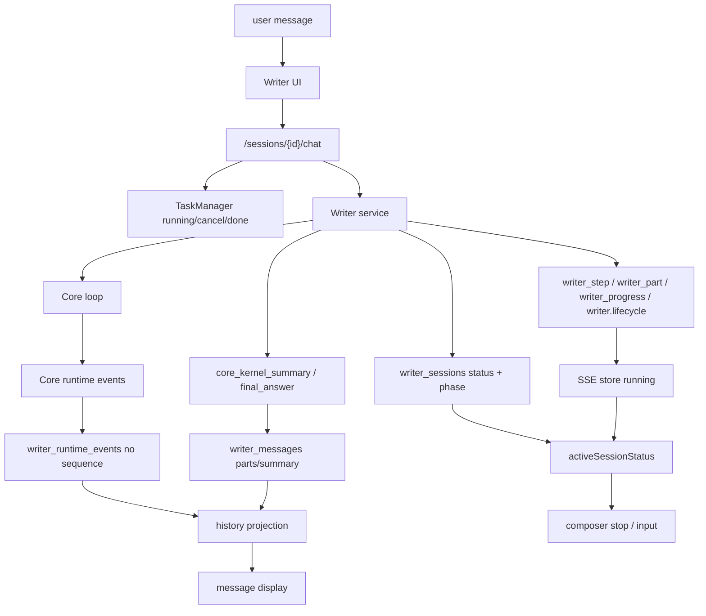
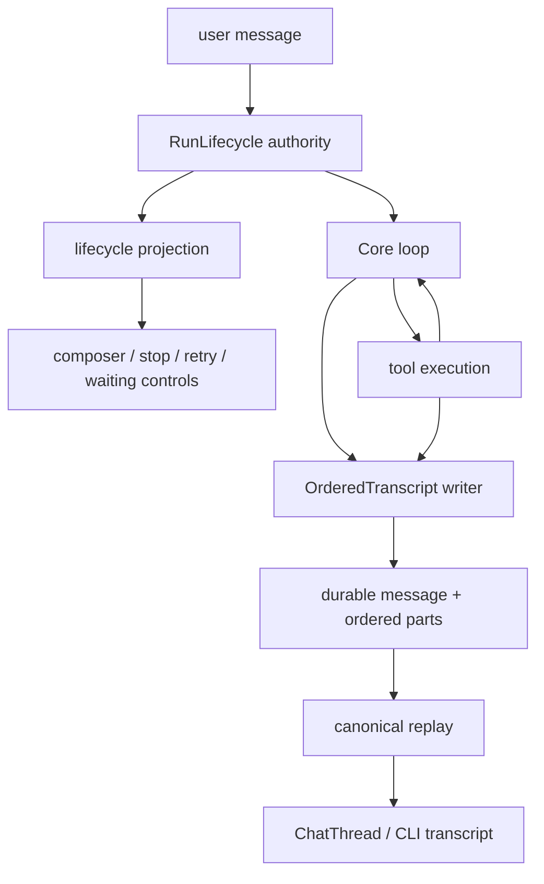

# Writer 会话状态与消息流修复计划

> 日期：2026-06-22
> 前置审计：`docs/writer-session-state-message-flow-audit-2026-06-22.md`
> 状态：已按本计划完成 Writer 会话状态与消息流整改；保留旧事件读取兼容，不再作为新主路径。

## 一、去噪后的修复原则

用户原始表达的核心要求整理如下：

1. 修复不能只补表象。`failed` 卡死只是入口，必须处理状态、事件、持久化、前端投影和提示词的根因。
2. 每一项修复都要优雅：优先复用已有能力，少造新轮子，少加旁路，能删就删。
3. 不优先使用强制打回策略。更好的路线是让协议、状态机和模块接口从一开始就难以出错。
4. 设计要精准、完备、占用最小空间。像规整的电路板一样，线路短、职责清、面积小。
5. Writer 系统提示词要清简，只保留必要约束，不用提示词替代工具权限、运行时协议和测试。
6. 对成熟产品已经解决的问题，优先对齐成熟方案；如果照抄，就抄完整闭环，不做半套基础版。

## 二、成熟方案对齐

本计划按以下成熟方案抽象原则对齐：

1. OpenAI Agents SDK：agent loop 在模型输出工具调用后执行工具并继续 loop；final output 的条件是模型产出文本且没有工具调用。来源：[Running agents](https://openai.github.io/openai-agents-python/running_agents/)。
2. OpenAI Function calling：工具结果以结构化 tool output 回填，再请求模型生成后续响应。来源：[Function calling](https://developers.openai.com/api/docs/guides/function-calling)。
3. Claude：模型响应是有序 content blocks，工具调用和工具结果是结构化块。来源：[Tool use with Claude](https://platform.claude.com/docs/en/agents-and-tools/tool-use/overview)、[Handle tool calls](https://platform.claude.com/docs/en/agents-and-tools/tool-use/handle-tool-calls)。
4. Claude Code：权限、拦截、自动化动作属于 lifecycle hooks，不应主要靠 system prompt 强压模型。来源：[Hooks reference](https://code.claude.com/docs/en/hooks)。
5. OpenCode 本地源码：durable session 使用 `message + part`，part 有类型和 pending/running/completed/error 状态。

## 三、目标架构

### 当前问题结构

问题点：

1. `running`、`status`、`phase`、lifecycle event、summary decision 同时表达运行状态。
2. part 顺序散落在 runtime event、summary、message parts 和前端本地排序里。
3. failed 说明和 final answer 使用同一字段语义。
4. 前端需要从多条旁路拼 transcript，刷新后和直播时可能不一致。

### 目标结构

目标：

1. 运行控制只读 `RunLifecycle authority` 的投影，不再自己拼 `running + status`。
2. 展示只读 `OrderedTranscript` 的有序 parts，直播和刷新后同源。
3. 工具调用是同一次模型调用的 part；工具结果进入下一轮模型调用。
4. 最终回复只来自没有继续工具调用的最终成功调用。
5. 失败说明保留为可见文本，但不标为最终回复。

## 四、模块价值论证

| 模块 | 价值 | 为什么不是重复造轮子 |
|---|---|---|
| RunLifecycle authority | 统一 running / waiting / completed / failed / cancelled，负责终态原因和可操作性 | 复用现有 TaskManager、session status、lifecycle event，但收敛为一个投影 |
| OrderedTranscript | 统一 message、reasoning、text、tool_call、tool_result、error 的顺序和归组 | 复用 Core `sequence`、Core UI `MessagePart`、Writer `messages.parts` |
| RuntimeEventBridge | 只做 Core event 到 Writer/UI part 的一次映射 | 删除 `writer_step/writer_progress/writer_part/core_kernel.*` 的重复语义 |
| PromptProfile | 让 Writer system prompt 保持清简 | 把执行纪律迁到工具 schema、权限、运行时和测试，不靠长提示词兜底 |
| Regression Harness | 把 P0 症状固化成红灯测试 | 复用现有 pytest、Playwright/Vitest seam，不新建复杂测试框架 |

## 五、修复路线

### Phase 0：先补红灯测试

目标：所有 P0 修复前先有能失败的测试。

1. 后端测试：`decision=failed` 时保存用户可见失败说明，但不得写 `final_answer=true`。
2. 后端测试：运行中任务即使 session 历史状态是 `failed`，生命周期投影仍返回 cancellable/running。
3. 前端测试：`running=true + activeSessionStatus=failed` 不应隐藏停止入口。
4. 排序测试：同一模型调用内 reasoning/text/tool_call 按 sequence 投影，不能靠 `created_at,id`。

验收：这些测试在当前代码上至少有一部分变红。

### Phase 1：收敛运行状态

目标：把“正在运行、等待用户、失败、取消、完成”的事实源收敛成一个权威投影。

优雅路线：

1. 不新增一套并行状态字段。
2. 复用 TaskManager 运行事实、Core terminal event、session status/phase。
3. 增加一个统一投影层，输出 UI/CLI 需要的少量字段：`state`、`cancellable`、`input_enabled`、`reason`、`updated_at`。
4. 前端停止按钮只看 `cancellable`，不再自己判断 `running && status not in [...]`。
5. cancel 请求必须进入同一生命周期，不只发一个临时事件。

最小性论证：只改状态读取口径和生命周期归并，不要求 UI 每个面板理解 TaskManager、DB 和 SSE 的细节。

### Phase 2：统一 ordered parts

目标：让一次模型调用的思考、正文、工具调用成为同一个有序 part 序列。

优雅路线：

1. 复用 Core `CoreEvent.sequence` 和 `RuntimeEventRecord.sequence`。
2. Writer `writer_runtime_events` 补 sequence，或直接使用 message parts 作为 canonical replay。
3. 每个 part 至少有 `run_id`、`turn_index`、`response_index`、`part_index/sequence`、`type`、`status`。
4. draft tool call 和正式 tool call 用同一个 stable call id 做状态升级，或明确分为 `tool_call_delta` 与 `tool_call`，避免前端靠跳过逻辑去重。
5. 历史恢复只重放 ordered parts；summary 只保留调试/统计，不参与主展示。

完备性论证：这同时覆盖直播、刷新恢复、CLI、默认数据库回放和未来多工具调用，不是只修某个 UI 排序。

### Phase 3：拆开最终回复和失败说明

目标：修正 `final_answer` 语义。

规则：

1. 成功最终回复：最终调用没有工具调用，且 run decision 是成功完成。
2. 失败可见说明：失败、取消、达到上限、验证失败时可以显示文本，但字段应是 `visible_error`、`failure_summary` 或普通 assistant/error part。
3. 旧数据兼容读取可以识别历史 `decision=failed + final_answer=true`，但新写入禁止继续制造该组合。

最小性论证：不删除可见失败文本，只修正语义标签，避免 UI 和后续上下文把失败说明当成功答案。

### Phase 4：删除重复事件语义

目标：减少浅模块和旁路。

处理顺序：

1. 保留 Core runtime event 作为原始事实。
2. 保留一个 Writer/UI 投影事件族。
3. 将 `writer_step`、`writer_progress`、`writer_part`、`writer.lifecycle`、`core_kernel.*`、legacy `writer.kernel_done` 分级迁移。
4. CLI 和前端同时改为消费 canonical lifecycle + ordered transcript。
5. 旧事件只在兼容层读，不再作为新写入主路径。

精准性论证：先改消费者，再停写重复事件，避免一次性删除造成不可观测。

实施状态：已完成。Writer service 不再从 live Core event 额外发布 `writer_step`、`writer_progress`、`writer_part`、`writer.reasoning`，也不再在运行结束后重放 `core_kernel.*` 或 `writer.kernel_done`。前端和 CLI 已改为优先消费 `writer_runtime_event + writer.lifecycle`，旧事件分支仅保留兼容历史/debug 流。

### Phase 5：清简系统提示词

目标：Writer system prompt 每个片段都有必要性。

处理：

1. 保留 `persona.md` 和 `platform.md`。
2. `platform_windows.md` 只保留环境事实和编码注意事项，减少命令方式强制语气。
3. `reply_contract.md` 改成轻量交付偏好，不限制复杂任务必要表达。
4. `execution_discipline.md` 拆分：工具权限交给工具 schema/权限层，联网规则交给运行时策略，编辑纪律交给 AGENTS.md 和测试，计划纪律交给 UI/流程。
5. 删除或降级旧 `WriterPromptAssembler`，只保留 `WriterKit.build_model_request()` 一条主路径。

完备性论证：提示词瘦身不是减少约束，而是把约束放到更可靠的位置。

实施状态：已完成。`WriterPromptAssembler` 类已移除；`prompt_assembler.py` 只保留 `WRITER_TOOLS`、`get_writer_execution_discipline()` 和日期 helper 这些生产共享出口。Prompt 测试已迁移到 `WriterKit.build_model_request()`，避免第二条组装路径继续被测试保护。

### Phase 6：迁移和兼容

目标：本地桌面数据库不能因为 schema 演进损坏旧会话。

要求：

1. SQLite migration 补齐 `writer_messages.parts` 和 `writer_runtime_events.sequence` 这类实际依赖列。
2. 旧 summary 数据只作为兼容读取来源，读取后投影成 canonical parts。
3. 对历史 `failed/idle`、`active/completed`、`waiting/idle` 做只读兼容，不用启动时强制批量改库。
4. 新写入必须只走新状态机和 ordered parts。

### Phase 7：验证矩阵

| 场景 | 验收 |
|---|---|
| 正常无工具回复 | 最后一轮正文是最终回复，状态 completed，输入可用 |
| 正文 + 工具调用 + 后续正文 | 同轮正文和工具调用按顺序展示，工具结果进入下一轮 |
| 工具失败 | 状态 failed，错误可见，停止/重试/继续入口正确 |
| 用户取消 | cancel 后状态 cancelled，后台任务停止或可观测地收敛 |
| 等待用户选择 | waiting 状态可见，输入/决策控件一致 |
| 刷新恢复 | transcript 与直播时一致 |
| 旧 failed 会话仍运行 | 停止入口可见，用户能结束运行 |
| 历史 failed final_answer | 兼容显示，但不再当成功最终回复 |
| CLI 输出 | 与前端消费同一 ordered transcript |
| Artist 影响 | Core 改动不写 Writer 专属逻辑，Artist 测试通过 |

## 六、为什么这是最简路线

1. 不新建第二套 agent loop。Core loop 的工具调用语义已经接近成熟方案，应复用。
2. 不在前端继续堆判断。前端只消费 lifecycle projection 和 ordered transcript。
3. 不靠 system prompt 修流程。流程正确性由状态机、协议和测试保证。
4. 不把旧 summary 继续当主展示协议。summary 只做兼容和调试。
5. 不为每个症状写一个 if。`failed + running`、错序、最终回复混淆都由同一组协议修复。

## 七、风险和开放项

1. 真实模型流式 delta 的 reasoning/text/tool_call 混排需要用 fixture 固化，避免不同 provider 适配差异漏测。
2. Agent/sub-agent 内部状态尚未逐工具审计，修复时要保证它们只作为 ordered parts/tool results 进入主链路。
3. 旧数据库兼容只能保守迁移，不能启动时强制重写历史状态。
4. CLI 和前端必须一起切到 canonical 投影，否则会继续产生双口径。

## 八、执行顺序建议

1. 先写红灯测试和最小 fixture。
2. 实现 lifecycle projection，并修复停止按钮。
3. 补 sequence/ordered parts 持久化与回放。
4. 拆 final answer 和 failure summary。
5. 收敛事件桥接，逐步停写重复事件。
6. 精简 prompt，并删除旧组装路径。
7. 跑 Writer 后端、Writer 前端、Core、Artist 影响测试。

## 九、实施记录

2026-06-22 已落地：

1. 生命周期投影：Core session 输出 `metadata.lifecycle`，运行中的 TaskManager 事实优先于数据库 stale failed；`status` 投影为 `running`，并暴露 `cancellable/input_enabled/db_status/db_phase`。
2. 停止入口：前端 composer 停止按钮改为读取 `sseStore.running || lifecycle.cancellable`，不再被历史 `failed/completed/cancelled/waiting` 状态遮蔽。
3. 最终回复语义：`decision=failed` 的可见文本保存为 `failure_summary`，不再写 `final_answer=true` 或 `core_kernel_summary.final_answer`；成功 `decision=done` 才写最终回复。
4. 有序事件：`writer_runtime_events.sequence` 加入模型、SQLite additive migration、HTTP 响应和排序；Writer 写入 runtime event 时复用 Core sequence，缺失时本地单调分配。
5. 前端 ordered parts：runtime event 转 part 时携带 sequence，合并和排序优先使用 sequence，时间戳只做兼容 fallback。
6. 提示词瘦身：`execution_discipline.md`、`platform_windows.md`、`reply_contract.md` 已压缩为必要原则，不再把工具实现细节和过长行为纪律塞进 system prompt。
7. Artist 影响：Artist 注入 state store 测试已对齐 Core 当前 run_id 语义，每次 run 使用新 run_id，但保留持久化 metadata。
8. 重复事件收敛：Core live event 只写入并发布 `writer_runtime_event`；终态控制只通过 `writer.lifecycle`；停止写入 `core_kernel.*`、`writer.kernel_done`、live `writer_step/progress/part/reasoning` 旁路。
9. 前端主投影：抽出 `src/runtime/runtimeParts.ts`，SSE store 和测试共用 runtime event → ordered parts 规则；`tool_call` part 不再被丢弃。
10. CLI 主投影：`writer_runtime_event` 增加人类可读格式化；旧 `writer_step/progress/part` 仅作为兼容读取分支。
11. Prompt 双路径：旧 `WriterPromptAssembler` 删除，测试和检查脚本改走 `WriterKit.build_model_request()`。

已验证：

1. Writer 后端：`test_writer_service.py`、`test_writer_core_http.py`、`test_runtime_events.py`、`test_prompt_assembler.py` 通过。
2. Writer CLI/工具/Core adapter：`test_writer_cli.py`、`test_tool_contracts.py`、`test_writer_core_adapter.py` 通过。
3. Core：`core/tests/test_kernel.py`、`core/tests/test_kit_boundary.py` 通过。
4. Artist：`test_artist_core_kernel_adapter_unit.py`、`test_main_core_app_unit.py` 通过。
5. 前端：`npm test`、`npm run build` 通过。
6. Playwright 回归：stale `failed` 会话发起挂起 `/chat` 后，页面无错误，停止按钮可见且可点击；严格场景下即使 Core session 不带 `metadata.lifecycle`，只靠 `sseStore.running` 也能显示停止入口。

本轮保留的兼容边界：

1. `writer_step/writer_progress/writer_part` 的类型定义、旧格式化分支和 debug 工具仍保留，用于历史/手动注入兼容；服务端主运行路径不再发这些重复事件。
2. `writer.lifecycle` 仍保留为运行控制事件，不参与 ordered transcript；这是 lifecycle authority 的投影，不再和 transcript 竞争。
3. 真实模型流式 provider 的复杂 delta 混排还需要持续补 fixture，尤其是 reasoning/text/tool_call_delta/tool_result 的跨 provider 差异。
