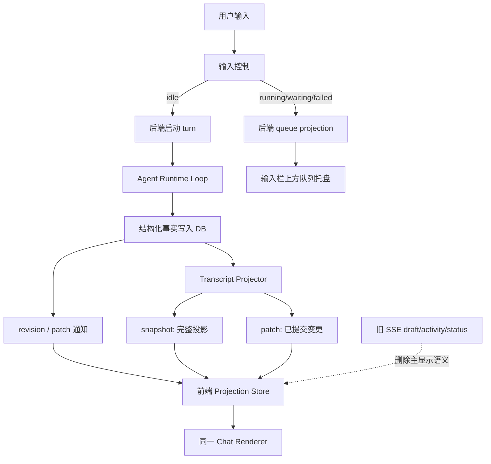

# Writer 消息流显示改造设计计划

> 日期：2026-06-22  
> 归档基线：`967d78b chore: archive writer message flow baseline`  
> 核对来源：`docs/消息流参考.txt`、`docs/writer-db-transcript-design.md`、`docs/writer-queued-input-and-realtime-design.md`

## 1. 目的

这次改造要解决的不是某一个显示 bug，而是 Writer 的“运行态”和“刷新态”长期不一致的问题。

根因是显示链路存在两套真相：

1. 后端落库后的 transcript projection。
2. 前端 SSE store 里临时拼出来的 `assistantDraft`、`activityFeed`、`running`、`statusText` 等直播态。

用户看到的闪烁、顺序错乱、工具过程缺失、刷新前后样式不同、运行中无法排队，本质上都是这两条链路竞争造成的。

目标不是让前端更聪明，而是把显示链路收敛为一条：

```text
Agent Runtime 事实
  -> 后端语义投影
  -> 持久化 DB
  -> transcript / queue projection
  -> 前端同一 store
  -> 同一 renderer
```

前端只能展示后端投影出来的结构化事实。SSE 可以用来减少延迟，但不能再生成另一套 UI 内容。

## 2. 参考文档的关键结论

`docs/消息流参考.txt` 的核心结论是：

1. OpenAI Agent 的核心是 agent loop，不是“模型 token 直接转发到前端”。
2. 模型流、运行时事件、UI 流是三层不同协议。
3. UI 应消费 runtime semantic projection，而不是 raw model event。
4. `toTextStream()` 只是文本投影，不包含工具、handoff、approval、reasoning、trace 等完整信息。
5. 完成不是最后一个 token 到达，而是 run、pending callbacks、持久化等全部完成。

因此，旧的“前端直接读 DB 并高频轮询”只说对了一半：DB 必须是事实源，但 UI 不应该直接理解底层事实表，也不应该解析模型或 SSE 原始事件。正确形态是：后端提供一个稳定的 UI projection 协议，刷新和直播都消费它。

## 3. 当前问题归类

| 表象 | 业务根因 | 设计根因 |
|---|---|---|
| 用户消息闪一下消失 | 发送时先走本地/临时态，随后被 DB transcript 覆盖 | 聊天区存在非 DB 事实渲染 |
| 工具调用运行中看不到 | 工具事件只进 activity 或旧 SSE 路径，没有成为 transcript block | 工具过程没有统一投影到 UI block |
| 刷新前后样式不一致 | 直播用 activity/draft，刷新用 transcript snapshot | 两套 renderer 输入 |
| 运行中发送无效或回到输入框 | 发送按钮被 `loading` 禁用，排队入口无法稳定触发 | 输入控制状态和运行状态混在一起 |
| “正在处理”冗余 | 前端内存状态重复表达 turn status | 状态显示没有完全回归 projection |
| 旧事件回放影响当前状态 | SSE store 仍可改变 running/statusText/activityFeed | 通知通道仍拥有业务语义 |

## 4. 设计原则

1. **事实后端化**：正文、思考、工具、等待、产物、指标、最终回复都必须由后端产生并落库。
2. **投影唯一化**：前端 chat thread 只消费 transcript projection；queue tray 只消费 queue projection。
3. **直播刷新同形**：直播 patch 与刷新 snapshot 使用同一 block 形状、同一状态字段、同一排序字段。
4. **SSE 降级为传输**：SSE 可以通知 revision，也可以发送 committed projection patch；不能发送前端专用业务内容。
5. **状态由事实推导**：`running/waiting/completed/failed` 来自 active producer、waiting request、final reply、terminal failure，不来自按钮动作或事件名。
6. **删除优先**：凡是 DB 没有事实却能让聊天区显示业务内容的代码，都属于债务。
7. **低复杂度实时**：优先使用“提交后 patch 或 revision 通知 + 同一 projection store”，不引入第三条直播状态机。

## 5. 目标模块

| 模块 | 小接口 | 深实现价值 | 是否必须 |
|---|---|---|---|
| Agent Runtime Fact Writer | 写入 turn/model_call/block/producer/waiting/artifact 事实 | 把模型、工具、审批、产物统一落成 DB 事实 | 必须 |
| Transcript Projector | `snapshot(session_id)`、`changes_after(session_id, revision)` | 把 DB 事实变成 UI 可渲染协议 | 必须 |
| Transcript Projection Store | `replace(snapshot)`、`apply(patch)`、`gap -> refetch` | 前端只维护一份 projection 状态 | 必须 |
| Queue Projector | `list/create/update/cancel/guidance/dispatch` | 排队不进入聊天正文，但可恢复可审计 | 必须 |
| Transport Notifier | `revision_changed` 或 `transcript.patch` | 降低延迟，但不拥有业务语义 | 可替换 |
| Chat Renderer | `render(projection)` | 只负责展示，不判断事实含义 | 必须 |

删除测试：

```text
如果删除前端 SSE draft/activity 渲染逻辑后，复杂度没有在多个地方重新出现，
说明它不是深模块，是债务。
```

## 6. 目标链路



关键点：

1. DB 是事实源。
2. Projector 是 UI 协议源。
3. Store 是前端唯一显示状态。
4. Renderer 不知道数据来自刷新还是直播。
5. Queue tray 不进入 transcript。

## 7. UI Projection 协议

### 7.1 Snapshot

Snapshot 是刷新、首次加载、gap recovery 的完整投影。

最小形状沿用现有 transcript 设计：

```text
session_id
status
revision
turns[]
  turn_id
  sequence
  status
  user_text
  final_reply_block_id
  metrics
  model_calls[]
    model_call_id
    sequence
    status
    metrics
    blocks[]
      block_id
      parent_block_id
      producer_id
      sequence
      event_sequence
      type
      status
      content
      is_final_reply
      duration_ms
      tool
      waiting_request
      artifacts
```

### 7.2 Patch

Patch 是直播用的增量投影，但它的 block 形状必须和 snapshot 完全一致。

```text
TranscriptPatch
  session_id
  base_revision
  revision
  operations[]
    upsert_turn
    upsert_model_call
    upsert_block
    delete_or_close_queue_item
```

规则：

1. patch 必须在 DB commit 之后发布。
2. patch 的 `revision` 必须单调递增。
3. `base_revision` 必须等于前端当前 revision；不等则 refetch snapshot。
4. patch 不允许携带 raw model delta、OpenAI chunk、旧 writer_step 业务语义。
5. patch 和 snapshot 经同一 Store 合并后，渲染结果必须一致。

如果第一阶段不实现 patch，可以先只发 revision 通知并 refetch snapshot；但设计上必须为 patch 留出同形协议，避免以后再造一条直播链路。

## 8. 排序与归属

排序是时序，但时序不能覆盖归属。

| 字段 | 作用 |
|---|---|
| `event_sequence` | 全局事件顺序，用于审计和跨父级时间线 |
| `sequence` | 同一父级/同一模型调用内的顺序 |
| `parent_block_id` | 嵌套归属，如 sub-agent、tool child output |
| `producer_id` | 哪个运行生产者写出的 block |

显示规则：

1. 顶层 model call 按 call sequence。
2. 同一 call 内按 block sequence/event_sequence。
3. 子块挂在自己的 parent 下，不能因为更晚到达而挂到别的 sub-agent/tool 下。
4. final reply block 不重复显示在过程区。

## 9. 状态规则

状态仍按四态：

```text
running | waiting | completed | failed
```

推导顺序：

```text
有 completed final_reply_block -> completed
否则有 terminal_failure -> failed
否则有 open_waiting_request -> waiting
否则有 active_producer -> running
否则 -> failed
```

注意：

1. `status_cache` 只能是历史缓存，不是当前状态依据。
2. stop、approval、ask、upload 都只是事实变化的触发动作，不直接定义状态。
3. waiting 是“需要用户介入但 turn 未结束”，不是工具失败。
4. session 显示状态来自 latest turn；latest turn completed 时 session 显示 idle。

## 10. 实时性

为兼顾稳定和实时，采用两层策略：

1. **稳定底线**：任何时候都可以通过 snapshot 恢复完整画面。
2. **低延迟增强**：DB commit 后发送 revision 或 patch，前端立即读取或合并同形投影。

允许批量 flush，但必须满足：

1. 工具开始时先创建 running tool block。
2. 工具输出、文件产物、命令 stdout/stderr 进入同一个 block 或其子 block。
3. 模型正文 delta 更新同一个 model_text block。
4. flush 频率以用户体感为准，建议 100-250ms 起步；不能变成几秒一个大块。
5. 前端不能为追求流畅而本地伪造 block。

## 11. 输入与队列

输入控制独立于 transcript。

规则：

1. idle：发送请求由后端创建 turn，DB 出现 turn 后聊天区才显示用户消息。
2. running/waiting：创建 queue item，显示在输入栏上方，不进入聊天区。
3. failed：保留 queue item，不自动派发。
4. completed：后端自动按 FIFO 派发下一条 queue item。
5. guidance：挂到当前 active turn，进入下一次模型调用；没有被消费不能静默消失。
6. 前端发送按钮不能因为 running/loading 而阻止排队。

## 12. 必须删除的债务

| 债务 | 删除原因 |
|---|---|
| chat thread 使用 `assistantDraft` 显示正文 | DB 没有事实也能显示内容 |
| chat thread 使用 `activityFeed` 作为过程 | 刷新态无法一致恢复 |
| SSE event 直接设置业务 `running/statusText` 并影响发送 | 传输通道越权 |
| OpenAI chunk 在前端拼正文 | raw model event 越过 runtime projection |
| 本地 pending 用户消息进聊天区 | 造成假发送 |
| 发送按钮由 `loading` 禁止排队 | 破坏 queue projection |
| final reply 由前端位置/内容猜测 | 最终回复必须是后端 block 指针 |

保留边界：

1. SSE 连接管理可以保留。
2. 旧事件解析可以短期作为 debug/历史兼容，但不得进入主 chat renderer。
3. `statusText` 可以用于连接错误提示，但不能覆盖 transcript status。

## 13. 完备性论证

这套设计覆盖所有用户可见事实：

| 用户看见的内容 | 来源 |
|---|---|
| 用户消息 | `turn.user_text` |
| 中间正文 | `model_text` block，非 final |
| 最终回复 | `final_reply_block_id` 指向的 completed `model_text` block |
| 思考/摘要 | `reasoning` block |
| 工具开始 | `tool_call` block running |
| 工具输出 | `tool_result` block 或 tool child block |
| 命令 stdout/stderr | tool block content/metadata/artifact |
| 等待审批/ask/upload | `waiting_request` block |
| 文件、图片、PDF | artifact id + file metadata |
| 过程条 | turn metrics |
| 排队项 | queue projection |
| session 状态 | latest turn status projection |

没有任何一项需要前端从 raw event、文本内容、时间空隙或本地状态推断。

## 14. 优雅性论证

1. 最短路线：复用现有 transcript 表、queue 表、projection 函数，删除前端双态渲染。
2. 完备路线：同一 projection 覆盖直播、刷新、恢复、失败、waiting、tool、artifact、queue。
3. 最小空间：新增的核心概念只有 patch/store 协议；不是新增第三套业务链路。
4. 模块价值清晰：Runtime 写事实，Projector 出协议，Store 合并协议，Renderer 展示协议。
5. 可测试：关键行为都能通过 snapshot/patch/queue 的公共投影接口测试。

## 15. 自审：对照 `docs/消息流参考.txt`

| 参考要求 | 本设计是否满足 | 说明 |
|---|---|---|
| 区分 model stream / runtime event / UI stream | 满足 | raw event 不给 UI 主链路消费 |
| Agent runtime 管 loop 和状态 | 满足 | Runtime fact writer 是事实入口 |
| UI 消费 semantic projection | 满足 | Snapshot/Patch 是唯一 UI 协议 |
| 工具、approval、handoff 不是文本 | 满足 | 工具和 waiting 都是 block |
| 完成不是最后 token | 满足 | final reply + producer close + terminal fact 决定状态 |
| 前端不手写所有 UI 状态 | 满足 | Store 只合并后端投影 |
| Trace/调试与 UI 分离 | 部分满足 | 本轮只规定 UI 不消费 raw/debug；trace 可后续独立强化 |
| Reasoning 不等于原始 COT | 满足 | 只展示后端允许的 reasoning/summary block |

### 仍需工程实现时小心的点

1. patch 同形协议如果半做，会变成第三条链路；第一阶段宁可只发 revision 通知，也不能发半成品 patch。
2. 旧 SSE store 删除时要同步处理 stop、连接错误、Git refresh 等非 transcript 功能，避免误删必要通知。
3. `status_cache` 的历史用途必须保留为 cache，不得继续参与当前状态推导。
4. 工具 stdout/stderr 的“流式”不能把每个字节都变成 DB 行；应批量更新同一个 block。
5. Queue submit 不能靠前端本地状态决定是否成功；必须等 queue projection 回来。

结论：设计与参考文档一致。它不是“前端直接读 DB”的基础版，而是“后端语义投影 + 持久事实 + 同形直播/刷新”的成熟版。
